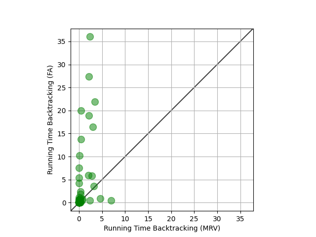

========================================
SUDOKU SOLVER RESULTS
========================================

Total Success Count:
  MRV            : 95
  FirstAvailable : 95

Total Time Taken:
  MRV            : 45.2548 seconds
  FirstAvailable : 244.6380 seconds

----------------------------------------
MRV RUN TIMES (seconds):
  Min  : 0.0021
  Max  : 6.9260
  All  : [0.0106, 0.0326, 0.0363, 2.3632, 0.4052, 6.9260, 2.0584, 0.0229, 1.7187, 3.0700, 0.3739, 0.0565, 0.0719, 1.0502, 0.1038, 0.5570, 0.0225, 2.3680, 0.0030, 0.0503, 2.9744, 0.0043, 0.0429, 0.0353, 0.0298, 0.2311, 0.1955, 5.5960, 0.0484, 0.1989, 0.0612, 0.0260, 0.0099, 4.5088, 0.2234, 0.0319, 0.1306, 0.0558, 0.2783, 0.0151, 0.5148, 0.3491, 0.2031, 0.0222, 0.0481, 2.6900, 0.1331, 0.0765, 0.4841, 0.0710, 0.0194, 0.0218, 0.0099, 0.0174, 0.0362, 0.0160, 0.1574, 0.0395, 0.0393, 0.0897, 0.1824, 0.0508, 0.0123, 0.1957, 0.0021, 0.0652, 0.1032, 0.1539, 0.0888, 0.0668, 1.9127, 0.0050, 0.1450, 0.1055, 0.0992, 0.0497, 0.0446, 0.0186, 0.2768, 0.0146, 0.0725, 0.0525, 0.1307, 0.0289, 0.0193, 0.0080, 0.0793, 0.0030, 0.0540, 0.0110, 0.0084, 0.0042, 0.0183, 0.0072, 0.0905]

----------------------------------------
FirstAvailable RUN TIMES (seconds):
  Min  : 0.0014
  Max  : 42.9556
  All  : [0.2838, 1.1763, 0.1308, 0.5362, 22.8937, 0.5270, 29.4844, 4.9971, 21.0026, 18.8880, 1.9678, 0.2070, 0.0725, 0.8270, 12.0419, 3.2385, 0.5843, 7.6593, 0.0043, 0.0162, 6.5026, 0.0160, 0.3148, 0.0654, 0.0044, 0.5040, 0.1498, 0.9205, 0.0533, 0.0343, 0.0126, 0.0327, 0.0050, 3.8441, 0.1676, 0.6095, 0.3894, 0.0544, 0.3221, 0.0206, 15.2129, 0.2830, 0.0622, 0.0080, 0.0316, 21.5419, 0.4065, 0.1258, 1.4207, 8.3106, 0.0325, 0.0736, 0.0074, 0.0170, 0.3351, 0.0204, 0.2620, 0.0417, 0.0303, 0.0245, 0.0126, 7.6074, 0.0518, 0.3897, 0.0014, 0.4710, 0.0533, 0.0493, 0.0437, 0.2473, 42.9556, 0.1320, 0.2963, 0.0711, 0.0891, 0.1528, 0.0246, 0.2344, 0.0469, 0.0438, 0.1455, 0.1893, 0.5532, 0.0942, 0.0269, 0.0040, 0.1389, 0.0221, 0.4582, 0.0020, 0.0633, 0.0125, 0.1137, 0.8940, 0.1118]

========================================
RUN TIME PLOT
========================================

========================================
ALL SOLVED SUDOKU
========================================
Initial Sudoku
- - - - - - - - - - - - - 
| 4 . . | . . . | 8 . 5 | 
| . 3 . | . . . | . . . | 
| . . . | 7 . . | . . . | 
- - - - - - - - - - - - - 
| . 2 . | . . . | . 6 . | 
| . . . | . 8 . | 4 . . | 
| . . . | . 1 . | . . . | 
- - - - - - - - - - - - - 
| . . . | 6 . 3 | . 7 . | 
| 5 . . | 2 . . | . . . | 
| 1 . 4 | . . . | . . . | 
- - - - - - - - - - - - - 

Solved Sudoku with Minimum Remaining Values (MRV) in 0.0085 seconds
- - - - - - - - - - - - - 
| 4 1 7 | 3 6 9 | 8 2 5 | 
| 6 3 2 | 1 5 8 | 9 4 7 | 
| 9 5 8 | 7 2 4 | 3 1 6 | 
- - - - - - - - - - - - - 
| 8 2 5 | 4 3 7 | 1 6 9 | 
| 7 9 1 | 5 8 6 | 4 3 2 | 
| 3 4 6 | 9 1 2 | 7 5 8 | 
- - - - - - - - - - - - - 
| 2 8 9 | 6 4 3 | 5 7 1 | 
| 5 7 3 | 2 9 1 | 6 8 4 | 
| 1 6 4 | 8 7 5 | 2 9 3 | 
- - - - - - - - - - - - - 

Solved Sudoku with First Available in 0.2511 seconds
- - - - - - - - - - - - - 
| 4 1 7 | 3 6 9 | 8 2 5 | 
| 6 3 2 | 1 5 8 | 9 4 7 | 
| 9 5 8 | 7 2 4 | 3 1 6 | 
- - - - - - - - - - - - - 
| 8 2 5 | 4 3 7 | 1 6 9 | 
| 7 9 1 | 5 8 6 | 4 3 2 | 
| 3 4 6 | 9 1 2 | 7 5 8 | 
- - - - - - - - - - - - - 
| 2 8 9 | 6 4 3 | 5 7 1 | 
| 5 7 3 | 2 9 1 | 6 8 4 | 
| 1 6 4 | 8 7 5 | 2 9 3 | 
- - - - - - - - - - - - - 

----------------------------------------------------------------------------------------
Initial Sudoku
- - - - - - - - - - - - - 
| 5 2 . | . . 6 | . . . | 
| . . . | . . . | 7 . 1 | 
| 3 . . | . . . | . . . | 
- - - - - - - - - - - - - 
| . . . | 4 . . | 8 . . | 
| 6 . . | . . . | . 5 . | 
| . . . | . . . | . . . | 
- - - - - - - - - - - - - 
| . 4 1 | 8 . . | . . . | 
| . . . | . 3 . | . 2 . | 
| . . 8 | 7 . . | . . . | 
- - - - - - - - - - - - - 

Solved Sudoku with Minimum Remaining Values (MRV) in 0.0321 seconds
- - - - - - - - - - - - - 
| 5 2 7 | 3 1 6 | 4 8 9 | 
| 8 9 6 | 5 4 2 | 7 3 1 | 
| 3 1 4 | 9 8 7 | 5 6 2 | 
- - - - - - - - - - - - - 
| 1 7 2 | 4 5 3 | 8 9 6 | 
| 6 8 9 | 2 7 1 | 3 5 4 | 
| 4 5 3 | 6 9 8 | 2 1 7 | 
- - - - - - - - - - - - - 
| 9 4 1 | 8 2 5 | 6 7 3 | 
| 7 6 5 | 1 3 4 | 9 2 8 | 
| 2 3 8 | 7 6 9 | 1 4 5 | 
- - - - - - - - - - - - - 

Solved Sudoku with First Available in 1.0948 seconds
- - - - - - - - - - - - - 
| 5 2 7 | 3 1 6 | 4 8 9 | 
| 8 9 6 | 5 4 2 | 7 3 1 | 
| 3 1 4 | 9 8 7 | 5 6 2 | 
- - - - - - - - - - - - - 
| 1 7 2 | 4 5 3 | 8 9 6 | 
| 6 8 9 | 2 7 1 | 3 5 4 | 
| 4 5 3 | 6 9 8 | 2 1 7 | 
- - - - - - - - - - - - - 
| 9 4 1 | 8 2 5 | 6 7 3 | 
| 7 6 5 | 1 3 4 | 9 2 8 | 
| 2 3 8 | 7 6 9 | 1 4 5 | 
- - - - - - - - - - - - - 

----------------------------------------------------------------------------------------
Initial Sudoku
- - - - - - - - - - - - - 
| 6 . . | . . . | 8 . 3 | 
| . 4 . | 7 . . | . . . | 
| . . . | . . . | . . . | 
- - - - - - - - - - - - - 
| . . . | 5 . 4 | . 7 . | 
| 3 . . | 2 . . | . . . | 
| 1 . 6 | . . . | . . . | 
- - - - - - - - - - - - - 
| . 2 . | . . . | . 5 . | 
| . . . | . 8 . | 6 . . | 
| . . . | . 1 . | . . . | 
- - - - - - - - - - - - - 

Solved Sudoku with Minimum Remaining Values (MRV) in 0.0326 seconds
- - - - - - - - - - - - - 
| 6 1 7 | 4 5 9 | 8 2 3 | 
| 2 4 8 | 7 3 6 | 9 1 5 | 
| 5 3 9 | 1 2 8 | 4 6 7 | 
- - - - - - - - - - - - - 
| 9 8 2 | 5 6 4 | 3 7 1 | 
| 3 7 4 | 2 9 1 | 5 8 6 | 
| 1 5 6 | 8 7 3 | 2 9 4 | 
- - - - - - - - - - - - - 
| 8 2 3 | 6 4 7 | 1 5 9 | 
| 7 9 1 | 3 8 5 | 6 4 2 | 
| 4 6 5 | 9 1 2 | 7 3 8 | 
- - - - - - - - - - - - - 

Solved Sudoku with First Available in 0.1153 seconds
- - - - - - - - - - - - - 
| 6 1 7 | 4 5 9 | 8 2 3 | 
| 2 4 8 | 7 3 6 | 9 1 5 | 
| 5 3 9 | 1 2 8 | 4 6 7 | 
- - - - - - - - - - - - - 
| 9 8 2 | 5 6 4 | 3 7 1 | 
| 3 7 4 | 2 9 1 | 5 8 6 | 
| 1 5 6 | 8 7 3 | 2 9 4 | 
- - - - - - - - - - - - - 
| 8 2 3 | 6 4 7 | 1 5 9 | 
| 7 9 1 | 3 8 5 | 6 4 2 | 
| 4 6 5 | 9 1 2 | 7 3 8 | 
- - - - - - - - - - - - - 

----------------------------------------------------------------------------------------
Initial Sudoku
- - - - - - - - - - - - - 
| 4 8 . | 3 . . | . . . | 
| . . . | . . . | . 7 1 | 
| . 2 . | . . . | . . . | 
- - - - - - - - - - - - - 
| 7 . 5 | . . . | . 6 . | 
| . . . | 2 . . | 8 . . | 
| . . . | . . . | . . . | 
- - - - - - - - - - - - - 
| . . 1 | . 7 6 | . . . | 
| 3 . . | . . . | 4 . . | 
| . . . | . 5 . | . . . | 
- - - - - - - - - - - - - 

Solved Sudoku with Minimum Remaining Values (MRV) in 2.3202 seconds
- - - - - - - - - - - - - 
| 4 8 7 | 3 1 2 | 6 9 5 | 
| 5 9 3 | 6 8 4 | 2 7 1 | 
| 1 2 6 | 5 9 7 | 3 8 4 | 
- - - - - - - - - - - - - 
| 7 3 5 | 8 4 9 | 1 6 2 | 
| 9 1 4 | 2 6 5 | 8 3 7 | 
| 2 6 8 | 7 3 1 | 5 4 9 | 
- - - - - - - - - - - - - 
| 8 5 1 | 4 7 6 | 9 2 3 | 
| 3 7 9 | 1 2 8 | 4 5 6 | 
| 6 4 2 | 9 5 3 | 7 1 8 | 
- - - - - - - - - - - - - 

Solved Sudoku with First Available in 0.5106 seconds
- - - - - - - - - - - - - 
| 4 8 7 | 3 1 2 | 6 9 5 | 
| 5 9 3 | 6 8 4 | 2 7 1 | 
| 1 2 6 | 5 9 7 | 3 8 4 | 
- - - - - - - - - - - - - 
| 7 3 5 | 8 4 9 | 1 6 2 | 
| 9 1 4 | 2 6 5 | 8 3 7 | 
| 2 6 8 | 7 3 1 | 5 4 9 | 
- - - - - - - - - - - - - 
| 8 5 1 | 4 7 6 | 9 2 3 | 
| 3 7 9 | 1 2 8 | 4 5 6 | 
| 6 4 2 | 9 5 3 | 7 1 8 | 
- - - - - - - - - - - - - 

----------------------------------------------------------------------------------------
Initial Sudoku
- - - - - - - - - - - - - 
| . . . | . 1 4 | . . . | 
| . 3 . | . . . | 2 . . | 
| . 7 . | . . . | . . . | 
- - - - - - - - - - - - - 
| . . . | 9 . . | . 3 . | 
| 6 . 1 | . . . | . . . | 
| . . . | . . . | . 8 . | 
- - - - - - - - - - - - - 
| 2 . . | . . . | 1 . 4 | 
| . . . | . 5 . | 6 . . | 
| . . . | 7 . 8 | . . . | 
- - - - - - - - - - - - - 

Solved Sudoku with Minimum Remaining Values (MRV) in 0.4416 seconds
- - - - - - - - - - - - - 
| 9 6 2 | 3 1 4 | 8 5 7 | 
| 1 3 4 | 5 8 7 | 2 6 9 | 
| 5 7 8 | 2 9 6 | 4 1 3 | 
- - - - - - - - - - - - - 
| 8 4 7 | 9 6 2 | 5 3 1 | 
| 6 5 1 | 8 7 3 | 9 4 2 | 
| 3 2 9 | 1 4 5 | 7 8 6 | 
- - - - - - - - - - - - - 
| 2 8 5 | 6 3 9 | 1 7 4 | 
| 7 9 3 | 4 5 1 | 6 2 8 | 
| 4 1 6 | 7 2 8 | 3 9 5 | 
- - - - - - - - - - - - - 

Solved Sudoku with First Available in 19.9649 seconds
- - - - - - - - - - - - - 
| 9 6 2 | 3 1 4 | 8 5 7 | 
| 1 3 4 | 5 8 7 | 2 6 9 | 
| 5 7 8 | 2 9 6 | 4 1 3 | 
- - - - - - - - - - - - - 
| 8 4 7 | 9 6 2 | 5 3 1 | 
| 6 5 1 | 8 7 3 | 9 4 2 | 
| 3 2 9 | 1 4 5 | 7 8 6 | 
- - - - - - - - - - - - - 
| 2 8 5 | 6 3 9 | 1 7 4 | 
| 7 9 3 | 4 5 1 | 6 2 8 | 
| 4 1 6 | 7 2 8 | 3 9 5 | 
- - - - - - - - - - - - - 

----------------------------------------------------------------------------------------
Initial Sudoku
- - - - - - - - - - - - - 
| . . . | . . . | 5 2 . | 
| . 8 . | 4 . . | . . . | 
| . 3 . | . . 9 | . . . | 
- - - - - - - - - - - - - 
| 5 . 1 | . . . | 6 . . | 
| 2 . . | 7 . . | . . . | 
| . . . | 3 . . | . . . | 
- - - - - - - - - - - - - 
| 6 . . | . 1 . | . . . | 
| . . . | . . . | 7 . 4 | 
| . . . | . . . | . 3 . | 
- - - - - - - - - - - - - 

Solved Sudoku with Minimum Remaining Values (MRV) in 6.9438 seconds
- - - - - - - - - - - - - 
| 4 1 6 | 8 3 7 | 5 2 9 | 
| 9 8 2 | 4 6 5 | 3 7 1 | 
| 7 3 5 | 1 2 9 | 4 6 8 | 
- - - - - - - - - - - - - 
| 5 7 1 | 2 9 8 | 6 4 3 | 
| 2 9 3 | 7 4 6 | 1 8 5 | 
| 8 6 4 | 3 5 1 | 2 9 7 | 
- - - - - - - - - - - - - 
| 6 4 7 | 9 1 3 | 8 5 2 | 
| 3 5 9 | 6 8 2 | 7 1 4 | 
| 1 2 8 | 5 7 4 | 9 3 6 | 
- - - - - - - - - - - - - 

Solved Sudoku with First Available in 0.4932 seconds
- - - - - - - - - - - - - 
| 4 1 6 | 8 3 7 | 5 2 9 | 
| 9 8 2 | 4 6 5 | 3 7 1 | 
| 7 3 5 | 1 2 9 | 4 6 8 | 
- - - - - - - - - - - - - 
| 5 7 1 | 2 9 8 | 6 4 3 | 
| 2 9 3 | 7 4 6 | 1 8 5 | 
| 8 6 4 | 3 5 1 | 2 9 7 | 
- - - - - - - - - - - - - 
| 6 4 7 | 9 1 3 | 8 5 2 | 
| 3 5 9 | 6 8 2 | 7 1 4 | 
| 1 2 8 | 5 7 4 | 9 3 6 | 
- - - - - - - - - - - - - 

----------------------------------------------------------------------------------------
Initial Sudoku
- - - - - - - - - - - - - 
| 6 . 2 | . 5 . | . . . | 
| . . . | . . 3 | . 4 . | 
| . . . | . . . | . . . | 
- - - - - - - - - - - - - 
| 4 3 . | . . 8 | . . . | 
| . 1 . | . . . | 2 . . | 
| . . . | . . . | 7 . . | 
- - - - - - - - - - - - - 
| 5 . . | 2 7 . | . . . | 
| . . . | . . . | . 8 1 | 
| . . . | 6 . . | . . . | 
- - - - - - - - - - - - - 

Solved Sudoku with Minimum Remaining Values (MRV) in 2.1915 seconds
- - - - - - - - - - - - - 
| 6 8 2 | 1 5 4 | 3 7 9 | 
| 9 5 1 | 7 6 3 | 8 4 2 | 
| 3 7 4 | 8 9 2 | 1 6 5 | 
- - - - - - - - - - - - - 
| 4 3 7 | 5 2 8 | 9 1 6 | 
| 8 1 6 | 9 3 7 | 2 5 4 | 
| 2 9 5 | 4 1 6 | 7 3 8 | 
- - - - - - - - - - - - - 
| 5 6 8 | 2 7 1 | 4 9 3 | 
| 7 2 9 | 3 4 5 | 6 8 1 | 
| 1 4 3 | 6 8 9 | 5 2 7 | 
- - - - - - - - - - - - - 

Solved Sudoku with First Available in 27.3966 seconds
- - - - - - - - - - - - - 
| 6 8 2 | 1 5 4 | 3 7 9 | 
| 9 5 1 | 7 6 3 | 8 4 2 | 
| 3 7 4 | 8 9 2 | 1 6 5 | 
- - - - - - - - - - - - - 
| 4 3 7 | 5 2 8 | 9 1 6 | 
| 8 1 6 | 9 3 7 | 2 5 4 | 
| 2 9 5 | 4 1 6 | 7 3 8 | 
- - - - - - - - - - - - - 
| 5 6 8 | 2 7 1 | 4 9 3 | 
| 7 2 9 | 3 4 5 | 6 8 1 | 
| 1 4 3 | 6 8 9 | 5 2 7 | 
- - - - - - - - - - - - - 

----------------------------------------------------------------------------------------
Initial Sudoku
- - - - - - - - - - - - - 
| . 5 2 | 4 . . | . . . | 
| . . . | . 7 . | 1 . . | 
| . . . | . . . | . . . | 
- - - - - - - - - - - - - 
| . . . | 8 . 2 | . . . | 
| 3 . . | . . . | 6 . . | 
| . 9 . | 5 . . | . . . | 
- - - - - - - - - - - - - 
| 1 . 6 | . 3 . | . . . | 
| . . . | . . . | . 8 9 | 
| 7 . . | . . . | . . . | 
- - - - - - - - - - - - - 

Solved Sudoku with Minimum Remaining Values (MRV) in 0.0223 seconds
- - - - - - - - - - - - - 
| 6 5 2 | 4 8 1 | 9 3 7 | 
| 8 3 4 | 6 7 9 | 1 5 2 | 
| 9 7 1 | 3 2 5 | 8 6 4 | 
- - - - - - - - - - - - - 
| 4 6 7 | 8 1 2 | 5 9 3 | 
| 3 1 5 | 7 9 4 | 6 2 8 | 
| 2 9 8 | 5 6 3 | 4 7 1 | 
- - - - - - - - - - - - - 
| 1 8 6 | 9 3 7 | 2 4 5 | 
| 5 2 3 | 1 4 6 | 7 8 9 | 
| 7 4 9 | 2 5 8 | 3 1 6 | 
- - - - - - - - - - - - - 

Solved Sudoku with First Available in 4.1858 seconds
- - - - - - - - - - - - - 
| 6 5 2 | 4 8 1 | 9 3 7 | 
| 8 3 4 | 6 7 9 | 1 5 2 | 
| 9 7 1 | 3 2 5 | 8 6 4 | 
- - - - - - - - - - - - - 
| 4 6 7 | 8 1 2 | 5 9 3 | 
| 3 1 5 | 7 9 4 | 6 2 8 | 
| 2 9 8 | 5 6 3 | 4 7 1 | 
- - - - - - - - - - - - - 
| 1 8 6 | 9 3 7 | 2 4 5 | 
| 5 2 3 | 1 4 6 | 7 8 9 | 
| 7 4 9 | 2 5 8 | 3 1 6 | 
- - - - - - - - - - - - - 

----------------------------------------------------------------------------------------
Initial Sudoku
- - - - - - - - - - - - - 
| 6 . 2 | . 5 . | . . . | 
| . . . | . . 4 | . 3 . | 
| . . . | . . . | . . . | 
- - - - - - - - - - - - - 
| 4 3 . | . . 8 | . . . | 
| . 1 . | . . . | 2 . . | 
| . . . | . . . | 7 . . | 
- - - - - - - - - - - - - 
| 5 . . | 2 7 . | . . . | 
| . . . | . . . | . 8 1 | 
| . . . | 6 . . | . . . | 
- - - - - - - - - - - - - 

Solved Sudoku with Minimum Remaining Values (MRV) in 2.1022 seconds
- - - - - - - - - - - - - 
| 6 8 2 | 1 5 3 | 4 7 9 | 
| 9 5 1 | 7 6 4 | 8 3 2 | 
| 3 7 4 | 8 9 2 | 1 6 5 | 
- - - - - - - - - - - - - 
| 4 3 7 | 5 2 8 | 9 1 6 | 
| 8 1 6 | 9 4 7 | 2 5 3 | 
| 2 9 5 | 3 1 6 | 7 4 8 | 
- - - - - - - - - - - - - 
| 5 6 8 | 2 7 1 | 3 9 4 | 
| 7 2 9 | 4 3 5 | 6 8 1 | 
| 1 4 3 | 6 8 9 | 5 2 7 | 
- - - - - - - - - - - - - 

Solved Sudoku with First Available in 18.9499 seconds
- - - - - - - - - - - - - 
| 6 8 2 | 1 5 3 | 4 7 9 | 
| 9 5 1 | 7 6 4 | 8 3 2 | 
| 3 7 4 | 8 9 2 | 1 6 5 | 
- - - - - - - - - - - - - 
| 4 3 7 | 5 2 8 | 9 1 6 | 
| 8 1 6 | 9 4 7 | 2 5 3 | 
| 2 9 5 | 3 1 6 | 7 4 8 | 
- - - - - - - - - - - - - 
| 5 6 8 | 2 7 1 | 3 9 4 | 
| 7 2 9 | 4 3 5 | 6 8 1 | 
| 1 4 3 | 6 8 9 | 5 2 7 | 
- - - - - - - - - - - - - 

----------------------------------------------------------------------------------------
Initial Sudoku
- - - - - - - - - - - - - 
| . 9 2 | 3 . . | . . . | 
| . . . | . 8 . | 1 . . | 
| . . . | . . . | . . . | 
- - - - - - - - - - - - - 
| 1 . 7 | . 4 . | . . . | 
| . . . | . . . | . 6 5 | 
| 8 . . | . . . | . . . | 
- - - - - - - - - - - - - 
| . 6 . | 5 . 2 | . . . | 
| 4 . . | . . . | 7 . . | 
| . . . | 9 . . | . . . | 
- - - - - - - - - - - - - 

Solved Sudoku with Minimum Remaining Values (MRV) in 2.9557 seconds
- - - - - - - - - - - - - 
| 7 9 2 | 3 5 1 | 6 4 8 | 
| 5 4 3 | 7 8 6 | 1 2 9 | 
| 6 8 1 | 4 2 9 | 5 3 7 | 
- - - - - - - - - - - - - 
| 1 5 7 | 6 4 8 | 2 9 3 | 
| 9 2 4 | 1 3 7 | 8 6 5 | 
| 8 3 6 | 2 9 5 | 4 7 1 | 
- - - - - - - - - - - - - 
| 3 6 8 | 5 7 2 | 9 1 4 | 
| 4 1 9 | 8 6 3 | 7 5 2 | 
| 2 7 5 | 9 1 4 | 3 8 6 | 
- - - - - - - - - - - - - 

Solved Sudoku with First Available in 16.4947 seconds
- - - - - - - - - - - - - 
| 7 9 2 | 3 5 1 | 6 4 8 | 
| 5 4 3 | 7 8 6 | 1 2 9 | 
| 6 8 1 | 4 2 9 | 5 3 7 | 
- - - - - - - - - - - - - 
| 1 5 7 | 6 4 8 | 2 9 3 | 
| 9 2 4 | 1 3 7 | 8 6 5 | 
| 8 3 6 | 2 9 5 | 4 7 1 | 
- - - - - - - - - - - - - 
| 3 6 8 | 5 7 2 | 9 1 4 | 
| 4 1 9 | 8 6 3 | 7 5 2 | 
| 2 7 5 | 9 1 4 | 3 8 6 | 
- - - - - - - - - - - - - 

----------------------------------------------------------------------------------------
Initial Sudoku
- - - - - - - - - - - - - 
| 6 . . | 3 . 2 | . . . | 
| . 5 . | . . . | . 1 . | 
| . . . | . . . | . . . | 
- - - - - - - - - - - - - 
| 7 . 2 | 6 . . | . . . | 
| . . . | . . . | . 5 4 | 
| 3 . . | . . . | . . . | 
- - - - - - - - - - - - - 
| . 8 . | 1 5 . | . . . | 
| . . . | . 4 . | 2 . . | 
| . . . | . . . | 7 . . | 
- - - - - - - - - - - - - 

Solved Sudoku with Minimum Remaining Values (MRV) in 0.3518 seconds
- - - - - - - - - - - - - 
| 6 1 4 | 3 8 2 | 5 7 9 | 
| 9 5 3 | 7 6 4 | 8 1 2 | 
| 8 2 7 | 5 9 1 | 4 3 6 | 
- - - - - - - - - - - - - 
| 7 4 2 | 6 3 5 | 1 9 8 | 
| 1 6 8 | 2 7 9 | 3 5 4 | 
| 3 9 5 | 4 1 8 | 6 2 7 | 
- - - - - - - - - - - - - 
| 2 8 6 | 1 5 7 | 9 4 3 | 
| 5 7 9 | 8 4 3 | 2 6 1 | 
| 4 3 1 | 9 2 6 | 7 8 5 | 
- - - - - - - - - - - - - 

Solved Sudoku with First Available in 1.8493 seconds
- - - - - - - - - - - - - 
| 6 1 4 | 3 8 2 | 5 7 9 | 
| 9 5 3 | 7 6 4 | 8 1 2 | 
| 8 2 7 | 5 9 1 | 4 3 6 | 
- - - - - - - - - - - - - 
| 7 4 2 | 6 3 5 | 1 9 8 | 
| 1 6 8 | 2 7 9 | 3 5 4 | 
| 3 9 5 | 4 1 8 | 6 2 7 | 
- - - - - - - - - - - - - 
| 2 8 6 | 1 5 7 | 9 4 3 | 
| 5 7 9 | 8 4 3 | 2 6 1 | 
| 4 3 1 | 9 2 6 | 7 8 5 | 
- - - - - - - - - - - - - 

----------------------------------------------------------------------------------------
Initial Sudoku
- - - - - - - - - - - - - 
| . 6 . | 5 . 1 | . 9 . | 
| 1 . . | . 9 . | . 5 3 | 
| 9 . . | . . 7 | . . . | 
- - - - - - - - - - - - - 
| . 4 . | 8 . . | . 7 . | 
| . . . | . . . | 5 . 8 | 
| . 8 1 | 7 . 5 | . 3 . | 
- - - - - - - - - - - - - 
| . . . | . 5 . | 2 . . | 
| . . . | . . . | . . . | 
| . 7 6 | . . 8 | . . . | 
- - - - - - - - - - - - - 

Solved Sudoku with Minimum Remaining Values (MRV) in 0.0428 seconds
- - - - - - - - - - - - - 
| 8 6 3 | 5 2 1 | 7 9 4 | 
| 1 2 7 | 4 9 6 | 8 5 3 | 
| 9 5 4 | 3 8 7 | 6 2 1 | 
- - - - - - - - - - - - - 
| 6 4 5 | 8 3 9 | 1 7 2 | 
| 7 3 9 | 1 4 2 | 5 6 8 | 
| 2 8 1 | 7 6 5 | 4 3 9 | 
- - - - - - - - - - - - - 
| 4 9 8 | 6 5 3 | 2 1 7 | 
| 5 1 2 | 9 7 4 | 3 8 6 | 
| 3 7 6 | 2 1 8 | 9 4 5 | 
- - - - - - - - - - - - - 

Solved Sudoku with First Available in 0.1986 seconds
- - - - - - - - - - - - - 
| 8 6 3 | 5 2 1 | 7 9 4 | 
| 1 2 7 | 4 9 6 | 8 5 3 | 
| 9 5 4 | 3 8 7 | 6 2 1 | 
- - - - - - - - - - - - - 
| 6 4 5 | 8 3 9 | 1 7 2 | 
| 7 3 9 | 1 4 2 | 5 6 8 | 
| 2 8 1 | 7 6 5 | 4 3 9 | 
- - - - - - - - - - - - - 
| 4 9 8 | 6 5 3 | 2 1 7 | 
| 5 1 2 | 9 7 4 | 3 8 6 | 
| 3 7 6 | 2 1 8 | 9 4 5 | 
- - - - - - - - - - - - - 

----------------------------------------------------------------------------------------
Initial Sudoku
- - - - - - - - - - - - - 
| . . 5 | . . . | 9 8 7 | 
| . 4 . | . 5 . | . . 1 | 
| . . 7 | . . . | . . . | 
- - - - - - - - - - - - - 
| 2 . . | . 4 8 | . . . | 
| . 9 . | 1 . . | . . . | 
| 6 . . | 2 . . | . . . | 
- - - - - - - - - - - - - 
| 3 . . | 6 . . | 2 . . | 
| . . . | . . 9 | . 7 . | 
| . . . | . . . | 5 . . | 
- - - - - - - - - - - - - 

Solved Sudoku with Minimum Remaining Values (MRV) in 0.0554 seconds
- - - - - - - - - - - - - 
| 1 3 5 | 4 2 6 | 9 8 7 | 
| 8 4 6 | 9 5 7 | 3 2 1 | 
| 9 2 7 | 3 8 1 | 4 6 5 | 
- - - - - - - - - - - - - 
| 2 1 3 | 7 4 8 | 6 5 9 | 
| 5 9 8 | 1 6 3 | 7 4 2 | 
| 6 7 4 | 2 9 5 | 8 1 3 | 
- - - - - - - - - - - - - 
| 3 5 1 | 6 7 4 | 2 9 8 | 
| 4 8 2 | 5 3 9 | 1 7 6 | 
| 7 6 9 | 8 1 2 | 5 3 4 | 
- - - - - - - - - - - - - 

Solved Sudoku with First Available in 0.0677 seconds
- - - - - - - - - - - - - 
| 1 3 5 | 4 2 6 | 9 8 7 | 
| 8 4 6 | 9 5 7 | 3 2 1 | 
| 9 2 7 | 3 8 1 | 4 6 5 | 
- - - - - - - - - - - - - 
| 2 1 3 | 7 4 8 | 6 5 9 | 
| 5 9 8 | 1 6 3 | 7 4 2 | 
| 6 7 4 | 2 9 5 | 8 1 3 | 
- - - - - - - - - - - - - 
| 3 5 1 | 6 7 4 | 2 9 8 | 
| 4 8 2 | 5 3 9 | 1 7 6 | 
| 7 6 9 | 8 1 2 | 5 3 4 | 
- - - - - - - - - - - - - 

----------------------------------------------------------------------------------------
Initial Sudoku
- - - - - - - - - - - - - 
| 3 . 6 | . 7 . | . . . | 
| . . . | . . . | . 5 1 | 
| 8 . . | . . . | . . . | 
- - - - - - - - - - - - - 
| . 1 . | 4 . 5 | . . . | 
| 7 . . | . . . | 6 . . | 
| . . . | 2 . . | . . . | 
- - - - - - - - - - - - - 
| . 2 . | . . . | . 4 . | 
| . . . | . 8 . | 3 . . | 
| . . . | 5 . . | . . . | 
- - - - - - - - - - - - - 

Solved Sudoku with Minimum Remaining Values (MRV) in 0.7641 seconds
- - - - - - - - - - - - - 
| 3 5 6 | 8 7 1 | 2 9 4 | 
| 9 7 2 | 6 4 3 | 8 5 1 | 
| 8 4 1 | 9 5 2 | 7 3 6 | 
- - - - - - - - - - - - - 
| 2 1 3 | 4 6 5 | 9 8 7 | 
| 7 9 4 | 3 1 8 | 6 2 5 | 
| 6 8 5 | 2 9 7 | 4 1 3 | 
- - - - - - - - - - - - - 
| 1 2 8 | 7 3 6 | 5 4 9 | 
| 5 6 9 | 1 8 4 | 3 7 2 | 
| 4 3 7 | 5 2 9 | 1 6 8 | 
- - - - - - - - - - - - - 

Solved Sudoku with First Available in 0.7423 seconds
- - - - - - - - - - - - - 
| 3 5 6 | 8 7 1 | 2 9 4 | 
| 9 7 2 | 6 4 3 | 8 5 1 | 
| 8 4 1 | 9 5 2 | 7 3 6 | 
- - - - - - - - - - - - - 
| 2 1 3 | 4 6 5 | 9 8 7 | 
| 7 9 4 | 3 1 8 | 6 2 5 | 
| 6 8 5 | 2 9 7 | 4 1 3 | 
- - - - - - - - - - - - - 
| 1 2 8 | 7 3 6 | 5 4 9 | 
| 5 6 9 | 1 8 4 | 3 7 2 | 
| 4 3 7 | 5 2 9 | 1 6 8 | 
- - - - - - - - - - - - - 

----------------------------------------------------------------------------------------
Initial Sudoku
- - - - - - - - - - - - - 
| 1 . . | . . . | 3 . 8 | 
| . 7 . | 4 . . | . . . | 
| . . . | . . . | . . . | 
- - - - - - - - - - - - - 
| 2 . 3 | . 1 . | . . . | 
| . . . | . . . | . 9 5 | 
| 8 . . | . . . | . . . | 
- - - - - - - - - - - - - 
| . 5 . | 6 . . | . 7 . | 
| . . . | . 8 . | 2 . . | 
| . 4 . | . . . | . . . | 
- - - - - - - - - - - - - 

Solved Sudoku with Minimum Remaining Values (MRV) in 0.0696 seconds
- - - - - - - - - - - - - 
| 1 2 9 | 5 7 6 | 3 4 8 | 
| 3 7 6 | 4 2 8 | 5 1 9 | 
| 5 8 4 | 3 9 1 | 6 2 7 | 
- - - - - - - - - - - - - 
| 2 9 3 | 8 1 5 | 7 6 4 | 
| 4 1 7 | 2 6 3 | 8 9 5 | 
| 8 6 5 | 7 4 9 | 1 3 2 | 
- - - - - - - - - - - - - 
| 9 5 8 | 6 3 2 | 4 7 1 | 
| 7 3 1 | 9 8 4 | 2 5 6 | 
| 6 4 2 | 1 5 7 | 9 8 3 | 
- - - - - - - - - - - - - 

Solved Sudoku with First Available in 10.1799 seconds
- - - - - - - - - - - - - 
| 1 2 9 | 5 7 6 | 3 4 8 | 
| 3 7 6 | 4 2 8 | 5 1 9 | 
| 5 8 4 | 3 9 1 | 6 2 7 | 
- - - - - - - - - - - - - 
| 2 9 3 | 8 1 5 | 7 6 4 | 
| 4 1 7 | 2 6 3 | 8 9 5 | 
| 8 6 5 | 7 4 9 | 1 3 2 | 
- - - - - - - - - - - - - 
| 9 5 8 | 6 3 2 | 4 7 1 | 
| 7 3 1 | 9 8 4 | 2 5 6 | 
| 6 4 2 | 1 5 7 | 9 8 3 | 
- - - - - - - - - - - - - 

----------------------------------------------------------------------------------------
Initial Sudoku
- - - - - - - - - - - - - 
| 6 . . | 3 . 2 | . . . | 
| . 4 . | . . . | . 1 . | 
| . . . | . . . | . . . | 
- - - - - - - - - - - - - 
| 7 . 2 | 6 . . | . . . | 
| . . . | . . . | . 5 4 | 
| 3 . . | . . . | . . . | 
- - - - - - - - - - - - - 
| . 8 . | 1 5 . | . . . | 
| . . . | . 4 . | 2 . . | 
| . . . | . . . | 7 . . | 
- - - - - - - - - - - - - 

Solved Sudoku with Minimum Remaining Values (MRV) in 0.3308 seconds
- - - - - - - - - - - - - 
| 6 1 5 | 3 8 2 | 4 7 9 | 
| 9 4 3 | 7 6 5 | 8 1 2 | 
| 8 2 7 | 4 9 1 | 5 3 6 | 
- - - - - - - - - - - - - 
| 7 5 2 | 6 3 4 | 1 9 8 | 
| 1 6 8 | 2 7 9 | 3 5 4 | 
| 3 9 4 | 5 1 8 | 6 2 7 | 
- - - - - - - - - - - - - 
| 2 8 6 | 1 5 7 | 9 4 3 | 
| 5 7 9 | 8 4 3 | 2 6 1 | 
| 4 3 1 | 9 2 6 | 7 8 5 | 
- - - - - - - - - - - - - 

Solved Sudoku with First Available in 2.4410 seconds
- - - - - - - - - - - - - 
| 6 1 5 | 3 8 2 | 4 7 9 | 
| 9 4 3 | 7 6 5 | 8 1 2 | 
| 8 2 7 | 4 9 1 | 5 3 6 | 
- - - - - - - - - - - - - 
| 7 5 2 | 6 3 4 | 1 9 8 | 
| 1 6 8 | 2 7 9 | 3 5 4 | 
| 3 9 4 | 5 1 8 | 6 2 7 | 
- - - - - - - - - - - - - 
| 2 8 6 | 1 5 7 | 9 4 3 | 
| 5 7 9 | 8 4 3 | 2 6 1 | 
| 4 3 1 | 9 2 6 | 7 8 5 | 
- - - - - - - - - - - - - 

----------------------------------------------------------------------------------------
Initial Sudoku
- - - - - - - - - - - - - 
| . . . | . 3 . | . 9 . | 
| . . . | 2 . . | . . 1 | 
| . 5 . | 9 . . | . . . | 
- - - - - - - - - - - - - 
| . . . | . . . | . . . | 
| 1 . 2 | . 8 . | 4 . 6 | 
| . 8 . | 5 . . | . 2 . | 
- - - - - - - - - - - - - 
| . 7 5 | . . . | . . . | 
| 4 . 1 | . . 6 | . . 3 | 
| . . . | . . 4 | . 6 . | 
- - - - - - - - - - - - - 

Solved Sudoku with Minimum Remaining Values (MRV) in 0.0143 seconds
- - - - - - - - - - - - - 
| 7 1 8 | 4 3 5 | 6 9 2 | 
| 9 6 3 | 2 7 8 | 5 4 1 | 
| 2 5 4 | 9 6 1 | 3 7 8 | 
- - - - - - - - - - - - - 
| 5 4 7 | 6 1 2 | 8 3 9 | 
| 1 9 2 | 3 8 7 | 4 5 6 | 
| 3 8 6 | 5 4 9 | 1 2 7 | 
- - - - - - - - - - - - - 
| 6 7 5 | 8 9 3 | 2 1 4 | 
| 4 2 1 | 7 5 6 | 9 8 3 | 
| 8 3 9 | 1 2 4 | 7 6 5 | 
- - - - - - - - - - - - - 

Solved Sudoku with First Available in 0.4270 seconds
- - - - - - - - - - - - - 
| 7 1 8 | 4 3 5 | 6 9 2 | 
| 9 6 3 | 2 7 8 | 5 4 1 | 
| 2 5 4 | 9 6 1 | 3 7 8 | 
- - - - - - - - - - - - - 
| 5 4 7 | 6 1 2 | 8 3 9 | 
| 1 9 2 | 3 8 7 | 4 5 6 | 
| 3 8 6 | 5 4 9 | 1 2 7 | 
- - - - - - - - - - - - - 
| 6 7 5 | 8 9 3 | 2 1 4 | 
| 4 2 1 | 7 5 6 | 9 8 3 | 
| 8 3 9 | 1 2 4 | 7 6 5 | 
- - - - - - - - - - - - - 

----------------------------------------------------------------------------------------
Initial Sudoku
- - - - - - - - - - - - - 
| 4 5 . | . . . | . 3 . | 
| . . . | 8 . 1 | . . . | 
| . 9 . | . . . | . . . | 
- - - - - - - - - - - - - 
| . . . | . 5 . | . 9 . | 
| 2 . . | 7 . . | . . . | 
| 8 . . | . . . | . . . | 
- - - - - - - - - - - - - 
| . 1 . | . 4 . | . . . | 
| . . . | . . . | 7 . 2 | 
| . . . | 6 . . | 8 . . | 
- - - - - - - - - - - - - 

Solved Sudoku with Minimum Remaining Values (MRV) in 1.9910 seconds
- - - - - - - - - - - - - 
| 4 5 8 | 2 7 6 | 9 3 1 | 
| 6 2 3 | 8 9 1 | 4 7 5 | 
| 1 9 7 | 5 3 4 | 2 8 6 | 
- - - - - - - - - - - - - 
| 3 7 1 | 4 5 2 | 6 9 8 | 
| 2 6 9 | 7 8 3 | 1 5 4 | 
| 8 4 5 | 1 6 9 | 3 2 7 | 
- - - - - - - - - - - - - 
| 7 1 2 | 9 4 8 | 5 6 3 | 
| 9 8 6 | 3 1 5 | 7 4 2 | 
| 5 3 4 | 6 2 7 | 8 1 9 | 
- - - - - - - - - - - - - 

Solved Sudoku with First Available in 5.9678 seconds
- - - - - - - - - - - - - 
| 4 5 8 | 2 7 6 | 9 3 1 | 
| 6 2 3 | 8 9 1 | 4 7 5 | 
| 1 9 7 | 5 3 4 | 2 8 6 | 
- - - - - - - - - - - - - 
| 3 7 1 | 4 5 2 | 6 9 8 | 
| 2 6 9 | 7 8 3 | 1 5 4 | 
| 8 4 5 | 1 6 9 | 3 2 7 | 
- - - - - - - - - - - - - 
| 7 1 2 | 9 4 8 | 5 6 3 | 
| 9 8 6 | 3 1 5 | 7 4 2 | 
| 5 3 4 | 6 2 7 | 8 1 9 | 
- - - - - - - - - - - - - 

----------------------------------------------------------------------------------------
Initial Sudoku
- - - - - - - - - - - - - 
| . 2 3 | 7 . . | . . 6 | 
| 8 . . | . 6 . | 5 9 . | 
| 9 . . | . . . | 7 . . | 
- - - - - - - - - - - - - 
| . . . | . 4 . | 9 7 . | 
| 3 . 7 | . 9 6 | . . 2 | 
| . . . | . . . | . . . | 
- - - - - - - - - - - - - 
| 5 . . | 4 7 . | . . . | 
| . . . | . . 2 | . . . | 
| . 8 . | . . . | . . . | 
- - - - - - - - - - - - - 

Solved Sudoku with Minimum Remaining Values (MRV) in 0.0032 seconds
- - - - - - - - - - - - - 
| 1 2 3 | 7 5 9 | 4 8 6 | 
| 8 7 4 | 2 6 1 | 5 9 3 | 
| 9 6 5 | 3 8 4 | 7 2 1 | 
- - - - - - - - - - - - - 
| 2 1 6 | 5 4 3 | 9 7 8 | 
| 3 5 7 | 8 9 6 | 1 4 2 | 
| 4 9 8 | 1 2 7 | 3 6 5 | 
- - - - - - - - - - - - - 
| 5 3 2 | 4 7 8 | 6 1 9 | 
| 6 4 1 | 9 3 2 | 8 5 7 | 
| 7 8 9 | 6 1 5 | 2 3 4 | 
- - - - - - - - - - - - - 

Solved Sudoku with First Available in 0.0030 seconds
- - - - - - - - - - - - - 
| 1 2 3 | 7 5 9 | 4 8 6 | 
| 8 7 4 | 2 6 1 | 5 9 3 | 
| 9 6 5 | 3 8 4 | 7 2 1 | 
- - - - - - - - - - - - - 
| 2 1 6 | 5 4 3 | 9 7 8 | 
| 3 5 7 | 8 9 6 | 1 4 2 | 
| 4 9 8 | 1 2 7 | 3 6 5 | 
- - - - - - - - - - - - - 
| 5 3 2 | 4 7 8 | 6 1 9 | 
| 6 4 1 | 9 3 2 | 8 5 7 | 
| 7 8 9 | 6 1 5 | 2 3 4 | 
- - - - - - - - - - - - - 

----------------------------------------------------------------------------------------
Initial Sudoku
- - - - - - - - - - - - - 
| . . 8 | 4 . . | . 3 . | 
| . . . | 3 . . | . . . | 
| 9 . . | . . 1 | 5 7 4 | 
- - - - - - - - - - - - - 
| 7 9 . | . . 8 | . . . | 
| . . . | . . 7 | . . 5 | 
| 1 4 . | . . . | . 2 . | 
- - - - - - - - - - - - - 
| . . 9 | . 6 . | . . 2 | 
| . 5 . | . . . | 4 . . | 
| . . . | . 9 . | . 5 6 | 
- - - - - - - - - - - - - 

Solved Sudoku with Minimum Remaining Values (MRV) in 0.0441 seconds
- - - - - - - - - - - - - 
| 5 1 8 | 4 7 6 | 2 3 9 | 
| 4 2 7 | 3 5 9 | 6 1 8 | 
| 9 6 3 | 8 2 1 | 5 7 4 | 
- - - - - - - - - - - - - 
| 7 9 5 | 2 4 8 | 3 6 1 | 
| 8 3 2 | 6 1 7 | 9 4 5 | 
| 1 4 6 | 9 3 5 | 8 2 7 | 
- - - - - - - - - - - - - 
| 3 7 9 | 5 6 4 | 1 8 2 | 
| 6 5 1 | 7 8 2 | 4 9 3 | 
| 2 8 4 | 1 9 3 | 7 5 6 | 
- - - - - - - - - - - - - 

Solved Sudoku with First Available in 0.0121 seconds
- - - - - - - - - - - - - 
| 5 1 8 | 4 7 6 | 2 3 9 | 
| 4 2 7 | 3 5 9 | 6 1 8 | 
| 9 6 3 | 8 2 1 | 5 7 4 | 
- - - - - - - - - - - - - 
| 7 9 5 | 2 4 8 | 3 6 1 | 
| 8 3 2 | 6 1 7 | 9 4 5 | 
| 1 4 6 | 9 3 5 | 8 2 7 | 
- - - - - - - - - - - - - 
| 3 7 9 | 5 6 4 | 1 8 2 | 
| 6 5 1 | 7 8 2 | 4 9 3 | 
| 2 8 4 | 1 9 3 | 7 5 6 | 
- - - - - - - - - - - - - 

----------------------------------------------------------------------------------------
Initial Sudoku
- - - - - - - - - - - - - 
| . 9 8 | . 1 . | . . . | 
| 2 . . | . . . | . 6 . | 
| . . . | . . . | . . . | 
- - - - - - - - - - - - - 
| . . . | 3 . 2 | . 5 . | 
| . 8 4 | . . . | . . . | 
| . . . | 6 . . | . . . | 
- - - - - - - - - - - - - 
| . . . | . 4 . | 8 . 9 | 
| 3 . . | 5 . . | . . . | 
| . . . | . . . | 1 . . | 
- - - - - - - - - - - - - 

Solved Sudoku with Minimum Remaining Values (MRV) in 2.7822 seconds
- - - - - - - - - - - - - 
| 4 9 8 | 7 1 6 | 5 2 3 | 
| 2 5 7 | 8 3 9 | 4 6 1 | 
| 1 3 6 | 4 2 5 | 9 8 7 | 
- - - - - - - - - - - - - 
| 9 7 1 | 3 8 2 | 6 5 4 | 
| 6 8 4 | 1 5 7 | 3 9 2 | 
| 5 2 3 | 6 9 4 | 7 1 8 | 
- - - - - - - - - - - - - 
| 7 6 5 | 2 4 1 | 8 3 9 | 
| 3 1 9 | 5 7 8 | 2 4 6 | 
| 8 4 2 | 9 6 3 | 1 7 5 | 
- - - - - - - - - - - - - 

Solved Sudoku with First Available in 5.7824 seconds
- - - - - - - - - - - - - 
| 4 9 8 | 7 1 6 | 5 2 3 | 
| 2 5 7 | 8 3 9 | 4 6 1 | 
| 1 3 6 | 4 2 5 | 9 8 7 | 
- - - - - - - - - - - - - 
| 9 7 1 | 3 8 2 | 6 5 4 | 
| 6 8 4 | 1 5 7 | 3 9 2 | 
| 5 2 3 | 6 9 4 | 7 1 8 | 
- - - - - - - - - - - - - 
| 7 6 5 | 2 4 1 | 8 3 9 | 
| 3 1 9 | 5 7 8 | 2 4 6 | 
| 8 4 2 | 9 6 3 | 1 7 5 | 
- - - - - - - - - - - - - 

----------------------------------------------------------------------------------------
Initial Sudoku
- - - - - - - - - - - - - 
| . . 2 | 4 7 . | . 5 8 | 
| . . . | . . . | . . . | 
| . . . | . . 1 | . 4 . | 
- - - - - - - - - - - - - 
| . . . | . 2 . | . . 9 | 
| 5 2 8 | . 9 . | 4 . . | 
| . . 9 | . . . | 1 . . | 
- - - - - - - - - - - - - 
| . . . | . . . | . 3 . | 
| 3 . . | . . 7 | 5 . . | 
| 6 8 5 | . . 2 | . . . | 
- - - - - - - - - - - - - 

Solved Sudoku with Minimum Remaining Values (MRV) in 0.0070 seconds
- - - - - - - - - - - - - 
| 1 3 2 | 4 7 9 | 6 5 8 | 
| 8 4 7 | 5 6 3 | 2 9 1 | 
| 9 5 6 | 2 8 1 | 3 4 7 | 
- - - - - - - - - - - - - 
| 4 1 3 | 7 2 5 | 8 6 9 | 
| 5 2 8 | 1 9 6 | 4 7 3 | 
| 7 6 9 | 3 4 8 | 1 2 5 | 
- - - - - - - - - - - - - 
| 2 7 1 | 8 5 4 | 9 3 6 | 
| 3 9 4 | 6 1 7 | 5 8 2 | 
| 6 8 5 | 9 3 2 | 7 1 4 | 
- - - - - - - - - - - - - 

Solved Sudoku with First Available in 0.0178 seconds
- - - - - - - - - - - - - 
| 1 3 2 | 4 7 9 | 6 5 8 | 
| 8 4 7 | 5 6 3 | 2 9 1 | 
| 9 5 6 | 2 8 1 | 3 4 7 | 
- - - - - - - - - - - - - 
| 4 1 3 | 7 2 5 | 8 6 9 | 
| 5 2 8 | 1 9 6 | 4 7 3 | 
| 7 6 9 | 3 4 8 | 1 2 5 | 
- - - - - - - - - - - - - 
| 2 7 1 | 8 5 4 | 9 3 6 | 
| 3 9 4 | 6 1 7 | 5 8 2 | 
| 6 8 5 | 9 3 2 | 7 1 4 | 
- - - - - - - - - - - - - 

----------------------------------------------------------------------------------------
Initial Sudoku
- - - - - - - - - - - - - 
| 4 . . | . . . | 8 . 5 | 
| . 3 . | . . . | . . . | 
| . . . | 7 . . | . . . | 
- - - - - - - - - - - - - 
| . 2 . | . . . | . 6 . | 
| . . . | . 5 . | 4 . . | 
| . . . | . 1 . | . . . | 
- - - - - - - - - - - - - 
| . . . | 6 . 3 | . 7 . | 
| 5 . . | 2 . . | . . . | 
| 1 . 9 | . . . | . . . | 
- - - - - - - - - - - - - 

Solved Sudoku with Minimum Remaining Values (MRV) in 0.0437 seconds
- - - - - - - - - - - - - 
| 4 1 7 | 3 6 9 | 8 2 5 | 
| 6 3 8 | 1 2 5 | 9 4 7 | 
| 9 5 2 | 7 4 8 | 3 1 6 | 
- - - - - - - - - - - - - 
| 8 2 5 | 4 3 7 | 1 6 9 | 
| 7 9 1 | 8 5 6 | 4 3 2 | 
| 3 4 6 | 9 1 2 | 7 5 8 | 
- - - - - - - - - - - - - 
| 2 8 4 | 6 9 3 | 5 7 1 | 
| 5 7 3 | 2 8 1 | 6 9 4 | 
| 1 6 9 | 5 7 4 | 2 8 3 | 
- - - - - - - - - - - - - 

Solved Sudoku with First Available in 0.2984 seconds
- - - - - - - - - - - - - 
| 4 1 7 | 3 6 9 | 8 2 5 | 
| 6 3 8 | 1 2 5 | 9 4 7 | 
| 9 5 2 | 7 4 8 | 3 1 6 | 
- - - - - - - - - - - - - 
| 8 2 5 | 4 3 7 | 1 6 9 | 
| 7 9 1 | 8 5 6 | 4 3 2 | 
| 3 4 6 | 9 1 2 | 7 5 8 | 
- - - - - - - - - - - - - 
| 2 8 4 | 6 9 3 | 5 7 1 | 
| 5 7 3 | 2 8 1 | 6 9 4 | 
| 1 6 9 | 5 7 4 | 2 8 3 | 
- - - - - - - - - - - - - 

----------------------------------------------------------------------------------------
Initial Sudoku
- - - - - - - - - - - - - 
| . 2 . | 3 . . | . . . | 
| . 6 3 | . . . | . . 5 | 
| 8 . . | . . . | . . 1 | 
- - - - - - - - - - - - - 
| 5 . . | . . 9 | . 3 . | 
| . . . | 7 . . | . . . | 
| . . . | 1 . . | . . 8 | 
- - - - - - - - - - - - - 
| . 8 7 | 9 . . | 2 6 . | 
| . . . | . . 6 | . 7 . | 
| . . 6 | . . 7 | . . 4 | 
- - - - - - - - - - - - - 

Solved Sudoku with Minimum Remaining Values (MRV) in 0.0340 seconds
- - - - - - - - - - - - - 
| 9 2 5 | 3 7 1 | 4 8 6 | 
| 1 6 3 | 4 9 8 | 7 2 5 | 
| 8 7 4 | 5 6 2 | 3 9 1 | 
- - - - - - - - - - - - - 
| 5 4 2 | 6 8 9 | 1 3 7 | 
| 6 1 8 | 7 5 3 | 9 4 2 | 
| 7 3 9 | 1 2 4 | 6 5 8 | 
- - - - - - - - - - - - - 
| 4 8 7 | 9 1 5 | 2 6 3 | 
| 3 5 1 | 2 4 6 | 8 7 9 | 
| 2 9 6 | 8 3 7 | 5 1 4 | 
- - - - - - - - - - - - - 

Solved Sudoku with First Available in 0.0635 seconds
- - - - - - - - - - - - - 
| 9 2 5 | 3 7 1 | 4 8 6 | 
| 1 6 3 | 4 9 8 | 7 2 5 | 
| 8 7 4 | 5 6 2 | 3 9 1 | 
- - - - - - - - - - - - - 
| 5 4 2 | 6 8 9 | 1 3 7 | 
| 6 1 8 | 7 5 3 | 9 4 2 | 
| 7 3 9 | 1 2 4 | 6 5 8 | 
- - - - - - - - - - - - - 
| 4 8 7 | 9 1 5 | 2 6 3 | 
| 3 5 1 | 2 4 6 | 8 7 9 | 
| 2 9 6 | 8 3 7 | 5 1 4 | 
- - - - - - - - - - - - - 

----------------------------------------------------------------------------------------
Initial Sudoku
- - - - - - - - - - - - - 
| 1 . . | . . . | 7 . 9 | 
| . 4 . | . . 7 | 2 . . | 
| 8 . . | . . . | . . . | 
- - - - - - - - - - - - - 
| . 7 . | . 1 . | . 6 . | 
| 3 . . | . . . | . . 5 | 
| . 6 . | . 4 . | . 2 . | 
- - - - - - - - - - - - - 
| . . . | . . . | . . 8 | 
| . . 5 | 3 . . | . 7 . | 
| 7 . 2 | . . . | . 4 6 | 
- - - - - - - - - - - - - 

Solved Sudoku with Minimum Remaining Values (MRV) in 0.0317 seconds
- - - - - - - - - - - - - 
| 1 2 3 | 4 5 6 | 7 8 9 | 
| 6 4 9 | 8 3 7 | 2 5 1 | 
| 8 5 7 | 2 9 1 | 6 3 4 | 
- - - - - - - - - - - - - 
| 2 7 4 | 5 1 8 | 9 6 3 | 
| 3 9 8 | 6 7 2 | 4 1 5 | 
| 5 6 1 | 9 4 3 | 8 2 7 | 
- - - - - - - - - - - - - 
| 4 1 6 | 7 2 5 | 3 9 8 | 
| 9 8 5 | 3 6 4 | 1 7 2 | 
| 7 3 2 | 1 8 9 | 5 4 6 | 
- - - - - - - - - - - - - 

Solved Sudoku with First Available in 0.0057 seconds
- - - - - - - - - - - - - 
| 1 2 3 | 4 5 6 | 7 8 9 | 
| 6 4 9 | 8 3 7 | 2 5 1 | 
| 8 5 7 | 2 9 1 | 6 3 4 | 
- - - - - - - - - - - - - 
| 2 7 4 | 5 1 8 | 9 6 3 | 
| 3 9 8 | 6 7 2 | 4 1 5 | 
| 5 6 1 | 9 4 3 | 8 2 7 | 
- - - - - - - - - - - - - 
| 4 1 6 | 7 2 5 | 3 9 8 | 
| 9 8 5 | 3 6 4 | 1 7 2 | 
| 7 3 2 | 1 8 9 | 5 4 6 | 
- - - - - - - - - - - - - 

----------------------------------------------------------------------------------------
Initial Sudoku
- - - - - - - - - - - - - 
| 4 . . | . . . | 3 . . | 
| . . . | 8 . 2 | . . . | 
| . . . | 7 . . | . . . | 
- - - - - - - - - - - - - 
| . . . | 1 . . | . 8 7 | 
| 3 4 . | . . . | . . . | 
| 6 . . | . . . | . . . | 
- - - - - - - - - - - - - 
| 5 . . | . 6 . | . . . | 
| . . . | . 1 . | 4 . . | 
| . 8 2 | . . . | . . . | 
- - - - - - - - - - - - - 

Solved Sudoku with Minimum Remaining Values (MRV) in 0.2660 seconds
- - - - - - - - - - - - - 
| 4 7 5 | 6 9 1 | 3 2 8 | 
| 9 6 1 | 8 3 2 | 7 4 5 | 
| 8 2 3 | 7 5 4 | 1 9 6 | 
- - - - - - - - - - - - - 
| 2 5 9 | 1 4 3 | 6 8 7 | 
| 3 4 7 | 5 8 6 | 2 1 9 | 
| 6 1 8 | 9 2 7 | 5 3 4 | 
- - - - - - - - - - - - - 
| 5 3 4 | 2 6 9 | 8 7 1 | 
| 7 9 6 | 3 1 8 | 4 5 2 | 
| 1 8 2 | 4 7 5 | 9 6 3 | 
- - - - - - - - - - - - - 

Solved Sudoku with First Available in 0.5295 seconds
- - - - - - - - - - - - - 
| 4 7 5 | 6 9 1 | 3 2 8 | 
| 9 6 1 | 8 3 2 | 7 4 5 | 
| 8 2 3 | 7 5 4 | 1 9 6 | 
- - - - - - - - - - - - - 
| 2 5 9 | 1 4 3 | 6 8 7 | 
| 3 4 7 | 5 8 6 | 2 1 9 | 
| 6 1 8 | 9 2 7 | 5 3 4 | 
- - - - - - - - - - - - - 
| 5 3 4 | 2 6 9 | 8 7 1 | 
| 7 9 6 | 3 1 8 | 4 5 2 | 
| 1 8 2 | 4 7 5 | 9 6 3 | 
- - - - - - - - - - - - - 

----------------------------------------------------------------------------------------
Initial Sudoku
- - - - - - - - - - - - - 
| . . . | . . . | . 7 1 | 
| . 2 . | 8 . . | . . . | 
| . . . | 4 . 3 | . . . | 
- - - - - - - - - - - - - 
| 7 . . | . 6 . | . 5 . | 
| . . . | 2 . . | 3 . . | 
| 9 . . | . . . | . . . | 
- - - - - - - - - - - - - 
| 6 . . | . 7 . | . . . | 
| . 8 . | . . . | 4 . . | 
| . . . | . 5 . | . . . | 
- - - - - - - - - - - - - 

Solved Sudoku with Minimum Remaining Values (MRV) in 0.1953 seconds
- - - - - - - - - - - - - 
| 3 4 9 | 5 2 6 | 8 7 1 | 
| 5 2 1 | 8 9 7 | 6 4 3 | 
| 8 7 6 | 4 1 3 | 5 2 9 | 
- - - - - - - - - - - - - 
| 7 1 8 | 3 6 9 | 2 5 4 | 
| 4 6 5 | 2 8 1 | 3 9 7 | 
| 9 3 2 | 7 4 5 | 1 8 6 | 
- - - - - - - - - - - - - 
| 6 5 4 | 1 7 8 | 9 3 2 | 
| 1 8 7 | 9 3 2 | 4 6 5 | 
| 2 9 3 | 6 5 4 | 7 1 8 | 
- - - - - - - - - - - - - 

Solved Sudoku with First Available in 0.1460 seconds
- - - - - - - - - - - - - 
| 3 4 9 | 5 2 6 | 8 7 1 | 
| 5 2 1 | 8 9 7 | 6 4 3 | 
| 8 7 6 | 4 1 3 | 5 2 9 | 
- - - - - - - - - - - - - 
| 7 1 8 | 3 6 9 | 2 5 4 | 
| 4 6 5 | 2 8 1 | 3 9 7 | 
| 9 3 2 | 7 4 5 | 1 8 6 | 
- - - - - - - - - - - - - 
| 6 5 4 | 1 7 8 | 9 3 2 | 
| 1 8 7 | 9 3 2 | 4 6 5 | 
| 2 9 3 | 6 5 4 | 7 1 8 | 
- - - - - - - - - - - - - 

----------------------------------------------------------------------------------------
Initial Sudoku
- - - - - - - - - - - - - 
| 6 . . | 3 . 2 | . . . | 
| . 4 . | . . . | . 8 . | 
| . . . | . . . | . . . | 
- - - - - - - - - - - - - 
| 7 . 2 | 6 . . | . . . | 
| . . . | . . . | . 5 4 | 
| 3 . . | . . . | . . . | 
- - - - - - - - - - - - - 
| . 8 . | 1 5 . | . . . | 
| . . . | . 8 . | 2 . . | 
| . . . | . . . | 7 . . | 
- - - - - - - - - - - - - 

Solved Sudoku with Minimum Remaining Values (MRV) in 4.5971 seconds
- - - - - - - - - - - - - 
| 6 1 8 | 3 4 2 | 5 7 9 | 
| 9 4 3 | 7 6 5 | 1 8 2 | 
| 5 2 7 | 8 9 1 | 4 3 6 | 
- - - - - - - - - - - - - 
| 7 5 2 | 6 3 4 | 8 9 1 | 
| 8 6 1 | 2 7 9 | 3 5 4 | 
| 3 9 4 | 5 1 8 | 6 2 7 | 
- - - - - - - - - - - - - 
| 2 8 6 | 1 5 7 | 9 4 3 | 
| 1 7 9 | 4 8 3 | 2 6 5 | 
| 4 3 5 | 9 2 6 | 7 1 8 | 
- - - - - - - - - - - - - 

Solved Sudoku with First Available in 0.9485 seconds
- - - - - - - - - - - - - 
| 6 1 8 | 3 4 2 | 5 7 9 | 
| 9 4 3 | 7 6 5 | 1 8 2 | 
| 5 2 7 | 8 9 1 | 4 3 6 | 
- - - - - - - - - - - - - 
| 7 5 2 | 6 3 4 | 8 9 1 | 
| 8 6 1 | 2 7 9 | 3 5 4 | 
| 3 9 4 | 5 1 8 | 6 2 7 | 
- - - - - - - - - - - - - 
| 2 8 6 | 1 5 7 | 9 4 3 | 
| 1 7 9 | 4 8 3 | 2 6 5 | 
| 4 3 5 | 9 2 6 | 7 1 8 | 
- - - - - - - - - - - - - 

----------------------------------------------------------------------------------------
Initial Sudoku
- - - - - - - - - - - - - 
| . 4 7 | . 8 . | . . 1 | 
| . . . | . . . | . . . | 
| . . . | 6 . . | 7 . . | 
- - - - - - - - - - - - - 
| 6 . . | . . 3 | 5 7 . | 
| . . . | . . 5 | . . . | 
| . 1 . | . 6 . | . . . | 
- - - - - - - - - - - - - 
| 2 8 . | . 4 . | . . . | 
| . 9 . | 1 . . | . 4 . | 
| . . . | . 2 . | 6 9 . | 
- - - - - - - - - - - - - 

Solved Sudoku with Minimum Remaining Values (MRV) in 0.0129 seconds
- - - - - - - - - - - - - 
| 9 4 7 | 5 8 2 | 3 6 1 | 
| 8 6 3 | 4 7 1 | 9 5 2 | 
| 1 5 2 | 6 3 9 | 7 8 4 | 
- - - - - - - - - - - - - 
| 6 2 4 | 8 1 3 | 5 7 9 | 
| 7 3 8 | 2 9 5 | 4 1 6 | 
| 5 1 9 | 7 6 4 | 8 2 3 | 
- - - - - - - - - - - - - 
| 2 8 5 | 9 4 6 | 1 3 7 | 
| 3 9 6 | 1 5 7 | 2 4 8 | 
| 4 7 1 | 3 2 8 | 6 9 5 | 
- - - - - - - - - - - - - 

Solved Sudoku with First Available in 0.0564 seconds
- - - - - - - - - - - - - 
| 9 4 7 | 5 8 2 | 3 6 1 | 
| 8 6 3 | 4 7 1 | 9 5 2 | 
| 1 5 2 | 6 3 9 | 7 8 4 | 
- - - - - - - - - - - - - 
| 6 2 4 | 8 1 3 | 5 7 9 | 
| 7 3 8 | 2 9 5 | 4 1 6 | 
| 5 1 9 | 7 6 4 | 8 2 3 | 
- - - - - - - - - - - - - 
| 2 8 5 | 9 4 6 | 1 3 7 | 
| 3 9 6 | 1 5 7 | 2 4 8 | 
| 4 7 1 | 3 2 8 | 6 9 5 | 
- - - - - - - - - - - - - 

----------------------------------------------------------------------------------------
Initial Sudoku
- - - - - - - - - - - - - 
| . . . | . . . | 8 . 1 | 
| 7 . . | 2 . . | . . . | 
| . . . | 5 . 6 | . . . | 
- - - - - - - - - - - - - 
| . . . | 7 . . | . 5 . | 
| . 1 . | . . . | 3 . . | 
| . 8 . | . . . | . . . | 
- - - - - - - - - - - - - 
| 5 . . | . . . | . 2 . | 
| . 4 . | . 8 . | . . . | 
| 6 . . | . 3 . | . . . | 
- - - - - - - - - - - - - 

Solved Sudoku with Minimum Remaining Values (MRV) in 0.0858 seconds
- - - - - - - - - - - - - 
| 2 5 4 | 3 7 9 | 8 6 1 | 
| 7 6 1 | 2 4 8 | 5 9 3 | 
| 8 9 3 | 5 1 6 | 7 4 2 | 
- - - - - - - - - - - - - 
| 3 2 6 | 7 9 1 | 4 5 8 | 
| 9 1 5 | 8 2 4 | 3 7 6 | 
| 4 8 7 | 6 5 3 | 2 1 9 | 
- - - - - - - - - - - - - 
| 5 3 8 | 1 6 7 | 9 2 4 | 
| 1 4 2 | 9 8 5 | 6 3 7 | 
| 6 7 9 | 4 3 2 | 1 8 5 | 
- - - - - - - - - - - - - 

Solved Sudoku with First Available in 0.0355 seconds
- - - - - - - - - - - - - 
| 2 5 4 | 3 7 9 | 8 6 1 | 
| 7 6 1 | 2 4 8 | 5 9 3 | 
| 8 9 3 | 5 1 6 | 7 4 2 | 
- - - - - - - - - - - - - 
| 3 2 6 | 7 9 1 | 4 5 8 | 
| 9 1 5 | 8 2 4 | 3 7 6 | 
| 4 8 7 | 6 5 3 | 2 1 9 | 
- - - - - - - - - - - - - 
| 5 3 8 | 1 6 7 | 9 2 4 | 
| 1 4 2 | 9 8 5 | 6 3 7 | 
| 6 7 9 | 4 3 2 | 1 8 5 | 
- - - - - - - - - - - - - 

----------------------------------------------------------------------------------------
Initial Sudoku
- - - - - - - - - - - - - 
| 3 8 . | 6 . . | . . . | 
| . . 9 | . . . | . . . | 
| . 2 . | . 3 . | 5 1 . | 
- - - - - - - - - - - - - 
| . . . | . . 5 | . . . | 
| . 3 . | . 1 . | . 6 . | 
| . . . | 4 . . | . . . | 
- - - - - - - - - - - - - 
| . 1 7 | . 5 . | . 8 . | 
| . . . | . . . | 9 . . | 
| . . . | . . 7 | . 3 2 | 
- - - - - - - - - - - - - 

Solved Sudoku with Minimum Remaining Values (MRV) in 0.0368 seconds
- - - - - - - - - - - - - 
| 3 8 5 | 6 2 1 | 4 9 7 | 
| 1 7 9 | 5 8 4 | 3 2 6 | 
| 4 2 6 | 7 3 9 | 5 1 8 | 
- - - - - - - - - - - - - 
| 7 6 2 | 3 9 5 | 8 4 1 | 
| 5 3 4 | 8 1 2 | 7 6 9 | 
| 8 9 1 | 4 7 6 | 2 5 3 | 
- - - - - - - - - - - - - 
| 9 1 7 | 2 5 3 | 6 8 4 | 
| 2 4 3 | 1 6 8 | 9 7 5 | 
| 6 5 8 | 9 4 7 | 1 3 2 | 
- - - - - - - - - - - - - 

Solved Sudoku with First Available in 0.0139 seconds
- - - - - - - - - - - - - 
| 3 8 5 | 6 2 1 | 4 9 7 | 
| 1 7 9 | 5 8 4 | 3 2 6 | 
| 4 2 6 | 7 3 9 | 5 1 8 | 
- - - - - - - - - - - - - 
| 7 6 2 | 3 9 5 | 8 4 1 | 
| 5 3 4 | 8 1 2 | 7 6 9 | 
| 8 9 1 | 4 7 6 | 2 5 3 | 
- - - - - - - - - - - - - 
| 9 1 7 | 2 5 3 | 6 8 4 | 
| 2 4 3 | 1 6 8 | 9 7 5 | 
| 6 5 8 | 9 4 7 | 1 3 2 | 
- - - - - - - - - - - - - 

----------------------------------------------------------------------------------------
Initial Sudoku
- - - - - - - - - - - - - 
| . . . | 5 . . | . . . | 
| . . . | . . . | 5 . 6 | 
| 9 7 . | . . . | . 2 . | 
- - - - - - - - - - - - - 
| . . 4 | 8 . 2 | . . . | 
| 2 5 . | 1 . . | . 3 . | 
| . 8 . | . 3 . | . . . | 
- - - - - - - - - - - - - 
| . . . | . . 4 | . 7 . | 
| . 1 3 | . 5 . | . 9 . | 
| . 2 . | . . 3 | 1 . . | 
- - - - - - - - - - - - - 

Solved Sudoku with Minimum Remaining Values (MRV) in 0.0121 seconds
- - - - - - - - - - - - - 
| 8 3 6 | 5 2 1 | 9 4 7 | 
| 1 4 2 | 3 7 9 | 5 8 6 | 
| 9 7 5 | 6 4 8 | 3 2 1 | 
- - - - - - - - - - - - - 
| 3 6 4 | 8 9 2 | 7 1 5 | 
| 2 5 9 | 1 6 7 | 4 3 8 | 
| 7 8 1 | 4 3 5 | 2 6 9 | 
- - - - - - - - - - - - - 
| 5 9 8 | 2 1 4 | 6 7 3 | 
| 4 1 3 | 7 5 6 | 8 9 2 | 
| 6 2 7 | 9 8 3 | 1 5 4 | 
- - - - - - - - - - - - - 

Solved Sudoku with First Available in 0.0329 seconds
- - - - - - - - - - - - - 
| 8 3 6 | 5 2 1 | 9 4 7 | 
| 1 4 2 | 3 7 9 | 5 8 6 | 
| 9 7 5 | 6 4 8 | 3 2 1 | 
- - - - - - - - - - - - - 
| 3 6 4 | 8 9 2 | 7 1 5 | 
| 2 5 9 | 1 6 7 | 4 3 8 | 
| 7 8 1 | 4 3 5 | 2 6 9 | 
- - - - - - - - - - - - - 
| 5 9 8 | 2 1 4 | 6 7 3 | 
| 4 1 3 | 7 5 6 | 8 9 2 | 
| 6 2 7 | 9 8 3 | 1 5 4 | 
- - - - - - - - - - - - - 

----------------------------------------------------------------------------------------
Initial Sudoku
- - - - - - - - - - - - - 
| . 2 . | . . . | . . . | 
| 3 . 5 | . 6 2 | . . 9 | 
| . 6 8 | . . . | 3 . . | 
- - - - - - - - - - - - - 
| . 5 . | . . . | . . . | 
| . . . | 6 4 . | 8 . 2 | 
| . . 4 | 7 . . | 9 . . | 
- - - - - - - - - - - - - 
| . . 3 | . . . | . . 1 | 
| . . . | . . 6 | . . . | 
| 1 7 . | 4 3 . | . . . | 
- - - - - - - - - - - - - 

Solved Sudoku with Minimum Remaining Values (MRV) in 0.0050 seconds
- - - - - - - - - - - - - 
| 4 2 7 | 5 9 3 | 1 8 6 | 
| 3 1 5 | 8 6 2 | 4 7 9 | 
| 9 6 8 | 1 7 4 | 3 2 5 | 
- - - - - - - - - - - - - 
| 6 5 9 | 3 2 8 | 7 1 4 | 
| 7 3 1 | 6 4 9 | 8 5 2 | 
| 2 8 4 | 7 5 1 | 9 6 3 | 
- - - - - - - - - - - - - 
| 5 9 3 | 2 8 7 | 6 4 1 | 
| 8 4 2 | 9 1 6 | 5 3 7 | 
| 1 7 6 | 4 3 5 | 2 9 8 | 
- - - - - - - - - - - - - 

Solved Sudoku with First Available in 0.0067 seconds
- - - - - - - - - - - - - 
| 4 2 7 | 5 9 3 | 1 8 6 | 
| 3 1 5 | 8 6 2 | 4 7 9 | 
| 9 6 8 | 1 7 4 | 3 2 5 | 
- - - - - - - - - - - - - 
| 6 5 9 | 3 2 8 | 7 1 4 | 
| 7 3 1 | 6 4 9 | 8 5 2 | 
| 2 8 4 | 7 5 1 | 9 6 3 | 
- - - - - - - - - - - - - 
| 5 9 3 | 2 8 7 | 6 4 1 | 
| 8 4 2 | 9 1 6 | 5 3 7 | 
| 1 7 6 | 4 3 5 | 2 9 8 | 
- - - - - - - - - - - - - 

----------------------------------------------------------------------------------------
Initial Sudoku
- - - - - - - - - - - - - 
| . 8 . | . 4 . | . . . | 
| 3 . . | . . . | . 1 . | 
| . . . | . . . | . 2 . | 
- - - - - - - - - - - - - 
| . . 5 | . . . | 4 . 6 | 
| 9 . . | 1 . . | 8 . . | 
| 2 . . | . . . | . . . | 
- - - - - - - - - - - - - 
| . . . | 3 . 9 | . . . | 
| . 6 . | . . . | 5 . . | 
| . . . | 2 . . | . . . | 
- - - - - - - - - - - - - 

Solved Sudoku with Minimum Remaining Values (MRV) in 3.1994 seconds
- - - - - - - - - - - - - 
| 7 8 1 | 9 4 2 | 3 6 5 | 
| 3 2 4 | 5 7 6 | 9 1 8 | 
| 6 5 9 | 8 3 1 | 7 2 4 | 
- - - - - - - - - - - - - 
| 8 1 5 | 7 2 3 | 4 9 6 | 
| 9 3 6 | 1 5 4 | 8 7 2 | 
| 2 4 7 | 6 9 8 | 1 5 3 | 
- - - - - - - - - - - - - 
| 5 7 8 | 3 6 9 | 2 4 1 | 
| 1 6 2 | 4 8 7 | 5 3 9 | 
| 4 9 3 | 2 1 5 | 6 8 7 | 
- - - - - - - - - - - - - 

Solved Sudoku with First Available in 3.6337 seconds
- - - - - - - - - - - - - 
| 7 8 1 | 9 4 2 | 3 6 5 | 
| 3 2 4 | 5 7 6 | 9 1 8 | 
| 6 5 9 | 8 3 1 | 7 2 4 | 
- - - - - - - - - - - - - 
| 8 1 5 | 7 2 3 | 4 9 6 | 
| 9 3 6 | 1 5 4 | 8 7 2 | 
| 2 4 7 | 6 9 8 | 1 5 3 | 
- - - - - - - - - - - - - 
| 5 7 8 | 3 6 9 | 2 4 1 | 
| 1 6 2 | 4 8 7 | 5 3 9 | 
| 4 9 3 | 2 1 5 | 6 8 7 | 
- - - - - - - - - - - - - 

----------------------------------------------------------------------------------------
Initial Sudoku
- - - - - - - - - - - - - 
| . . 8 | . 9 . | 1 . . | 
| . 6 . | 5 . . | . 2 . | 
| . . . | . . 6 | . . . | 
- - - - - - - - - - - - - 
| . 3 . | 1 . 7 | . 5 . | 
| . . . | . . . | . . 9 | 
| . . 4 | . . . | 3 . . | 
- - - - - - - - - - - - - 
| . 5 . | . . . | 2 . . | 
| . 7 . | . . 3 | . 8 . | 
| 2 . . | 7 . . | . . 4 | 
- - - - - - - - - - - - - 

Solved Sudoku with Minimum Remaining Values (MRV) in 0.1958 seconds
- - - - - - - - - - - - - 
| 7 4 8 | 3 9 2 | 1 6 5 | 
| 3 6 9 | 5 1 4 | 7 2 8 | 
| 1 2 5 | 8 7 6 | 9 4 3 | 
- - - - - - - - - - - - - 
| 9 3 2 | 1 4 7 | 8 5 6 | 
| 6 8 7 | 2 3 5 | 4 1 9 | 
| 5 1 4 | 6 8 9 | 3 7 2 | 
- - - - - - - - - - - - - 
| 8 5 3 | 4 6 1 | 2 9 7 | 
| 4 7 6 | 9 2 3 | 5 8 1 | 
| 2 9 1 | 7 5 8 | 6 3 4 | 
- - - - - - - - - - - - - 

Solved Sudoku with First Available in 0.1752 seconds
- - - - - - - - - - - - - 
| 7 4 8 | 3 9 2 | 1 6 5 | 
| 3 6 9 | 5 1 4 | 7 2 8 | 
| 1 2 5 | 8 7 6 | 9 4 3 | 
- - - - - - - - - - - - - 
| 9 3 2 | 1 4 7 | 8 5 6 | 
| 6 8 7 | 2 3 5 | 4 1 9 | 
| 5 1 4 | 6 8 9 | 3 7 2 | 
- - - - - - - - - - - - - 
| 8 5 3 | 4 6 1 | 2 9 7 | 
| 4 7 6 | 9 2 3 | 5 8 1 | 
| 2 9 1 | 7 5 8 | 6 3 4 | 
- - - - - - - - - - - - - 

----------------------------------------------------------------------------------------
Initial Sudoku
- - - - - - - - - - - - - 
| 4 . . | . . . | 5 . 8 | 
| . 3 . | . . . | . . . | 
| . . . | 7 . . | . . . | 
- - - - - - - - - - - - - 
| . 2 . | . . . | . 6 . | 
| . . . | . 5 . | 8 . . | 
| . . . | . 1 . | . . . | 
- - - - - - - - - - - - - 
| . . . | 6 . 3 | . 7 . | 
| 5 . . | 2 . . | . . . | 
| 1 . 8 | . . . | . . . | 
- - - - - - - - - - - - - 

Solved Sudoku with Minimum Remaining Values (MRV) in 0.0314 seconds
- - - - - - - - - - - - - 
| 4 1 7 | 3 6 9 | 5 2 8 | 
| 8 3 9 | 1 2 5 | 7 4 6 | 
| 6 5 2 | 7 4 8 | 3 1 9 | 
- - - - - - - - - - - - - 
| 9 2 5 | 8 3 7 | 4 6 1 | 
| 7 4 1 | 9 5 6 | 8 3 2 | 
| 3 8 6 | 4 1 2 | 9 5 7 | 
- - - - - - - - - - - - - 
| 2 9 4 | 6 8 3 | 1 7 5 | 
| 5 7 3 | 2 9 1 | 6 8 4 | 
| 1 6 8 | 5 7 4 | 2 9 3 | 
- - - - - - - - - - - - - 

Solved Sudoku with First Available in 0.6360 seconds
- - - - - - - - - - - - - 
| 4 1 7 | 3 6 9 | 5 2 8 | 
| 8 3 9 | 1 2 5 | 7 4 6 | 
| 6 5 2 | 7 4 8 | 3 1 9 | 
- - - - - - - - - - - - - 
| 9 2 5 | 8 3 7 | 4 6 1 | 
| 7 4 1 | 9 5 6 | 8 3 2 | 
| 3 8 6 | 4 1 2 | 9 5 7 | 
- - - - - - - - - - - - - 
| 2 9 4 | 6 8 3 | 1 7 5 | 
| 5 7 3 | 2 9 1 | 6 8 4 | 
| 1 6 8 | 5 7 4 | 2 9 3 | 
- - - - - - - - - - - - - 

----------------------------------------------------------------------------------------
Initial Sudoku
- - - - - - - - - - - - - 
| 1 . . | . . . | 3 . 8 | 
| . 6 . | 4 . . | . . . | 
| . . . | . . . | . . . | 
- - - - - - - - - - - - - 
| 2 . 3 | . 1 . | . . . | 
| . . . | . . . | . 9 5 | 
| 8 . . | . . . | . . . | 
- - - - - - - - - - - - - 
| . 5 . | 6 . . | . 7 . | 
| . . . | . 8 . | 2 . . | 
| . 4 . | . . . | . . . | 
- - - - - - - - - - - - - 

Solved Sudoku with Minimum Remaining Values (MRV) in 0.1697 seconds
- - - - - - - - - - - - - 
| 1 2 4 | 5 9 7 | 3 6 8 | 
| 3 6 9 | 4 2 8 | 5 1 7 | 
| 5 8 7 | 3 6 1 | 9 2 4 | 
- - - - - - - - - - - - - 
| 2 9 3 | 8 1 5 | 7 4 6 | 
| 4 1 6 | 2 7 3 | 8 9 5 | 
| 8 7 5 | 9 4 6 | 1 3 2 | 
- - - - - - - - - - - - - 
| 9 5 8 | 6 3 2 | 4 7 1 | 
| 6 3 1 | 7 8 4 | 2 5 9 | 
| 7 4 2 | 1 5 9 | 6 8 3 | 
- - - - - - - - - - - - - 

Solved Sudoku with First Available in 0.4509 seconds
- - - - - - - - - - - - - 
| 1 2 4 | 5 9 7 | 3 6 8 | 
| 3 6 9 | 4 2 8 | 5 1 7 | 
| 5 8 7 | 3 6 1 | 9 2 4 | 
- - - - - - - - - - - - - 
| 2 9 3 | 8 1 5 | 7 4 6 | 
| 4 1 6 | 2 7 3 | 8 9 5 | 
| 8 7 5 | 9 4 6 | 1 3 2 | 
- - - - - - - - - - - - - 
| 9 5 8 | 6 3 2 | 4 7 1 | 
| 6 3 1 | 7 8 4 | 2 5 9 | 
| 7 4 2 | 1 5 9 | 6 8 3 | 
- - - - - - - - - - - - - 

----------------------------------------------------------------------------------------
Initial Sudoku
- - - - - - - - - - - - - 
| 1 . . | . . 6 | . 8 . | 
| . 6 4 | . . . | . . . | 
| . . . | . 4 . | . . 7 | 
- - - - - - - - - - - - - 
| . . . | . 9 . | 6 . . | 
| . 7 . | 4 . . | 5 . . | 
| 5 . . | . 7 . | 1 . . | 
- - - - - - - - - - - - - 
| . 5 . | . . . | 3 2 . | 
| 3 . . | . . 8 | . . . | 
| 4 . . | . . . | . . . | 
- - - - - - - - - - - - - 

Solved Sudoku with Minimum Remaining Values (MRV) in 0.0507 seconds
- - - - - - - - - - - - - 
| 1 3 7 | 9 2 6 | 4 8 5 | 
| 9 6 4 | 5 8 7 | 2 3 1 | 
| 8 2 5 | 3 4 1 | 9 6 7 | 
- - - - - - - - - - - - - 
| 2 4 1 | 8 9 5 | 6 7 3 | 
| 6 7 3 | 4 1 2 | 5 9 8 | 
| 5 8 9 | 6 7 3 | 1 4 2 | 
- - - - - - - - - - - - - 
| 7 5 8 | 1 6 4 | 3 2 9 | 
| 3 9 6 | 2 5 8 | 7 1 4 | 
| 4 1 2 | 7 3 9 | 8 5 6 | 
- - - - - - - - - - - - - 

Solved Sudoku with First Available in 0.0479 seconds
- - - - - - - - - - - - - 
| 1 3 7 | 9 2 6 | 4 8 5 | 
| 9 6 4 | 5 8 7 | 2 3 1 | 
| 8 2 5 | 3 4 1 | 9 6 7 | 
- - - - - - - - - - - - - 
| 2 4 1 | 8 9 5 | 6 7 3 | 
| 6 7 3 | 4 1 2 | 5 9 8 | 
| 5 8 9 | 6 7 3 | 1 4 2 | 
- - - - - - - - - - - - - 
| 7 5 8 | 1 6 4 | 3 2 9 | 
| 3 9 6 | 2 5 8 | 7 1 4 | 
| 4 1 2 | 7 3 9 | 8 5 6 | 
- - - - - - - - - - - - - 

----------------------------------------------------------------------------------------
Initial Sudoku
- - - - - - - - - - - - - 
| 2 4 9 | . 6 . | . . 3 | 
| . 3 . | . . . | 2 . . | 
| 8 . . | . . . | . . 5 | 
- - - - - - - - - - - - - 
| . . . | . . 6 | . . . | 
| . . . | 2 . . | . . . | 
| . 1 . | . 4 . | 8 2 . | 
- - - - - - - - - - - - - 
| . 9 . | 5 . . | 7 . . | 
| . . 4 | . . . | . . 1 | 
| . 7 . | . . 3 | . . . | 
- - - - - - - - - - - - - 

Solved Sudoku with Minimum Remaining Values (MRV) in 0.2601 seconds
- - - - - - - - - - - - - 
| 2 4 9 | 8 6 5 | 1 7 3 | 
| 5 3 1 | 9 7 4 | 2 6 8 | 
| 8 6 7 | 1 3 2 | 4 9 5 | 
- - - - - - - - - - - - - 
| 4 2 3 | 7 8 6 | 5 1 9 | 
| 9 8 6 | 2 5 1 | 3 4 7 | 
| 7 1 5 | 3 4 9 | 8 2 6 | 
- - - - - - - - - - - - - 
| 6 9 2 | 5 1 8 | 7 3 4 | 
| 3 5 4 | 6 2 7 | 9 8 1 | 
| 1 7 8 | 4 9 3 | 6 5 2 | 
- - - - - - - - - - - - - 

Solved Sudoku with First Available in 0.3180 seconds
- - - - - - - - - - - - - 
| 2 4 9 | 8 6 5 | 1 7 3 | 
| 5 3 1 | 9 7 4 | 2 6 8 | 
| 8 6 7 | 1 3 2 | 4 9 5 | 
- - - - - - - - - - - - - 
| 4 2 3 | 7 8 6 | 5 1 9 | 
| 9 8 6 | 2 5 1 | 3 4 7 | 
| 7 1 5 | 3 4 9 | 8 2 6 | 
- - - - - - - - - - - - - 
| 6 9 2 | 5 1 8 | 7 3 4 | 
| 3 5 4 | 6 2 7 | 9 8 1 | 
| 1 7 8 | 4 9 3 | 6 5 2 | 
- - - - - - - - - - - - - 

----------------------------------------------------------------------------------------
Initial Sudoku
- - - - - - - - - - - - - 
| . . . | 8 . . | . . 9 | 
| . 8 7 | 3 . . | . 4 . | 
| 6 . . | 7 . . | . . . | 
- - - - - - - - - - - - - 
| . . 8 | 5 . . | 9 7 . | 
| . . . | . . . | . . . | 
| . 4 3 | . . 7 | 5 . . | 
- - - - - - - - - - - - - 
| . . . | . . 3 | . . . | 
| . 3 . | . . 1 | 4 5 . | 
| 4 . . | . . 2 | . . 1 | 
- - - - - - - - - - - - - 

Solved Sudoku with Minimum Remaining Values (MRV) in 0.0133 seconds
- - - - - - - - - - - - - 
| 3 5 1 | 8 4 6 | 7 2 9 | 
| 2 8 7 | 3 1 9 | 6 4 5 | 
| 6 9 4 | 7 2 5 | 1 8 3 | 
- - - - - - - - - - - - - 
| 1 6 8 | 5 3 4 | 9 7 2 | 
| 7 2 5 | 1 9 8 | 3 6 4 | 
| 9 4 3 | 2 6 7 | 5 1 8 | 
- - - - - - - - - - - - - 
| 5 1 6 | 4 8 3 | 2 9 7 | 
| 8 3 2 | 9 7 1 | 4 5 6 | 
| 4 7 9 | 6 5 2 | 8 3 1 | 
- - - - - - - - - - - - - 

Solved Sudoku with First Available in 0.0220 seconds
- - - - - - - - - - - - - 
| 3 5 1 | 8 4 6 | 7 2 9 | 
| 2 8 7 | 3 1 9 | 6 4 5 | 
| 6 9 4 | 7 2 5 | 1 8 3 | 
- - - - - - - - - - - - - 
| 1 6 8 | 5 3 4 | 9 7 2 | 
| 7 2 5 | 1 9 8 | 3 6 4 | 
| 9 4 3 | 2 6 7 | 5 1 8 | 
- - - - - - - - - - - - - 
| 5 1 6 | 4 8 3 | 2 9 7 | 
| 8 3 2 | 9 7 1 | 4 5 6 | 
| 4 7 9 | 6 5 2 | 8 3 1 | 
- - - - - - - - - - - - - 

----------------------------------------------------------------------------------------
Initial Sudoku
- - - - - - - - - - - - - 
| . . . | 5 . 1 | . . . | 
| . 9 . | . . . | 8 . . | 
| . 6 . | . . . | . . . | 
- - - - - - - - - - - - - 
| 4 . 1 | . . . | . . . | 
| . . . | . 7 . | . 9 . | 
| . . . | . . . | . 3 . | 
- - - - - - - - - - - - - 
| 8 . . | . . . | 1 . 5 | 
| . . . | 2 . . | 4 . . | 
| . . . | 3 6 . | . . . | 
- - - - - - - - - - - - - 

Solved Sudoku with Minimum Remaining Values (MRV) in 0.4831 seconds
- - - - - - - - - - - - - 
| 7 4 8 | 5 9 1 | 3 2 6 | 
| 1 9 5 | 6 2 3 | 8 4 7 | 
| 2 6 3 | 4 8 7 | 5 1 9 | 
- - - - - - - - - - - - - 
| 4 2 1 | 9 3 6 | 7 5 8 | 
| 3 5 6 | 8 7 4 | 2 9 1 | 
| 9 8 7 | 1 5 2 | 6 3 4 | 
- - - - - - - - - - - - - 
| 8 3 2 | 7 4 9 | 1 6 5 | 
| 6 7 9 | 2 1 5 | 4 8 3 | 
| 5 1 4 | 3 6 8 | 9 7 2 | 
- - - - - - - - - - - - - 

Solved Sudoku with First Available in 13.7360 seconds
- - - - - - - - - - - - - 
| 7 4 8 | 5 9 1 | 3 2 6 | 
| 1 9 5 | 6 2 3 | 8 4 7 | 
| 2 6 3 | 4 8 7 | 5 1 9 | 
- - - - - - - - - - - - - 
| 4 2 1 | 9 3 6 | 7 5 8 | 
| 3 5 6 | 8 7 4 | 2 9 1 | 
| 9 8 7 | 1 5 2 | 6 3 4 | 
- - - - - - - - - - - - - 
| 8 3 2 | 7 4 9 | 1 6 5 | 
| 6 7 9 | 2 1 5 | 4 8 3 | 
| 5 1 4 | 3 6 8 | 9 7 2 | 
- - - - - - - - - - - - - 

----------------------------------------------------------------------------------------
Initial Sudoku
- - - - - - - - - - - - - 
| . . . | . . . | 8 . 1 | 
| 6 . . | 2 . . | . . . | 
| . . . | 7 . 5 | . . . | 
- - - - - - - - - - - - - 
| . . . | 6 . . | . 2 . | 
| . 1 . | . . . | 3 . . | 
| . 8 . | . . . | . . . | 
- - - - - - - - - - - - - 
| 2 . . | . . . | . 7 . | 
| . 3 . | . 8 . | . . . | 
| 5 . . | . 4 . | . . . | 
- - - - - - - - - - - - - 

Solved Sudoku with Minimum Remaining Values (MRV) in 0.6670 seconds
- - - - - - - - - - - - - 
| 7 2 3 | 4 6 9 | 8 5 1 | 
| 6 5 1 | 2 3 8 | 7 9 4 | 
| 8 9 4 | 7 1 5 | 6 3 2 | 
- - - - - - - - - - - - - 
| 3 7 5 | 6 9 1 | 4 2 8 | 
| 9 1 2 | 8 7 4 | 3 6 5 | 
| 4 8 6 | 5 2 3 | 9 1 7 | 
- - - - - - - - - - - - - 
| 2 4 8 | 3 5 6 | 1 7 9 | 
| 1 3 7 | 9 8 2 | 5 4 6 | 
| 5 6 9 | 1 4 7 | 2 8 3 | 
- - - - - - - - - - - - - 

Solved Sudoku with First Available in 0.4682 seconds
- - - - - - - - - - - - - 
| 7 2 3 | 4 6 9 | 8 5 1 | 
| 6 5 1 | 2 3 8 | 7 9 4 | 
| 8 9 4 | 7 1 5 | 6 3 2 | 
- - - - - - - - - - - - - 
| 3 7 5 | 6 9 1 | 4 2 8 | 
| 9 1 2 | 8 7 4 | 3 6 5 | 
| 4 8 6 | 5 2 3 | 9 1 7 | 
- - - - - - - - - - - - - 
| 2 4 8 | 3 5 6 | 1 7 9 | 
| 1 3 7 | 9 8 2 | 5 4 6 | 
| 5 6 9 | 1 4 7 | 2 8 3 | 
- - - - - - - - - - - - - 

----------------------------------------------------------------------------------------
Initial Sudoku
- - - - - - - - - - - - - 
| . 4 7 | 6 . . | . 5 . | 
| 8 . 3 | . . . | . . 2 | 
| . . . | . . 9 | . . . | 
- - - - - - - - - - - - - 
| . . . | 8 . 5 | . . 6 | 
| . . . | 1 . . | . . . | 
| 6 . 2 | 4 . . | . . . | 
- - - - - - - - - - - - - 
| . 7 8 | . . . | 5 1 . | 
| . . 6 | . . . | . 4 . | 
| . 9 . | . . 4 | . . 7 | 
- - - - - - - - - - - - - 

Solved Sudoku with Minimum Remaining Values (MRV) in 0.3034 seconds
- - - - - - - - - - - - - 
| 9 4 7 | 6 2 8 | 3 5 1 | 
| 8 6 3 | 7 5 1 | 4 9 2 | 
| 1 2 5 | 3 4 9 | 6 7 8 | 
- - - - - - - - - - - - - 
| 7 3 4 | 8 9 5 | 1 2 6 | 
| 5 8 9 | 1 6 2 | 7 3 4 | 
| 6 1 2 | 4 7 3 | 9 8 5 | 
- - - - - - - - - - - - - 
| 4 7 8 | 2 3 6 | 5 1 9 | 
| 2 5 6 | 9 1 7 | 8 4 3 | 
| 3 9 1 | 5 8 4 | 2 6 7 | 
- - - - - - - - - - - - - 

Solved Sudoku with First Available in 0.0914 seconds
- - - - - - - - - - - - - 
| 9 4 7 | 6 2 8 | 3 5 1 | 
| 8 6 3 | 7 5 1 | 4 9 2 | 
| 1 2 5 | 3 4 9 | 6 7 8 | 
- - - - - - - - - - - - - 
| 7 3 4 | 8 9 5 | 1 2 6 | 
| 5 8 9 | 1 6 2 | 7 3 4 | 
| 6 1 2 | 4 7 3 | 9 8 5 | 
- - - - - - - - - - - - - 
| 4 7 8 | 2 3 6 | 5 1 9 | 
| 2 5 6 | 9 1 7 | 8 4 3 | 
| 3 9 1 | 5 8 4 | 2 6 7 | 
- - - - - - - - - - - - - 

----------------------------------------------------------------------------------------
Initial Sudoku
- - - - - - - - - - - - - 
| . . . | . . 7 | . 9 5 | 
| . . . | . . 1 | . . . | 
| 8 6 . | . 2 . | . . . | 
- - - - - - - - - - - - - 
| . 2 . | . 7 3 | . . 8 | 
| 5 . . | . . . | . 6 . | 
| . . 3 | . . 4 | 9 . . | 
- - - - - - - - - - - - - 
| 3 . 5 | . . . | 4 1 7 | 
| 2 4 . | . . . | . . . | 
| . . . | . . . | . . . | 
- - - - - - - - - - - - - 

Solved Sudoku with Minimum Remaining Values (MRV) in 0.0345 seconds
- - - - - - - - - - - - - 
| 1 3 2 | 4 6 7 | 8 9 5 | 
| 9 5 7 | 3 8 1 | 2 4 6 | 
| 8 6 4 | 5 2 9 | 7 3 1 | 
- - - - - - - - - - - - - 
| 4 2 9 | 6 7 3 | 1 5 8 | 
| 5 7 8 | 9 1 2 | 3 6 4 | 
| 6 1 3 | 8 5 4 | 9 7 2 | 
- - - - - - - - - - - - - 
| 3 8 5 | 2 9 6 | 4 1 7 | 
| 2 4 1 | 7 3 5 | 6 8 9 | 
| 7 9 6 | 1 4 8 | 5 2 3 | 
- - - - - - - - - - - - - 

Solved Sudoku with First Available in 0.0123 seconds
- - - - - - - - - - - - - 
| 1 3 2 | 4 6 7 | 8 9 5 | 
| 9 5 7 | 3 8 1 | 2 4 6 | 
| 8 6 4 | 5 2 9 | 7 3 1 | 
- - - - - - - - - - - - - 
| 4 2 9 | 6 7 3 | 1 5 8 | 
| 5 7 8 | 9 1 2 | 3 6 4 | 
| 6 1 3 | 8 5 4 | 9 7 2 | 
- - - - - - - - - - - - - 
| 3 8 5 | 2 9 6 | 4 1 7 | 
| 2 4 1 | 7 3 5 | 6 8 9 | 
| 7 9 6 | 1 4 8 | 5 2 3 | 
- - - - - - - - - - - - - 

----------------------------------------------------------------------------------------
Initial Sudoku
- - - - - - - - - - - - - 
| . 4 . | 5 . . | . . . | 
| 8 . . | . 9 . | . 3 . | 
| . 7 6 | . 2 . | . . . | 
- - - - - - - - - - - - - 
| . 1 4 | 6 . . | . . . | 
| . . . | . . 9 | . . 7 | 
| . . . | . . 3 | 6 . . | 
- - - - - - - - - - - - - 
| . . 1 | . . 4 | . 5 . | 
| . 6 . | . . . | . . 3 | 
| . . 7 | 1 . . | 2 . . | 
- - - - - - - - - - - - - 

Solved Sudoku with Minimum Remaining Values (MRV) in 0.0744 seconds
- - - - - - - - - - - - - 
| 1 4 3 | 5 8 7 | 9 6 2 | 
| 8 5 2 | 4 9 6 | 7 3 1 | 
| 9 7 6 | 3 2 1 | 5 8 4 | 
- - - - - - - - - - - - - 
| 2 1 4 | 6 7 5 | 3 9 8 | 
| 6 3 5 | 8 1 9 | 4 2 7 | 
| 7 8 9 | 2 4 3 | 6 1 5 | 
- - - - - - - - - - - - - 
| 3 2 1 | 7 6 4 | 8 5 9 | 
| 4 6 8 | 9 5 2 | 1 7 3 | 
| 5 9 7 | 1 3 8 | 2 4 6 | 
- - - - - - - - - - - - - 

Solved Sudoku with First Available in 0.0584 seconds
- - - - - - - - - - - - - 
| 1 4 3 | 5 8 7 | 9 6 2 | 
| 8 5 2 | 4 9 6 | 7 3 1 | 
| 9 7 6 | 3 2 1 | 5 8 4 | 
- - - - - - - - - - - - - 
| 2 1 4 | 6 7 5 | 3 9 8 | 
| 6 3 5 | 8 1 9 | 4 2 7 | 
| 7 8 9 | 2 4 3 | 6 1 5 | 
- - - - - - - - - - - - - 
| 3 2 1 | 7 6 4 | 8 5 9 | 
| 4 6 8 | 9 5 2 | 1 7 3 | 
| 5 9 7 | 1 3 8 | 2 4 6 | 
- - - - - - - - - - - - - 

----------------------------------------------------------------------------------------
Initial Sudoku
- - - - - - - - - - - - - 
| . 8 3 | 4 . . | . . . | 
| . . . | . 7 . | . 5 . | 
| . . . | . . . | . . . | 
- - - - - - - - - - - - - 
| . 4 . | 1 . 8 | . . . | 
| . . . | . . . | . 2 7 | 
| . . . | 3 . . | . . . | 
- - - - - - - - - - - - - 
| 2 . 6 | . 5 . | . . . | 
| 5 . . | . . . | 8 . . | 
| . . . | . . . | 1 . . | 
- - - - - - - - - - - - - 

Solved Sudoku with Minimum Remaining Values (MRV) in 3.4750 seconds
- - - - - - - - - - - - - 
| 7 8 3 | 4 6 5 | 2 1 9 | 
| 4 2 1 | 9 7 3 | 6 5 8 | 
| 9 6 5 | 2 8 1 | 7 3 4 | 
- - - - - - - - - - - - - 
| 3 4 7 | 1 2 8 | 5 9 6 | 
| 1 9 8 | 5 4 6 | 3 2 7 | 
| 6 5 2 | 3 9 7 | 4 8 1 | 
- - - - - - - - - - - - - 
| 2 1 6 | 8 5 4 | 9 7 3 | 
| 5 3 4 | 7 1 9 | 8 6 2 | 
| 8 7 9 | 6 3 2 | 1 4 5 | 
- - - - - - - - - - - - - 

Solved Sudoku with First Available in 21.9519 seconds
- - - - - - - - - - - - - 
| 7 8 3 | 4 6 5 | 2 1 9 | 
| 4 2 1 | 9 7 3 | 6 5 8 | 
| 9 6 5 | 2 8 1 | 7 3 4 | 
- - - - - - - - - - - - - 
| 3 4 7 | 1 2 8 | 5 9 6 | 
| 1 9 8 | 5 4 6 | 3 2 7 | 
| 6 5 2 | 3 9 7 | 4 8 1 | 
- - - - - - - - - - - - - 
| 2 1 6 | 8 5 4 | 9 7 3 | 
| 5 3 4 | 7 1 9 | 8 6 2 | 
| 8 7 9 | 6 3 2 | 1 4 5 | 
- - - - - - - - - - - - - 

----------------------------------------------------------------------------------------
Initial Sudoku
- - - - - - - - - - - - - 
| . . 9 | . . . | . . 3 | 
| . . . | . . 9 | . . . | 
| 7 . . | . . . | 5 . 6 | 
- - - - - - - - - - - - - 
| . . 6 | 5 . . | 4 . . | 
| . . . | 3 . . | . . . | 
| . 2 8 | . . . | . . . | 
- - - - - - - - - - - - - 
| 3 . . | 7 5 . | 6 . . | 
| 6 . . | . . . | . . . | 
| . . . | 1 2 . | 3 . 8 | 
- - - - - - - - - - - - - 

Solved Sudoku with Minimum Remaining Values (MRV) in 0.0783 seconds
- - - - - - - - - - - - - 
| 2 1 9 | 6 7 5 | 8 4 3 | 
| 8 6 5 | 4 3 9 | 7 2 1 | 
| 7 4 3 | 2 8 1 | 5 9 6 | 
- - - - - - - - - - - - - 
| 9 3 6 | 5 1 2 | 4 8 7 | 
| 1 5 7 | 3 4 8 | 9 6 2 | 
| 4 2 8 | 9 6 7 | 1 3 5 | 
- - - - - - - - - - - - - 
| 3 8 2 | 7 5 4 | 6 1 9 | 
| 6 7 1 | 8 9 3 | 2 5 4 | 
| 5 9 4 | 1 2 6 | 3 7 8 | 
- - - - - - - - - - - - - 

Solved Sudoku with First Available in 0.2230 seconds
- - - - - - - - - - - - - 
| 2 1 9 | 6 7 5 | 8 4 3 | 
| 8 6 5 | 4 3 9 | 7 2 1 | 
| 7 4 3 | 2 8 1 | 5 9 6 | 
- - - - - - - - - - - - - 
| 9 3 6 | 5 1 2 | 4 8 7 | 
| 1 5 7 | 3 4 8 | 9 6 2 | 
| 4 2 8 | 9 6 7 | 1 3 5 | 
- - - - - - - - - - - - - 
| 3 8 2 | 7 5 4 | 6 1 9 | 
| 6 7 1 | 8 9 3 | 2 5 4 | 
| 5 9 4 | 1 2 6 | 3 7 8 | 
- - - - - - - - - - - - - 

----------------------------------------------------------------------------------------
Initial Sudoku
- - - - - - - - - - - - - 
| . 2 6 | . 3 9 | . . . | 
| . . . | 6 . . | . . 1 | 
| 9 . . | . . . | 7 . . | 
- - - - - - - - - - - - - 
| . . . | . . 4 | . . 9 | 
| . 5 . | . . . | 2 . . | 
| . . 8 | 5 . . | . . . | 
- - - - - - - - - - - - - 
| 3 . . | 2 . . | 9 . . | 
| 4 . . | . . 7 | 6 2 . | 
| . . . | . . . | . . 4 | 
- - - - - - - - - - - - - 

Solved Sudoku with Minimum Remaining Values (MRV) in 0.0342 seconds
- - - - - - - - - - - - - 
| 1 2 6 | 7 3 9 | 8 4 5 | 
| 8 4 7 | 6 2 5 | 3 9 1 | 
| 9 3 5 | 4 8 1 | 7 6 2 | 
- - - - - - - - - - - - - 
| 2 1 3 | 8 6 4 | 5 7 9 | 
| 6 5 4 | 9 7 3 | 2 1 8 | 
| 7 9 8 | 5 1 2 | 4 3 6 | 
- - - - - - - - - - - - - 
| 3 6 1 | 2 4 8 | 9 5 7 | 
| 4 8 9 | 1 5 7 | 6 2 3 | 
| 5 7 2 | 3 9 6 | 1 8 4 | 
- - - - - - - - - - - - - 

Solved Sudoku with First Available in 0.1015 seconds
- - - - - - - - - - - - - 
| 1 2 6 | 7 3 9 | 8 4 5 | 
| 8 4 7 | 6 2 5 | 3 9 1 | 
| 9 3 5 | 4 8 1 | 7 6 2 | 
- - - - - - - - - - - - - 
| 2 1 3 | 8 6 4 | 5 7 9 | 
| 6 5 4 | 9 7 3 | 2 1 8 | 
| 7 9 8 | 5 1 2 | 4 3 6 | 
- - - - - - - - - - - - - 
| 3 6 1 | 2 4 8 | 9 5 7 | 
| 4 8 9 | 1 5 7 | 6 2 3 | 
| 5 7 2 | 3 9 6 | 1 8 4 | 
- - - - - - - - - - - - - 

----------------------------------------------------------------------------------------
Initial Sudoku
- - - - - - - - - - - - - 
| 2 . 3 | . 8 . | . . . | 
| 8 . . | 7 . . | . . . | 
| . . . | . . . | 1 . . | 
- - - - - - - - - - - - - 
| . 6 . | 5 . 7 | . . . | 
| 4 . . | . . . | . 3 . | 
| . . . | 1 . . | . . . | 
- - - - - - - - - - - - - 
| . . . | . . . | . 8 2 | 
| . 5 . | . . . | 6 . . | 
| . 1 . | . . . | . . . | 
- - - - - - - - - - - - - 

Solved Sudoku with Minimum Remaining Values (MRV) in 0.3082 seconds
- - - - - - - - - - - - - 
| 2 7 3 | 6 8 1 | 4 9 5 | 
| 8 9 1 | 7 5 4 | 2 6 3 | 
| 5 4 6 | 3 9 2 | 1 7 8 | 
- - - - - - - - - - - - - 
| 1 6 9 | 5 3 7 | 8 2 4 | 
| 4 8 5 | 2 6 9 | 7 3 1 | 
| 3 2 7 | 1 4 8 | 9 5 6 | 
- - - - - - - - - - - - - 
| 7 3 4 | 9 1 6 | 5 8 2 | 
| 9 5 8 | 4 2 3 | 6 1 7 | 
| 6 1 2 | 8 7 5 | 3 4 9 | 
- - - - - - - - - - - - - 

Solved Sudoku with First Available in 0.9732 seconds
- - - - - - - - - - - - - 
| 2 7 3 | 6 8 1 | 4 9 5 | 
| 8 9 1 | 7 5 4 | 2 6 3 | 
| 5 4 6 | 3 9 2 | 1 7 8 | 
- - - - - - - - - - - - - 
| 1 6 9 | 5 3 7 | 8 2 4 | 
| 4 8 5 | 2 6 9 | 7 3 1 | 
| 3 2 7 | 1 4 8 | 9 5 6 | 
- - - - - - - - - - - - - 
| 7 3 4 | 9 1 6 | 5 8 2 | 
| 9 5 8 | 4 2 3 | 6 1 7 | 
| 6 1 2 | 8 7 5 | 3 4 9 | 
- - - - - - - - - - - - - 

----------------------------------------------------------------------------------------
Initial Sudoku
- - - - - - - - - - - - - 
| 6 . . | 3 . 2 | . . . | 
| . 1 . | . . . | . 5 . | 
| . . . | . . . | . . . | 
- - - - - - - - - - - - - 
| 7 . 2 | 6 . . | . . . | 
| . . . | . . . | . 8 4 | 
| 3 . . | . . . | . . . | 
- - - - - - - - - - - - - 
| . 8 . | 1 5 . | . . . | 
| . . . | . 8 . | 2 . . | 
| . . . | . . . | 7 . . | 
- - - - - - - - - - - - - 

Solved Sudoku with Minimum Remaining Values (MRV) in 0.0443 seconds
- - - - - - - - - - - - - 
| 6 5 4 | 3 1 2 | 8 7 9 | 
| 9 1 3 | 8 7 6 | 4 5 2 | 
| 8 2 7 | 4 9 5 | 1 3 6 | 
- - - - - - - - - - - - - 
| 7 4 2 | 6 3 8 | 5 9 1 | 
| 1 6 5 | 7 2 9 | 3 8 4 | 
| 3 9 8 | 5 4 1 | 6 2 7 | 
- - - - - - - - - - - - - 
| 2 8 6 | 1 5 7 | 9 4 3 | 
| 4 7 1 | 9 8 3 | 2 6 5 | 
| 5 3 9 | 2 6 4 | 7 1 8 | 
- - - - - - - - - - - - - 

Solved Sudoku with First Available in 5.4437 seconds
- - - - - - - - - - - - - 
| 6 5 4 | 3 1 2 | 8 7 9 | 
| 9 1 3 | 8 7 6 | 4 5 2 | 
| 8 2 7 | 4 9 5 | 1 3 6 | 
- - - - - - - - - - - - - 
| 7 4 2 | 6 3 8 | 5 9 1 | 
| 1 6 5 | 7 2 9 | 3 8 4 | 
| 3 9 8 | 5 4 1 | 6 2 7 | 
- - - - - - - - - - - - - 
| 2 8 6 | 1 5 7 | 9 4 3 | 
| 4 7 1 | 9 8 3 | 2 6 5 | 
| 5 3 9 | 2 6 4 | 7 1 8 | 
- - - - - - - - - - - - - 

----------------------------------------------------------------------------------------
Initial Sudoku
- - - - - - - - - - - - - 
| 1 . . | . . . | 9 . . | 
| . 6 4 | . . 1 | . 7 . | 
| . 7 . | . 4 . | . . . | 
- - - - - - - - - - - - - 
| . . . | 3 . . | . . . | 
| 3 . 8 | 9 . . | 5 . . | 
| . . 7 | . . . | . 2 . | 
- - - - - - - - - - - - - 
| . . . | . 6 . | 7 . 9 | 
| . . . | . . 4 | . 1 . | 
| . . . | 1 2 9 | . 3 . | 
- - - - - - - - - - - - - 

Solved Sudoku with Minimum Remaining Values (MRV) in 0.0102 seconds
- - - - - - - - - - - - - 
| 1 5 2 | 7 3 8 | 9 4 6 | 
| 8 6 4 | 2 9 1 | 3 7 5 | 
| 9 7 3 | 6 4 5 | 2 8 1 | 
- - - - - - - - - - - - - 
| 2 1 6 | 3 5 7 | 4 9 8 | 
| 3 4 8 | 9 1 2 | 5 6 7 | 
| 5 9 7 | 4 8 6 | 1 2 3 | 
- - - - - - - - - - - - - 
| 4 2 1 | 8 6 3 | 7 5 9 | 
| 6 3 9 | 5 7 4 | 8 1 2 | 
| 7 8 5 | 1 2 9 | 6 3 4 | 
- - - - - - - - - - - - - 

Solved Sudoku with First Available in 0.0324 seconds
- - - - - - - - - - - - - 
| 1 5 2 | 7 3 8 | 9 4 6 | 
| 8 6 4 | 2 9 1 | 3 7 5 | 
| 9 7 3 | 6 4 5 | 2 8 1 | 
- - - - - - - - - - - - - 
| 2 1 6 | 3 5 7 | 4 9 8 | 
| 3 4 8 | 9 1 2 | 5 6 7 | 
| 5 9 7 | 4 8 6 | 1 2 3 | 
- - - - - - - - - - - - - 
| 4 2 1 | 8 6 3 | 7 5 9 | 
| 6 3 9 | 5 7 4 | 8 1 2 | 
| 7 8 5 | 1 2 9 | 6 3 4 | 
- - - - - - - - - - - - - 

----------------------------------------------------------------------------------------
Initial Sudoku
- - - - - - - - - - - - - 
| . . . | . . . | . . . | 
| 9 . . | . . . | . 8 4 | 
| . 6 2 | 3 . . | . 5 . | 
- - - - - - - - - - - - - 
| . . . | 6 . . | . 4 5 | 
| 3 . . | . 1 . | . . 6 | 
| . . . | 9 . . | . 7 . | 
- - - - - - - - - - - - - 
| . . . | 1 . . | . . . | 
| 4 . 5 | . . 2 | . . . | 
| . 3 . | 8 . . | . . 9 | 
- - - - - - - - - - - - - 

Solved Sudoku with Minimum Remaining Values (MRV) in 0.0142 seconds
- - - - - - - - - - - - - 
| 1 7 4 | 5 8 9 | 3 6 2 | 
| 9 5 3 | 2 6 1 | 7 8 4 | 
| 8 6 2 | 3 4 7 | 9 5 1 | 
- - - - - - - - - - - - - 
| 2 1 9 | 6 7 3 | 8 4 5 | 
| 3 8 7 | 4 1 5 | 2 9 6 | 
| 5 4 6 | 9 2 8 | 1 7 3 | 
- - - - - - - - - - - - - 
| 6 2 8 | 1 9 4 | 5 3 7 | 
| 4 9 5 | 7 3 2 | 6 1 8 | 
| 7 3 1 | 8 5 6 | 4 2 9 | 
- - - - - - - - - - - - - 

Solved Sudoku with First Available in 0.0681 seconds
- - - - - - - - - - - - - 
| 1 7 4 | 5 8 9 | 3 6 2 | 
| 9 5 3 | 2 6 1 | 7 8 4 | 
| 8 6 2 | 3 4 7 | 9 5 1 | 
- - - - - - - - - - - - - 
| 2 1 9 | 6 7 3 | 8 4 5 | 
| 3 8 7 | 4 1 5 | 2 9 6 | 
| 5 4 6 | 9 2 8 | 1 7 3 | 
- - - - - - - - - - - - - 
| 6 2 8 | 1 9 4 | 5 3 7 | 
| 4 9 5 | 7 3 2 | 6 1 8 | 
| 7 3 1 | 8 5 6 | 4 2 9 | 
- - - - - - - - - - - - - 

----------------------------------------------------------------------------------------
Initial Sudoku
- - - - - - - - - - - - - 
| . 2 . | . . . | 5 9 3 | 
| 8 . . | 5 . . | 4 6 . | 
| 9 4 . | . 6 . | . . 8 | 
- - - - - - - - - - - - - 
| . . 2 | . 3 . | . . . | 
| . 6 . | . 8 . | 7 3 . | 
| 7 . . | 2 . . | . . . | 
- - - - - - - - - - - - - 
| . . . | . 4 . | 3 8 . | 
| . 7 . | . . . | 6 . . | 
| . . . | . . . | . . 5 | 
- - - - - - - - - - - - - 

Solved Sudoku with Minimum Remaining Values (MRV) in 0.0073 seconds
- - - - - - - - - - - - - 
| 1 2 6 | 4 7 8 | 5 9 3 | 
| 8 3 7 | 5 9 2 | 4 6 1 | 
| 9 4 5 | 3 6 1 | 2 7 8 | 
- - - - - - - - - - - - - 
| 4 1 2 | 9 3 7 | 8 5 6 | 
| 5 6 9 | 1 8 4 | 7 3 2 | 
| 7 8 3 | 2 5 6 | 9 1 4 | 
- - - - - - - - - - - - - 
| 2 5 1 | 6 4 9 | 3 8 7 | 
| 3 7 4 | 8 1 5 | 6 2 9 | 
| 6 9 8 | 7 2 3 | 1 4 5 | 
- - - - - - - - - - - - - 

Solved Sudoku with First Available in 0.0070 seconds
- - - - - - - - - - - - - 
| 1 2 6 | 4 7 8 | 5 9 3 | 
| 8 3 7 | 5 9 2 | 4 6 1 | 
| 9 4 5 | 3 6 1 | 2 7 8 | 
- - - - - - - - - - - - - 
| 4 1 2 | 9 3 7 | 8 5 6 | 
| 5 6 9 | 1 8 4 | 7 3 2 | 
| 7 8 3 | 2 5 6 | 9 1 4 | 
- - - - - - - - - - - - - 
| 2 5 1 | 6 4 9 | 3 8 7 | 
| 3 7 4 | 8 1 5 | 6 2 9 | 
| 6 9 8 | 7 2 3 | 1 4 5 | 
- - - - - - - - - - - - - 

----------------------------------------------------------------------------------------
Initial Sudoku
- - - - - - - - - - - - - 
| 9 . 4 | . . 5 | . . . | 
| 2 5 . | 6 . . | 1 . . | 
| 3 1 . | . . . | . . 8 | 
- - - - - - - - - - - - - 
| . 7 . | . . 9 | . . . | 
| 4 . . | 2 6 . | . . . | 
| . . 1 | 4 7 . | . . . | 
- - - - - - - - - - - - - 
| 7 . . | . . . | . . 2 | 
| . . . | 3 . . | 8 . 6 | 
| . 4 . | . . . | . 9 . | 
- - - - - - - - - - - - - 

Solved Sudoku with Minimum Remaining Values (MRV) in 0.0133 seconds
- - - - - - - - - - - - - 
| 9 6 4 | 8 1 5 | 2 3 7 | 
| 2 5 8 | 6 3 7 | 1 4 9 | 
| 3 1 7 | 9 2 4 | 6 5 8 | 
- - - - - - - - - - - - - 
| 8 7 2 | 1 5 9 | 3 6 4 | 
| 4 9 5 | 2 6 3 | 7 8 1 | 
| 6 3 1 | 4 7 8 | 9 2 5 | 
- - - - - - - - - - - - - 
| 7 8 3 | 5 9 6 | 4 1 2 | 
| 5 2 9 | 3 4 1 | 8 7 6 | 
| 1 4 6 | 7 8 2 | 5 9 3 | 
- - - - - - - - - - - - - 

Solved Sudoku with First Available in 0.0134 seconds
- - - - - - - - - - - - - 
| 9 6 4 | 8 1 5 | 2 3 7 | 
| 2 5 8 | 6 3 7 | 1 4 9 | 
| 3 1 7 | 9 2 4 | 6 5 8 | 
- - - - - - - - - - - - - 
| 8 7 2 | 1 5 9 | 3 6 4 | 
| 4 9 5 | 2 6 3 | 7 8 1 | 
| 6 3 1 | 4 7 8 | 9 2 5 | 
- - - - - - - - - - - - - 
| 7 8 3 | 5 9 6 | 4 1 2 | 
| 5 2 9 | 3 4 1 | 8 7 6 | 
| 1 4 6 | 7 8 2 | 5 9 3 | 
- - - - - - - - - - - - - 

----------------------------------------------------------------------------------------
Initial Sudoku
- - - - - - - - - - - - - 
| . . . | 5 2 . | . . . | 
| . 9 . | . . 3 | . . 4 | 
| . . . | . . . | 7 . . | 
- - - - - - - - - - - - - 
| . 1 . | . . . | . 4 . | 
| . 8 . | . 4 5 | 3 . . | 
| 6 . . | . 1 . | . . 8 | 
- - - - - - - - - - - - - 
| 7 . 2 | . . . | . . . | 
| . . 8 | . . . | . 3 2 | 
| . 4 . | . 8 . | . 1 . | 
- - - - - - - - - - - - - 

Solved Sudoku with Minimum Remaining Values (MRV) in 0.0266 seconds
- - - - - - - - - - - - - 
| 4 7 6 | 5 2 9 | 1 8 3 | 
| 8 9 5 | 1 7 3 | 6 2 4 | 
| 3 2 1 | 8 6 4 | 7 9 5 | 
- - - - - - - - - - - - - 
| 5 1 7 | 3 9 8 | 2 4 6 | 
| 2 8 9 | 6 4 5 | 3 7 1 | 
| 6 3 4 | 7 1 2 | 9 5 8 | 
- - - - - - - - - - - - - 
| 7 5 2 | 4 3 1 | 8 6 9 | 
| 1 6 8 | 9 5 7 | 4 3 2 | 
| 9 4 3 | 2 8 6 | 5 1 7 | 
- - - - - - - - - - - - - 

Solved Sudoku with First Available in 0.3234 seconds
- - - - - - - - - - - - - 
| 4 7 6 | 5 2 9 | 1 8 3 | 
| 8 9 5 | 1 7 3 | 6 2 4 | 
| 3 2 1 | 8 6 4 | 7 9 5 | 
- - - - - - - - - - - - - 
| 5 1 7 | 3 9 8 | 2 4 6 | 
| 2 8 9 | 6 4 5 | 3 7 1 | 
| 6 3 4 | 7 1 2 | 9 5 8 | 
- - - - - - - - - - - - - 
| 7 5 2 | 4 3 1 | 8 6 9 | 
| 1 6 8 | 9 5 7 | 4 3 2 | 
| 9 4 3 | 2 8 6 | 5 1 7 | 
- - - - - - - - - - - - - 

----------------------------------------------------------------------------------------
Initial Sudoku
- - - - - - - - - - - - - 
| 5 3 . | . 2 . | 9 . . | 
| . 2 4 | . 3 . | . 5 . | 
| . . 9 | . . . | . . . | 
- - - - - - - - - - - - - 
| . . . | . 1 . | 8 2 7 | 
| . . . | 7 . . | . . . | 
| . . . | . 9 8 | 1 . . | 
- - - - - - - - - - - - - 
| . . . | . . . | . . . | 
| . . 6 | 4 . . | . . 9 | 
| 1 . 2 | . 5 . | 4 3 . | 
- - - - - - - - - - - - - 

Solved Sudoku with Minimum Remaining Values (MRV) in 0.0105 seconds
- - - - - - - - - - - - - 
| 5 3 8 | 1 2 7 | 9 4 6 | 
| 6 2 4 | 8 3 9 | 7 5 1 | 
| 7 1 9 | 6 4 5 | 3 8 2 | 
- - - - - - - - - - - - - 
| 9 6 5 | 3 1 4 | 8 2 7 | 
| 3 8 1 | 7 6 2 | 5 9 4 | 
| 2 4 7 | 5 9 8 | 1 6 3 | 
- - - - - - - - - - - - - 
| 4 9 3 | 2 8 1 | 6 7 5 | 
| 8 5 6 | 4 7 3 | 2 1 9 | 
| 1 7 2 | 9 5 6 | 4 3 8 | 
- - - - - - - - - - - - - 

Solved Sudoku with First Available in 0.0155 seconds
- - - - - - - - - - - - - 
| 5 3 8 | 1 2 7 | 9 4 6 | 
| 6 2 4 | 8 3 9 | 7 5 1 | 
| 7 1 9 | 6 4 5 | 3 8 2 | 
- - - - - - - - - - - - - 
| 9 6 5 | 3 1 4 | 8 2 7 | 
| 3 8 1 | 7 6 2 | 5 9 4 | 
| 2 4 7 | 5 9 8 | 1 6 3 | 
- - - - - - - - - - - - - 
| 4 9 3 | 2 8 1 | 6 7 5 | 
| 8 5 6 | 4 7 3 | 2 1 9 | 
| 1 7 2 | 9 5 6 | 4 3 8 | 
- - - - - - - - - - - - - 

----------------------------------------------------------------------------------------
Initial Sudoku
- - - - - - - - - - - - - 
| 1 . . | . . 7 | 8 6 . | 
| . . 7 | . . 8 | . 1 . | 
| 8 . . | 2 . . | . . 9 | 
- - - - - - - - - - - - - 
| . . . | . . . | . . 2 | 
| 4 . . | . 1 . | . . . | 
| . . 9 | . . 5 | . . . | 
- - - - - - - - - - - - - 
| 6 . 8 | . . . | . . . | 
| . . . | . 5 . | 9 . . | 
| . . . | . . 9 | 3 . 4 | 
- - - - - - - - - - - - - 

Solved Sudoku with Minimum Remaining Values (MRV) in 0.1017 seconds
- - - - - - - - - - - - - 
| 1 2 4 | 5 9 7 | 8 6 3 | 
| 9 3 7 | 6 4 8 | 2 1 5 | 
| 8 5 6 | 2 3 1 | 7 4 9 | 
- - - - - - - - - - - - - 
| 5 1 3 | 7 8 6 | 4 9 2 | 
| 4 8 2 | 9 1 3 | 6 5 7 | 
| 7 6 9 | 4 2 5 | 1 3 8 | 
- - - - - - - - - - - - - 
| 6 9 8 | 3 7 4 | 5 2 1 | 
| 3 4 1 | 8 5 2 | 9 7 6 | 
| 2 7 5 | 1 6 9 | 3 8 4 | 
- - - - - - - - - - - - - 

Solved Sudoku with First Available in 0.2658 seconds
- - - - - - - - - - - - - 
| 1 2 4 | 5 9 7 | 8 6 3 | 
| 9 3 7 | 6 4 8 | 2 1 5 | 
| 8 5 6 | 2 3 1 | 7 4 9 | 
- - - - - - - - - - - - - 
| 5 1 3 | 7 8 6 | 4 9 2 | 
| 4 8 2 | 9 1 3 | 6 5 7 | 
| 7 6 9 | 4 2 5 | 1 3 8 | 
- - - - - - - - - - - - - 
| 6 9 8 | 3 7 4 | 5 2 1 | 
| 3 4 1 | 8 5 2 | 9 7 6 | 
| 2 7 5 | 1 6 9 | 3 8 4 | 
- - - - - - - - - - - - - 

----------------------------------------------------------------------------------------
Initial Sudoku
- - - - - - - - - - - - - 
| . . . | . 5 . | . . 1 | 
| 1 . . | . . . | . 7 . | 
| . 6 . | . . . | . 8 . | 
- - - - - - - - - - - - - 
| . . . | . . 4 | . . . | 
| . . 9 | . 1 . | 3 . . | 
| . . . | 5 9 6 | . 2 . | 
- - - - - - - - - - - - - 
| . 8 . | . 6 2 | . . 7 | 
| . . 7 | . . . | . . . | 
| 3 . 5 | . 7 . | 2 . . | 
- - - - - - - - - - - - - 

Solved Sudoku with Minimum Remaining Values (MRV) in 0.0313 seconds
- - - - - - - - - - - - - 
| 8 7 2 | 4 5 9 | 6 3 1 | 
| 1 5 4 | 6 8 3 | 9 7 2 | 
| 9 6 3 | 7 2 1 | 4 8 5 | 
- - - - - - - - - - - - - 
| 2 1 6 | 8 3 4 | 7 5 9 | 
| 5 4 9 | 2 1 7 | 3 6 8 | 
| 7 3 8 | 5 9 6 | 1 2 4 | 
- - - - - - - - - - - - - 
| 4 8 1 | 3 6 2 | 5 9 7 | 
| 6 2 7 | 9 4 5 | 8 1 3 | 
| 3 9 5 | 1 7 8 | 2 4 6 | 
- - - - - - - - - - - - - 

Solved Sudoku with First Available in 0.0404 seconds
- - - - - - - - - - - - - 
| 8 7 2 | 4 5 9 | 6 3 1 | 
| 1 5 4 | 6 8 3 | 9 7 2 | 
| 9 6 3 | 7 2 1 | 4 8 5 | 
- - - - - - - - - - - - - 
| 2 1 6 | 8 3 4 | 7 5 9 | 
| 5 4 9 | 2 1 7 | 3 6 8 | 
| 7 3 8 | 5 9 6 | 1 2 4 | 
- - - - - - - - - - - - - 
| 4 8 1 | 3 6 2 | 5 9 7 | 
| 6 2 7 | 9 4 5 | 8 1 3 | 
| 3 9 5 | 1 7 8 | 2 4 6 | 
- - - - - - - - - - - - - 

----------------------------------------------------------------------------------------
Initial Sudoku
- - - - - - - - - - - - - 
| . 4 7 | . 2 . | . . . | 
| 8 . . | . . 1 | . . . | 
| . 3 . | . . . | 9 . 2 | 
- - - - - - - - - - - - - 
| . . . | . . 5 | . . . | 
| 6 . . | 8 1 . | . 5 . | 
| . . . | . 4 . | . . . | 
- - - - - - - - - - - - - 
| . 7 . | . . . | 3 . 4 | 
| . . . | 9 . . | . 1 . | 
| 4 . . | 2 7 . | 8 . . | 
- - - - - - - - - - - - - 

Solved Sudoku with Minimum Remaining Values (MRV) in 0.0299 seconds
- - - - - - - - - - - - - 
| 9 4 7 | 3 2 6 | 5 8 1 | 
| 8 5 2 | 4 9 1 | 6 7 3 | 
| 1 3 6 | 5 8 7 | 9 4 2 | 
- - - - - - - - - - - - - 
| 2 8 4 | 7 3 5 | 1 6 9 | 
| 6 9 3 | 8 1 2 | 4 5 7 | 
| 7 1 5 | 6 4 9 | 2 3 8 | 
- - - - - - - - - - - - - 
| 5 7 9 | 1 6 8 | 3 2 4 | 
| 3 2 8 | 9 5 4 | 7 1 6 | 
| 4 6 1 | 2 7 3 | 8 9 5 | 
- - - - - - - - - - - - - 

Solved Sudoku with First Available in 0.0303 seconds
- - - - - - - - - - - - - 
| 9 4 7 | 3 2 6 | 5 8 1 | 
| 8 5 2 | 4 9 1 | 6 7 3 | 
| 1 3 6 | 5 8 7 | 9 4 2 | 
- - - - - - - - - - - - - 
| 2 8 4 | 7 3 5 | 1 6 9 | 
| 6 9 3 | 8 1 2 | 4 5 7 | 
| 7 1 5 | 6 4 9 | 2 3 8 | 
- - - - - - - - - - - - - 
| 5 7 9 | 1 6 8 | 3 2 4 | 
| 3 2 8 | 9 5 4 | 7 1 6 | 
| 4 6 1 | 2 7 3 | 8 9 5 | 
- - - - - - - - - - - - - 

----------------------------------------------------------------------------------------
Initial Sudoku
- - - - - - - - - - - - - 
| . . . | . . . | 9 4 . | 
| . . . | . 9 . | . . 5 | 
| 3 . . | . . 5 | . 7 . | 
- - - - - - - - - - - - - 
| . 8 . | 4 . . | 1 . . | 
| 4 6 3 | . . . | . . . | 
| . . . | . . 7 | . 8 . | 
- - - - - - - - - - - - - 
| 8 . . | 7 . . | . . . | 
| 7 . . | . . . | . 2 8 | 
| . 5 . | 2 6 . | . . . | 
- - - - - - - - - - - - - 

Solved Sudoku with Minimum Remaining Values (MRV) in 0.0547 seconds
- - - - - - - - - - - - - 
| 2 1 5 | 8 7 6 | 9 4 3 | 
| 6 7 8 | 3 9 4 | 2 1 5 | 
| 3 4 9 | 1 2 5 | 8 7 6 | 
- - - - - - - - - - - - - 
| 5 8 7 | 4 3 2 | 1 6 9 | 
| 4 6 3 | 9 8 1 | 7 5 2 | 
| 1 9 2 | 6 5 7 | 3 8 4 | 
- - - - - - - - - - - - - 
| 8 2 6 | 7 4 3 | 5 9 1 | 
| 7 3 4 | 5 1 9 | 6 2 8 | 
| 9 5 1 | 2 6 8 | 4 3 7 | 
- - - - - - - - - - - - - 

Solved Sudoku with First Available in 0.0223 seconds
- - - - - - - - - - - - - 
| 2 1 5 | 8 7 6 | 9 4 3 | 
| 6 7 8 | 3 9 4 | 2 1 5 | 
| 3 4 9 | 1 2 5 | 8 7 6 | 
- - - - - - - - - - - - - 
| 5 8 7 | 4 3 2 | 1 6 9 | 
| 4 6 3 | 9 8 1 | 7 5 2 | 
| 1 9 2 | 6 5 7 | 3 8 4 | 
- - - - - - - - - - - - - 
| 8 2 6 | 7 4 3 | 5 9 1 | 
| 7 3 4 | 5 1 9 | 6 2 8 | 
| 9 5 1 | 2 6 8 | 4 3 7 | 
- - - - - - - - - - - - - 

----------------------------------------------------------------------------------------
Initial Sudoku
- - - - - - - - - - - - - 
| . 2 . | . . . | . . 6 | 
| . . . | . 4 1 | . . . | 
| . . 7 | 8 . . | . . 1 | 
- - - - - - - - - - - - - 
| . . . | . . . | 7 . . | 
| . . 3 | 7 . . | . . . | 
| 6 . . | 4 1 2 | . . . | 
- - - - - - - - - - - - - 
| . 1 . | . 7 4 | . . 5 | 
| . . 8 | . 5 . | . 7 . | 
| . . . | . . 3 | 9 . . | 
- - - - - - - - - - - - - 

Solved Sudoku with Minimum Remaining Values (MRV) in 0.1159 seconds
- - - - - - - - - - - - - 
| 1 2 4 | 3 9 7 | 8 5 6 | 
| 8 3 5 | 6 4 1 | 2 9 7 | 
| 9 6 7 | 8 2 5 | 3 4 1 | 
- - - - - - - - - - - - - 
| 2 4 1 | 5 3 8 | 7 6 9 | 
| 5 8 3 | 7 6 9 | 4 1 2 | 
| 6 7 9 | 4 1 2 | 5 3 8 | 
- - - - - - - - - - - - - 
| 3 1 2 | 9 7 4 | 6 8 5 | 
| 4 9 8 | 2 5 6 | 1 7 3 | 
| 7 5 6 | 1 8 3 | 9 2 4 | 
- - - - - - - - - - - - - 

Solved Sudoku with First Available in 0.0139 seconds
- - - - - - - - - - - - - 
| 1 2 4 | 3 9 7 | 8 5 6 | 
| 8 3 5 | 6 4 1 | 2 9 7 | 
| 9 6 7 | 8 2 5 | 3 4 1 | 
- - - - - - - - - - - - - 
| 2 4 1 | 5 3 8 | 7 6 9 | 
| 5 8 3 | 7 6 9 | 4 1 2 | 
| 6 7 9 | 4 1 2 | 5 3 8 | 
- - - - - - - - - - - - - 
| 3 1 2 | 9 7 4 | 6 8 5 | 
| 4 9 8 | 2 5 6 | 1 7 3 | 
| 7 5 6 | 1 8 3 | 9 2 4 | 
- - - - - - - - - - - - - 

----------------------------------------------------------------------------------------
Initial Sudoku
- - - - - - - - - - - - - 
| 1 . . | . . . | 3 . 8 | 
| . 6 . | 4 . . | . . . | 
| . . . | . . . | . . . | 
- - - - - - - - - - - - - 
| 2 . 3 | . 1 . | . . . | 
| . . . | . . . | . 7 5 | 
| 8 . . | . . . | . . . | 
- - - - - - - - - - - - - 
| . 7 . | 5 . . | . 6 . | 
| . . . | . 8 . | 2 . . | 
| . 4 . | . . . | . . . | 
- - - - - - - - - - - - - 

Solved Sudoku with Minimum Remaining Values (MRV) in 0.0402 seconds
- - - - - - - - - - - - - 
| 1 2 5 | 9 7 6 | 3 4 8 | 
| 3 6 9 | 4 2 8 | 5 1 7 | 
| 7 8 4 | 3 5 1 | 9 2 6 | 
- - - - - - - - - - - - - 
| 2 5 3 | 8 1 7 | 6 9 4 | 
| 4 1 6 | 2 9 3 | 8 7 5 | 
| 8 9 7 | 6 4 5 | 1 3 2 | 
- - - - - - - - - - - - - 
| 9 7 8 | 5 3 2 | 4 6 1 | 
| 6 3 1 | 7 8 4 | 2 5 9 | 
| 5 4 2 | 1 6 9 | 7 8 3 | 
- - - - - - - - - - - - - 

Solved Sudoku with First Available in 7.5779 seconds
- - - - - - - - - - - - - 
| 1 2 5 | 9 7 6 | 3 4 8 | 
| 3 6 9 | 4 2 8 | 5 1 7 | 
| 7 8 4 | 3 5 1 | 9 2 6 | 
- - - - - - - - - - - - - 
| 2 5 3 | 8 1 7 | 6 9 4 | 
| 4 1 6 | 2 9 3 | 8 7 5 | 
| 8 9 7 | 6 4 5 | 1 3 2 | 
- - - - - - - - - - - - - 
| 9 7 8 | 5 3 2 | 4 6 1 | 
| 6 3 1 | 7 8 4 | 2 5 9 | 
| 5 4 2 | 1 6 9 | 7 8 3 | 
- - - - - - - - - - - - - 

----------------------------------------------------------------------------------------
Initial Sudoku
- - - - - - - - - - - - - 
| 2 . . | . . 1 | . 9 . | 
| . 1 . | . 3 . | 7 . . | 
| 9 . . | 8 . . | . 2 . | 
- - - - - - - - - - - - - 
| . . . | . . . | 8 5 . | 
| . 6 . | 4 . . | . . . | 
| . . . | . 7 . | . . 3 | 
- - - - - - - - - - - - - 
| . 2 . | 3 . . | . 6 . | 
| . . . | 5 . . | . . . | 
| 1 . 9 | . . . | 2 . 5 | 
- - - - - - - - - - - - - 

Solved Sudoku with Minimum Remaining Values (MRV) in 0.0090 seconds
- - - - - - - - - - - - - 
| 2 8 3 | 7 4 1 | 5 9 6 | 
| 6 1 5 | 2 3 9 | 7 4 8 | 
| 9 7 4 | 8 6 5 | 3 2 1 | 
- - - - - - - - - - - - - 
| 3 9 7 | 1 2 6 | 8 5 4 | 
| 8 6 1 | 4 5 3 | 9 7 2 | 
| 4 5 2 | 9 7 8 | 6 1 3 | 
- - - - - - - - - - - - - 
| 5 2 8 | 3 9 4 | 1 6 7 | 
| 7 3 6 | 5 1 2 | 4 8 9 | 
| 1 4 9 | 6 8 7 | 2 3 5 | 
- - - - - - - - - - - - - 

Solved Sudoku with First Available in 0.0477 seconds
- - - - - - - - - - - - - 
| 2 8 3 | 7 4 1 | 5 9 6 | 
| 6 1 5 | 2 3 9 | 7 4 8 | 
| 9 7 4 | 8 6 5 | 3 2 1 | 
- - - - - - - - - - - - - 
| 3 9 7 | 1 2 6 | 8 5 4 | 
| 8 6 1 | 4 5 3 | 9 7 2 | 
| 4 5 2 | 9 7 8 | 6 1 3 | 
- - - - - - - - - - - - - 
| 5 2 8 | 3 9 4 | 1 6 7 | 
| 7 3 6 | 5 1 2 | 4 8 9 | 
| 1 4 9 | 6 8 7 | 2 3 5 | 
- - - - - - - - - - - - - 

----------------------------------------------------------------------------------------
Initial Sudoku
- - - - - - - - - - - - - 
| . . 7 | . . 8 | . . . | 
| . . 6 | . 2 . | 3 . . | 
| . 3 . | . . . | . . 9 | 
- - - - - - - - - - - - - 
| . 1 . | . 5 . | . 6 . | 
| . . . | . 1 . | . . . | 
| . 7 . | 9 . . | . . 2 | 
- - - - - - - - - - - - - 
| . . . | . . . | . . 4 | 
| . 8 3 | . . 4 | . . . | 
| 2 6 . | . . . | 5 1 . | 
- - - - - - - - - - - - - 

Solved Sudoku with Minimum Remaining Values (MRV) in 0.1415 seconds
- - - - - - - - - - - - - 
| 9 5 7 | 6 3 8 | 4 2 1 | 
| 1 4 6 | 7 2 9 | 3 8 5 | 
| 8 3 2 | 5 4 1 | 6 7 9 | 
- - - - - - - - - - - - - 
| 4 1 9 | 3 5 2 | 7 6 8 | 
| 6 2 8 | 4 1 7 | 9 5 3 | 
| 3 7 5 | 9 8 6 | 1 4 2 | 
- - - - - - - - - - - - - 
| 7 9 1 | 2 6 5 | 8 3 4 | 
| 5 8 3 | 1 7 4 | 2 9 6 | 
| 2 6 4 | 8 9 3 | 5 1 7 | 
- - - - - - - - - - - - - 

Solved Sudoku with First Available in 0.3515 seconds
- - - - - - - - - - - - - 
| 9 5 7 | 6 3 8 | 4 2 1 | 
| 1 4 6 | 7 2 9 | 3 8 5 | 
| 8 3 2 | 5 4 1 | 6 7 9 | 
- - - - - - - - - - - - - 
| 4 1 9 | 3 5 2 | 7 6 8 | 
| 6 2 8 | 4 1 7 | 9 5 3 | 
| 3 7 5 | 9 8 6 | 1 4 2 | 
- - - - - - - - - - - - - 
| 7 9 1 | 2 6 5 | 8 3 4 | 
| 5 8 3 | 1 7 4 | 2 9 6 | 
| 2 6 4 | 8 9 3 | 5 1 7 | 
- - - - - - - - - - - - - 

----------------------------------------------------------------------------------------
Initial Sudoku
- - - - - - - - - - - - - 
| . . . | 3 6 . | . . . | 
| 8 5 . | . . . | . . . | 
| 9 . 4 | . . 8 | . . . | 
- - - - - - - - - - - - - 
| . . . | . . 6 | 8 . . | 
| . . . | . . . | . 1 7 | 
| . . 9 | . . 4 | 5 . . | 
- - - - - - - - - - - - - 
| . 1 . | 5 . . | . 6 . | 
| 4 . . | . . 9 | . . 2 | 
| . . . | . . 3 | . . . | 
- - - - - - - - - - - - - 

Solved Sudoku with Minimum Remaining Values (MRV) in 0.0010 seconds
- - - - - - - - - - - - - 
| 1 2 7 | 3 6 5 | 4 8 9 | 
| 8 5 3 | 4 9 1 | 2 7 6 | 
| 9 6 4 | 2 7 8 | 3 5 1 | 
- - - - - - - - - - - - - 
| 2 3 1 | 7 5 6 | 8 9 4 | 
| 5 4 8 | 9 3 2 | 6 1 7 | 
| 6 7 9 | 1 8 4 | 5 2 3 | 
- - - - - - - - - - - - - 
| 3 1 2 | 5 4 7 | 9 6 8 | 
| 4 8 5 | 6 1 9 | 7 3 2 | 
| 7 9 6 | 8 2 3 | 1 4 5 | 
- - - - - - - - - - - - - 

Solved Sudoku with First Available in 0.0015 seconds
- - - - - - - - - - - - - 
| 1 2 7 | 3 6 5 | 4 8 9 | 
| 8 5 3 | 4 9 1 | 2 7 6 | 
| 9 6 4 | 2 7 8 | 3 5 1 | 
- - - - - - - - - - - - - 
| 2 3 1 | 7 5 6 | 8 9 4 | 
| 5 4 8 | 9 3 2 | 6 1 7 | 
| 6 7 9 | 1 8 4 | 5 2 3 | 
- - - - - - - - - - - - - 
| 3 1 2 | 5 4 7 | 9 6 8 | 
| 4 8 5 | 6 1 9 | 7 3 2 | 
| 7 9 6 | 8 2 3 | 1 4 5 | 
- - - - - - - - - - - - - 

----------------------------------------------------------------------------------------
Initial Sudoku
- - - - - - - - - - - - - 
| 3 4 . | 6 . . | . . . | 
| . . 7 | . . . | . . . | 
| . 2 . | . 8 . | 5 7 . | 
- - - - - - - - - - - - - 
| . . . | . . 5 | . . . | 
| . 7 . | . 1 . | . 2 . | 
| . . . | 4 . . | . . . | 
- - - - - - - - - - - - - 
| . 3 6 | . 2 . | . 1 . | 
| . . . | . . . | 9 . . | 
| . . . | . . 7 | . 8 2 | 
- - - - - - - - - - - - - 

Solved Sudoku with Minimum Remaining Values (MRV) in 0.0534 seconds
- - - - - - - - - - - - - 
| 3 4 5 | 6 7 1 | 2 9 8 | 
| 9 8 7 | 2 5 3 | 1 4 6 | 
| 6 2 1 | 9 8 4 | 5 7 3 | 
- - - - - - - - - - - - - 
| 2 6 4 | 7 9 5 | 8 3 1 | 
| 5 7 3 | 8 1 6 | 4 2 9 | 
| 1 9 8 | 4 3 2 | 6 5 7 | 
- - - - - - - - - - - - - 
| 8 3 6 | 5 2 9 | 7 1 4 | 
| 7 1 2 | 3 4 8 | 9 6 5 | 
| 4 5 9 | 1 6 7 | 3 8 2 | 
- - - - - - - - - - - - - 

Solved Sudoku with First Available in 0.4132 seconds
- - - - - - - - - - - - - 
| 3 4 5 | 6 7 1 | 2 9 8 | 
| 9 8 7 | 2 5 3 | 1 4 6 | 
| 6 2 1 | 9 8 4 | 5 7 3 | 
- - - - - - - - - - - - - 
| 2 6 4 | 7 9 5 | 8 3 1 | 
| 5 7 3 | 8 1 6 | 4 2 9 | 
| 1 9 8 | 4 3 2 | 6 5 7 | 
- - - - - - - - - - - - - 
| 8 3 6 | 5 2 9 | 7 1 4 | 
| 7 1 2 | 3 4 8 | 9 6 5 | 
| 4 5 9 | 1 6 7 | 3 8 2 | 
- - - - - - - - - - - - - 

----------------------------------------------------------------------------------------
Initial Sudoku
- - - - - - - - - - - - - 
| . . . | . . . | 4 . 1 | 
| 8 . . | 2 . . | . . . | 
| . . . | 6 . 7 | . . . | 
- - - - - - - - - - - - - 
| . . . | 8 . . | . 6 . | 
| . 4 . | . . . | 3 . . | 
| . 1 . | . . . | . . . | 
- - - - - - - - - - - - - 
| 6 . . | . . . | . 2 . | 
| . 5 . | . 1 . | . . . | 
| 7 . . | . 3 . | . . . | 
- - - - - - - - - - - - - 

Solved Sudoku with Minimum Remaining Values (MRV) in 0.0793 seconds
- - - - - - - - - - - - - 
| 2 6 5 | 3 8 9 | 4 7 1 | 
| 8 7 4 | 2 5 1 | 6 9 3 | 
| 1 9 3 | 6 4 7 | 8 5 2 | 
- - - - - - - - - - - - - 
| 3 2 7 | 8 9 4 | 1 6 5 | 
| 9 4 6 | 1 2 5 | 3 8 7 | 
| 5 1 8 | 7 6 3 | 2 4 9 | 
- - - - - - - - - - - - - 
| 6 3 1 | 5 7 8 | 9 2 4 | 
| 4 5 2 | 9 1 6 | 7 3 8 | 
| 7 8 9 | 4 3 2 | 5 1 6 | 
- - - - - - - - - - - - - 

Solved Sudoku with First Available in 0.0474 seconds
- - - - - - - - - - - - - 
| 2 6 5 | 3 8 9 | 4 7 1 | 
| 8 7 4 | 2 5 1 | 6 9 3 | 
| 1 9 3 | 6 4 7 | 8 5 2 | 
- - - - - - - - - - - - - 
| 3 2 7 | 8 9 4 | 1 6 5 | 
| 9 4 6 | 1 2 5 | 3 8 7 | 
| 5 1 8 | 7 6 3 | 2 4 9 | 
- - - - - - - - - - - - - 
| 6 3 1 | 5 7 8 | 9 2 4 | 
| 4 5 2 | 9 1 6 | 7 3 8 | 
| 7 8 9 | 4 3 2 | 5 1 6 | 
- - - - - - - - - - - - - 

----------------------------------------------------------------------------------------
Initial Sudoku
- - - - - - - - - - - - - 
| . 4 . | . 5 . | . 6 7 | 
| . . . | 1 . . | . 4 . | 
| . . . | 2 . . | . . . | 
- - - - - - - - - - - - - 
| 1 . . | 8 . . | 3 . . | 
| . . . | . . . | 2 . . | 
| . 6 . | . . . | . . . | 
- - - - - - - - - - - - - 
| . . . | . 4 . | . 5 . | 
| 3 . . | . . . | 8 . . | 
| 2 . . | . . . | . . . | 
- - - - - - - - - - - - - 

Solved Sudoku with Minimum Remaining Values (MRV) in 0.1291 seconds
- - - - - - - - - - - - - 
| 8 4 2 | 3 5 9 | 1 6 7 | 
| 5 7 3 | 1 8 6 | 9 4 2 | 
| 6 1 9 | 2 7 4 | 5 3 8 | 
- - - - - - - - - - - - - 
| 1 2 7 | 8 6 5 | 3 9 4 | 
| 4 3 5 | 7 9 1 | 2 8 6 | 
| 9 6 8 | 4 2 3 | 7 1 5 | 
- - - - - - - - - - - - - 
| 7 8 1 | 9 4 2 | 6 5 3 | 
| 3 5 4 | 6 1 7 | 8 2 9 | 
| 2 9 6 | 5 3 8 | 4 7 1 | 
- - - - - - - - - - - - - 

Solved Sudoku with First Available in 0.0510 seconds
- - - - - - - - - - - - - 
| 8 4 2 | 3 5 9 | 1 6 7 | 
| 5 7 3 | 1 8 6 | 9 4 2 | 
| 6 1 9 | 2 7 4 | 5 3 8 | 
- - - - - - - - - - - - - 
| 1 2 7 | 8 6 5 | 3 9 4 | 
| 4 3 5 | 7 9 1 | 2 8 6 | 
| 9 6 8 | 4 2 3 | 7 1 5 | 
- - - - - - - - - - - - - 
| 7 8 1 | 9 4 2 | 6 5 3 | 
| 3 5 4 | 6 1 7 | 8 2 9 | 
| 2 9 6 | 5 3 8 | 4 7 1 | 
- - - - - - - - - - - - - 

----------------------------------------------------------------------------------------
Initial Sudoku
- - - - - - - - - - - - - 
| . . . | . . . | . 4 . | 
| . . 2 | . . 4 | . . 1 | 
| . 7 . | . 5 . | . 9 . | 
- - - - - - - - - - - - - 
| . . 3 | . . 7 | . . . | 
| . 4 . | . 6 . | . . . | 
| 6 . . | 1 . . | 8 . . | 
- - - - - - - - - - - - - 
| . 2 . | . . . | 1 . . | 
| 8 5 . | 9 . . | . 6 . | 
| . . . | . 8 . | . . 3 | 
- - - - - - - - - - - - - 

Solved Sudoku with Minimum Remaining Values (MRV) in 0.0754 seconds
- - - - - - - - - - - - - 
| 5 3 8 | 2 1 9 | 7 4 6 | 
| 9 6 2 | 8 7 4 | 5 3 1 | 
| 1 7 4 | 3 5 6 | 2 9 8 | 
- - - - - - - - - - - - - 
| 2 8 3 | 4 9 7 | 6 1 5 | 
| 7 4 1 | 5 6 8 | 3 2 9 | 
| 6 9 5 | 1 2 3 | 8 7 4 | 
- - - - - - - - - - - - - 
| 3 2 9 | 6 4 5 | 1 8 7 | 
| 8 5 7 | 9 3 1 | 4 6 2 | 
| 4 1 6 | 7 8 2 | 9 5 3 | 
- - - - - - - - - - - - - 

Solved Sudoku with First Available in 0.0422 seconds
- - - - - - - - - - - - - 
| 5 3 8 | 2 1 9 | 7 4 6 | 
| 9 6 2 | 8 7 4 | 5 3 1 | 
| 1 7 4 | 3 5 6 | 2 9 8 | 
- - - - - - - - - - - - - 
| 2 8 3 | 4 9 7 | 6 1 5 | 
| 7 4 1 | 5 6 8 | 3 2 9 | 
| 6 9 5 | 1 2 3 | 8 7 4 | 
- - - - - - - - - - - - - 
| 3 2 9 | 6 4 5 | 1 8 7 | 
| 8 5 7 | 9 3 1 | 4 6 2 | 
| 4 1 6 | 7 8 2 | 9 5 3 | 
- - - - - - - - - - - - - 

----------------------------------------------------------------------------------------
Initial Sudoku
- - - - - - - - - - - - - 
| 8 . . | 7 . . | . . 4 | 
| . 5 . | . . . | 6 . . | 
| . . . | . . . | . . . | 
- - - - - - - - - - - - - 
| . 3 . | 9 7 . | . . 8 | 
| . . . | . 4 3 | . . 5 | 
| . . . | . 2 . | 9 . . | 
- - - - - - - - - - - - - 
| . . 6 | . . . | . . . | 
| 2 . . | . 6 . | . . 7 | 
| . 7 1 | . . 8 | 3 . 2 | 
- - - - - - - - - - - - - 

Solved Sudoku with Minimum Remaining Values (MRV) in 0.0616 seconds
- - - - - - - - - - - - - 
| 8 6 3 | 7 5 1 | 2 9 4 | 
| 9 5 7 | 4 3 2 | 6 8 1 | 
| 1 2 4 | 6 8 9 | 5 7 3 | 
- - - - - - - - - - - - - 
| 5 3 2 | 9 7 6 | 1 4 8 | 
| 6 1 9 | 8 4 3 | 7 2 5 | 
| 7 4 8 | 1 2 5 | 9 3 6 | 
- - - - - - - - - - - - - 
| 3 8 6 | 2 1 7 | 4 5 9 | 
| 2 9 5 | 3 6 4 | 8 1 7 | 
| 4 7 1 | 5 9 8 | 3 6 2 | 
- - - - - - - - - - - - - 

Solved Sudoku with First Available in 0.2349 seconds
- - - - - - - - - - - - - 
| 8 6 3 | 7 5 1 | 2 9 4 | 
| 9 5 7 | 4 3 2 | 6 8 1 | 
| 1 2 4 | 6 8 9 | 5 7 3 | 
- - - - - - - - - - - - - 
| 5 3 2 | 9 7 6 | 1 4 8 | 
| 6 1 9 | 8 4 3 | 7 2 5 | 
| 7 4 8 | 1 2 5 | 9 3 6 | 
- - - - - - - - - - - - - 
| 3 8 6 | 2 1 7 | 4 5 9 | 
| 2 9 5 | 3 6 4 | 8 1 7 | 
| 4 7 1 | 5 9 8 | 3 6 2 | 
- - - - - - - - - - - - - 

----------------------------------------------------------------------------------------
Initial Sudoku
- - - - - - - - - - - - - 
| . 8 . | . . 4 | . 5 . | 
| . . . | 7 . . | 3 . . | 
| . . . | . . . | . . . | 
- - - - - - - - - - - - - 
| . 1 . | . 8 5 | . . . | 
| 6 . . | . . . | 2 . . | 
| . . . | . 4 . | . . . | 
- - - - - - - - - - - - - 
| 3 . 2 | 6 . . | . . . | 
| . . . | . . . | . 4 1 | 
| 7 . . | . . . | . . . | 
- - - - - - - - - - - - - 

Solved Sudoku with Minimum Remaining Values (MRV) in 2.4054 seconds
- - - - - - - - - - - - - 
| 9 8 6 | 3 2 4 | 1 5 7 | 
| 1 2 4 | 7 5 9 | 3 6 8 | 
| 5 3 7 | 8 6 1 | 4 2 9 | 
- - - - - - - - - - - - - 
| 4 1 3 | 2 8 5 | 9 7 6 | 
| 6 9 5 | 1 7 3 | 2 8 4 | 
| 2 7 8 | 9 4 6 | 5 1 3 | 
- - - - - - - - - - - - - 
| 3 4 2 | 6 1 7 | 8 9 5 | 
| 8 6 9 | 5 3 2 | 7 4 1 | 
| 7 5 1 | 4 9 8 | 6 3 2 | 
- - - - - - - - - - - - - 

Solved Sudoku with First Available in 36.0159 seconds
- - - - - - - - - - - - - 
| 9 8 6 | 3 2 4 | 1 5 7 | 
| 1 2 4 | 7 5 9 | 3 6 8 | 
| 5 3 7 | 8 6 1 | 4 2 9 | 
- - - - - - - - - - - - - 
| 4 1 3 | 2 8 5 | 9 7 6 | 
| 6 9 5 | 1 7 3 | 2 8 4 | 
| 2 7 8 | 9 4 6 | 5 1 3 | 
- - - - - - - - - - - - - 
| 3 4 2 | 6 1 7 | 8 9 5 | 
| 8 6 9 | 5 3 2 | 7 4 1 | 
| 7 5 1 | 4 9 8 | 6 3 2 | 
- - - - - - - - - - - - - 

----------------------------------------------------------------------------------------
Initial Sudoku
- - - - - - - - - - - - - 
| . . . | . 7 . | . 8 . | 
| . . 6 | . . . | 5 . . | 
| . 2 . | . . 3 | . 6 1 | 
- - - - - - - - - - - - - 
| . 1 . | . . 7 | . . 2 | 
| . . 8 | . . 5 | 3 4 . | 
| 2 . . | 9 . . | . . . | 
- - - - - - - - - - - - - 
| . . 2 | . . . | . . . | 
| 5 8 . | . . 6 | . 3 . | 
| 4 . . | . 1 . | . . . | 
- - - - - - - - - - - - - 

Solved Sudoku with Minimum Remaining Values (MRV) in 0.0060 seconds
- - - - - - - - - - - - - 
| 9 4 5 | 6 7 1 | 2 8 3 | 
| 1 3 6 | 4 8 2 | 5 9 7 | 
| 8 2 7 | 5 9 3 | 4 6 1 | 
- - - - - - - - - - - - - 
| 6 1 4 | 8 3 7 | 9 5 2 | 
| 7 9 8 | 1 2 5 | 3 4 6 | 
| 2 5 3 | 9 6 4 | 1 7 8 | 
- - - - - - - - - - - - - 
| 3 6 2 | 7 5 9 | 8 1 4 | 
| 5 8 1 | 2 4 6 | 7 3 9 | 
| 4 7 9 | 3 1 8 | 6 2 5 | 
- - - - - - - - - - - - - 

Solved Sudoku with First Available in 0.0700 seconds
- - - - - - - - - - - - - 
| 9 4 5 | 6 7 1 | 2 8 3 | 
| 1 3 6 | 4 8 2 | 5 9 7 | 
| 8 2 7 | 5 9 3 | 4 6 1 | 
- - - - - - - - - - - - - 
| 6 1 4 | 8 3 7 | 9 5 2 | 
| 7 9 8 | 1 2 5 | 3 4 6 | 
| 2 5 3 | 9 6 4 | 1 7 8 | 
- - - - - - - - - - - - - 
| 3 6 2 | 7 5 9 | 8 1 4 | 
| 5 8 1 | 2 4 6 | 7 3 9 | 
| 4 7 9 | 3 1 8 | 6 2 5 | 
- - - - - - - - - - - - - 

----------------------------------------------------------------------------------------
Initial Sudoku
- - - - - - - - - - - - - 
| . . . | . . . | 8 . 1 | 
| 6 . . | 2 . . | . . . | 
| . . . | 7 . 5 | . . . | 
- - - - - - - - - - - - - 
| . . . | 6 . . | . 2 . | 
| . 1 . | . . . | 3 . . | 
| . 8 . | . . . | . . . | 
- - - - - - - - - - - - - 
| 2 . . | . . . | . 7 . | 
| . 4 . | . 8 . | . . . | 
| 5 . . | . 3 . | . . . | 
- - - - - - - - - - - - - 

Solved Sudoku with Minimum Remaining Values (MRV) in 0.1353 seconds
- - - - - - - - - - - - - 
| 7 2 4 | 3 6 9 | 8 5 1 | 
| 6 5 1 | 2 4 8 | 7 9 3 | 
| 8 9 3 | 7 1 5 | 6 4 2 | 
- - - - - - - - - - - - - 
| 3 7 5 | 6 9 1 | 4 2 8 | 
| 9 1 2 | 8 7 4 | 3 6 5 | 
| 4 8 6 | 5 2 3 | 9 1 7 | 
- - - - - - - - - - - - - 
| 2 3 8 | 4 5 6 | 1 7 9 | 
| 1 4 7 | 9 8 2 | 5 3 6 | 
| 5 6 9 | 1 3 7 | 2 8 4 | 
- - - - - - - - - - - - - 

Solved Sudoku with First Available in 0.2127 seconds
- - - - - - - - - - - - - 
| 7 2 4 | 3 6 9 | 8 5 1 | 
| 6 5 1 | 2 4 8 | 7 9 3 | 
| 8 9 3 | 7 1 5 | 6 4 2 | 
- - - - - - - - - - - - - 
| 3 7 5 | 6 9 1 | 4 2 8 | 
| 9 1 2 | 8 7 4 | 3 6 5 | 
| 4 8 6 | 5 2 3 | 9 1 7 | 
- - - - - - - - - - - - - 
| 2 3 8 | 4 5 6 | 1 7 9 | 
| 1 4 7 | 9 8 2 | 5 3 6 | 
| 5 6 9 | 1 3 7 | 2 8 4 | 
- - - - - - - - - - - - - 

----------------------------------------------------------------------------------------
Initial Sudoku
- - - - - - - - - - - - - 
| . 2 . | . . . | . . . | 
| . . . | 6 . . | . . 3 | 
| . 7 4 | . 8 . | . . . | 
- - - - - - - - - - - - - 
| . . . | . . 3 | . . 2 | 
| . 8 . | . 4 . | . 1 . | 
| 6 . . | 5 . . | . . . | 
- - - - - - - - - - - - - 
| . . . | . 1 . | 7 8 . | 
| 5 . . | . . 9 | . . . | 
| . . . | . . . | . 4 . | 
- - - - - - - - - - - - - 

Solved Sudoku with Minimum Remaining Values (MRV) in 0.0934 seconds
- - - - - - - - - - - - - 
| 1 2 6 | 4 3 7 | 9 5 8 | 
| 8 9 5 | 6 2 1 | 4 7 3 | 
| 3 7 4 | 9 8 5 | 1 2 6 | 
- - - - - - - - - - - - - 
| 4 5 7 | 1 9 3 | 8 6 2 | 
| 9 8 3 | 2 4 6 | 5 1 7 | 
| 6 1 2 | 5 7 8 | 3 9 4 | 
- - - - - - - - - - - - - 
| 2 6 9 | 3 1 4 | 7 8 5 | 
| 5 4 8 | 7 6 9 | 2 3 1 | 
| 7 3 1 | 8 5 2 | 6 4 9 | 
- - - - - - - - - - - - - 

Solved Sudoku with First Available in 0.0605 seconds
- - - - - - - - - - - - - 
| 1 2 6 | 4 3 7 | 9 5 8 | 
| 8 9 5 | 6 2 1 | 4 7 3 | 
| 3 7 4 | 9 8 5 | 1 2 6 | 
- - - - - - - - - - - - - 
| 4 5 7 | 1 9 3 | 8 6 2 | 
| 9 8 3 | 2 4 6 | 5 1 7 | 
| 6 1 2 | 5 7 8 | 3 9 4 | 
- - - - - - - - - - - - - 
| 2 6 9 | 3 1 4 | 7 8 5 | 
| 5 4 8 | 7 6 9 | 2 3 1 | 
| 7 3 1 | 8 5 2 | 6 4 9 | 
- - - - - - - - - - - - - 

----------------------------------------------------------------------------------------
Initial Sudoku
- - - - - - - - - - - - - 
| . 5 2 | . . 6 | 8 . . | 
| . . . | . . 7 | . 2 . | 
| . . . | . . . | 6 . . | 
- - - - - - - - - - - - - 
| . . 4 | 8 . . | 9 . . | 
| 2 . . | 4 1 . | . . . | 
| . . 1 | . . . | . . 8 | 
- - - - - - - - - - - - - 
| . . 6 | 1 . . | 3 8 . | 
| . . . | . 9 . | . . 6 | 
| 3 . . | 6 . . | 1 . 9 | 
- - - - - - - - - - - - - 

Solved Sudoku with Minimum Remaining Values (MRV) in 0.0925 seconds
- - - - - - - - - - - - - 
| 1 5 2 | 9 4 6 | 8 3 7 | 
| 9 6 3 | 5 8 7 | 4 2 1 | 
| 8 4 7 | 2 3 1 | 6 9 5 | 
- - - - - - - - - - - - - 
| 5 7 4 | 8 6 3 | 9 1 2 | 
| 2 8 9 | 4 1 5 | 7 6 3 | 
| 6 3 1 | 7 2 9 | 5 4 8 | 
- - - - - - - - - - - - - 
| 7 9 6 | 1 5 2 | 3 8 4 | 
| 4 1 5 | 3 9 8 | 2 7 6 | 
| 3 2 8 | 6 7 4 | 1 5 9 | 
- - - - - - - - - - - - - 

Solved Sudoku with First Available in 0.0710 seconds
- - - - - - - - - - - - - 
| 1 5 2 | 9 4 6 | 8 3 7 | 
| 9 6 3 | 5 8 7 | 4 2 1 | 
| 8 4 7 | 2 3 1 | 6 9 5 | 
- - - - - - - - - - - - - 
| 5 7 4 | 8 6 3 | 9 1 2 | 
| 2 8 9 | 4 1 5 | 7 6 3 | 
| 6 3 1 | 7 2 9 | 5 4 8 | 
- - - - - - - - - - - - - 
| 7 9 6 | 1 5 2 | 3 8 4 | 
| 4 1 5 | 3 9 8 | 2 7 6 | 
| 3 2 8 | 6 7 4 | 1 5 9 | 
- - - - - - - - - - - - - 

----------------------------------------------------------------------------------------
Initial Sudoku
- - - - - - - - - - - - - 
| . . . | . 1 . | 7 8 . | 
| 5 . . | . . 9 | . . . | 
| . . . | . . . | . 4 . | 
- - - - - - - - - - - - - 
| . 2 . | . . . | . . . | 
| . . . | 6 . . | . . 3 | 
| . 7 4 | . 8 . | . . . | 
- - - - - - - - - - - - - 
| . . . | . . 3 | . . 2 | 
| . 8 . | . 4 . | . 1 . | 
| 6 . . | 5 . . | . . . | 
- - - - - - - - - - - - - 

Solved Sudoku with Minimum Remaining Values (MRV) in 0.0487 seconds
- - - - - - - - - - - - - 
| 2 6 9 | 3 1 4 | 7 8 5 | 
| 5 4 8 | 7 6 9 | 2 3 1 | 
| 7 3 1 | 8 5 2 | 6 4 9 | 
- - - - - - - - - - - - - 
| 1 2 6 | 4 3 7 | 9 5 8 | 
| 8 9 5 | 6 2 1 | 4 7 3 | 
| 3 7 4 | 9 8 5 | 1 2 6 | 
- - - - - - - - - - - - - 
| 4 5 7 | 1 9 3 | 8 6 2 | 
| 9 8 3 | 2 4 6 | 5 1 7 | 
| 6 1 2 | 5 7 8 | 3 9 4 | 
- - - - - - - - - - - - - 

Solved Sudoku with First Available in 0.1262 seconds
- - - - - - - - - - - - - 
| 2 6 9 | 3 1 4 | 7 8 5 | 
| 5 4 8 | 7 6 9 | 2 3 1 | 
| 7 3 1 | 8 5 2 | 6 4 9 | 
- - - - - - - - - - - - - 
| 1 2 6 | 4 3 7 | 9 5 8 | 
| 8 9 5 | 6 2 1 | 4 7 3 | 
| 3 7 4 | 9 8 5 | 1 2 6 | 
- - - - - - - - - - - - - 
| 4 5 7 | 1 9 3 | 8 6 2 | 
| 9 8 3 | 2 4 6 | 5 1 7 | 
| 6 1 2 | 5 7 8 | 3 9 4 | 
- - - - - - - - - - - - - 

----------------------------------------------------------------------------------------
Initial Sudoku
- - - - - - - - - - - - - 
| 1 . . | . . . | . . 3 | 
| . 6 . | 3 . . | 7 . . | 
| . 7 . | . . 5 | . . 1 | 
- - - - - - - - - - - - - 
| 2 1 . | 7 . . | . 9 . | 
| . . 7 | . . . | . . . | 
| . . 8 | . 1 . | . 2 . | 
- - - - - - - - - - - - - 
| . . . | 8 . 6 | 4 . . | 
| . . 9 | . 2 . | . 6 . | 
| . . . | 4 . . | . . . | 
- - - - - - - - - - - - - 

Solved Sudoku with Minimum Remaining Values (MRV) in 0.0389 seconds
- - - - - - - - - - - - - 
| 1 5 2 | 6 7 8 | 9 4 3 | 
| 8 6 4 | 3 9 1 | 7 5 2 | 
| 9 7 3 | 2 4 5 | 6 8 1 | 
- - - - - - - - - - - - - 
| 2 1 5 | 7 6 3 | 8 9 4 | 
| 4 9 7 | 5 8 2 | 1 3 6 | 
| 6 3 8 | 9 1 4 | 5 2 7 | 
- - - - - - - - - - - - - 
| 3 2 1 | 8 5 6 | 4 7 9 | 
| 5 4 9 | 1 2 7 | 3 6 8 | 
| 7 8 6 | 4 3 9 | 2 1 5 | 
- - - - - - - - - - - - - 

Solved Sudoku with First Available in 0.0202 seconds
- - - - - - - - - - - - - 
| 1 5 2 | 6 7 8 | 9 4 3 | 
| 8 6 4 | 3 9 1 | 7 5 2 | 
| 9 7 3 | 2 4 5 | 6 8 1 | 
- - - - - - - - - - - - - 
| 2 1 5 | 7 6 3 | 8 9 4 | 
| 4 9 7 | 5 8 2 | 1 3 6 | 
| 6 3 8 | 9 1 4 | 5 2 7 | 
- - - - - - - - - - - - - 
| 3 2 1 | 8 5 6 | 4 7 9 | 
| 5 4 9 | 1 2 7 | 3 6 8 | 
| 7 8 6 | 4 3 9 | 2 1 5 | 
- - - - - - - - - - - - - 

----------------------------------------------------------------------------------------
Initial Sudoku
- - - - - - - - - - - - - 
| 4 . . | . 7 . | 1 . . | 
| . . 1 | 9 . 4 | 6 . 5 | 
| . . . | . . 1 | . . . | 
- - - - - - - - - - - - - 
| . . . | 7 . . | . . 2 | 
| . . 2 | . 3 . | . . . | 
| 8 4 7 | . . 6 | . . . | 
- - - - - - - - - - - - - 
| . 1 4 | . . . | 8 . 6 | 
| . 2 . | . . . | 3 . . | 
| 6 . . | . 9 . | . . . | 
- - - - - - - - - - - - - 

Solved Sudoku with Minimum Remaining Values (MRV) in 0.0090 seconds
- - - - - - - - - - - - - 
| 4 9 6 | 5 7 3 | 1 2 8 | 
| 3 8 1 | 9 2 4 | 6 7 5 | 
| 2 7 5 | 8 6 1 | 9 4 3 | 
- - - - - - - - - - - - - 
| 1 5 3 | 7 8 9 | 4 6 2 | 
| 9 6 2 | 4 3 5 | 7 8 1 | 
| 8 4 7 | 2 1 6 | 5 3 9 | 
- - - - - - - - - - - - - 
| 7 1 4 | 3 5 2 | 8 9 6 | 
| 5 2 9 | 6 4 8 | 3 1 7 | 
| 6 3 8 | 1 9 7 | 2 5 4 | 
- - - - - - - - - - - - - 

Solved Sudoku with First Available in 0.2053 seconds
- - - - - - - - - - - - - 
| 4 9 6 | 5 7 3 | 1 2 8 | 
| 3 8 1 | 9 2 4 | 6 7 5 | 
| 2 7 5 | 8 6 1 | 9 4 3 | 
- - - - - - - - - - - - - 
| 1 5 3 | 7 8 9 | 4 6 2 | 
| 9 6 2 | 4 3 5 | 7 8 1 | 
| 8 4 7 | 2 1 6 | 5 3 9 | 
- - - - - - - - - - - - - 
| 7 1 4 | 3 5 2 | 8 9 6 | 
| 5 2 9 | 6 4 8 | 3 1 7 | 
| 6 3 8 | 1 9 7 | 2 5 4 | 
- - - - - - - - - - - - - 

----------------------------------------------------------------------------------------
Initial Sudoku
- - - - - - - - - - - - - 
| . . . | . . . | 8 . 1 | 
| 7 . . | 2 . . | . . . | 
| . . . | 5 . 6 | . . . | 
- - - - - - - - - - - - - 
| . . . | 7 . . | . 5 . | 
| . 1 . | . . . | 3 . . | 
| . 8 . | . . . | . . . | 
- - - - - - - - - - - - - 
| 5 . . | . . . | . 2 . | 
| . 3 . | . 8 . | . . . | 
| 6 . . | . 4 . | . . . | 
- - - - - - - - - - - - - 

Solved Sudoku with Minimum Remaining Values (MRV) in 0.2272 seconds
- - - - - - - - - - - - - 
| 2 5 3 | 4 7 9 | 8 6 1 | 
| 7 6 1 | 2 3 8 | 5 9 4 | 
| 8 9 4 | 5 1 6 | 7 3 2 | 
- - - - - - - - - - - - - 
| 3 2 6 | 7 9 1 | 4 5 8 | 
| 9 1 5 | 8 2 4 | 3 7 6 | 
| 4 8 7 | 6 5 3 | 2 1 9 | 
- - - - - - - - - - - - - 
| 5 4 8 | 1 6 7 | 9 2 3 | 
| 1 3 2 | 9 8 5 | 6 4 7 | 
| 6 7 9 | 3 4 2 | 1 8 5 | 
- - - - - - - - - - - - - 

Solved Sudoku with First Available in 0.0448 seconds
- - - - - - - - - - - - - 
| 2 5 3 | 4 7 9 | 8 6 1 | 
| 7 6 1 | 2 3 8 | 5 9 4 | 
| 8 9 4 | 5 1 6 | 7 3 2 | 
- - - - - - - - - - - - - 
| 3 2 6 | 7 9 1 | 4 5 8 | 
| 9 1 5 | 8 2 4 | 3 7 6 | 
| 4 8 7 | 6 5 3 | 2 1 9 | 
- - - - - - - - - - - - - 
| 5 4 8 | 1 6 7 | 9 2 3 | 
| 1 3 2 | 9 8 5 | 6 4 7 | 
| 6 7 9 | 3 4 2 | 1 8 5 | 
- - - - - - - - - - - - - 

----------------------------------------------------------------------------------------
Initial Sudoku
- - - - - - - - - - - - - 
| 9 6 3 | . . . | . . . | 
| 1 . . | . . 8 | . . . | 
| . . . | 2 . 5 | . . . | 
- - - - - - - - - - - - - 
| . 4 . | 8 . . | . . . | 
| . 1 . | . . . | 7 . . | 
| . . . | . 3 . | . 2 5 | 
- - - - - - - - - - - - - 
| 7 . . | . . . | . 3 . | 
| . . 9 | . 2 . | 4 . 7 | 
| . . . | . . . | 9 . . | 
- - - - - - - - - - - - - 

Solved Sudoku with Minimum Remaining Values (MRV) in 0.0142 seconds
- - - - - - - - - - - - - 
| 9 6 3 | 7 4 1 | 2 5 8 | 
| 1 5 2 | 3 9 8 | 6 7 4 | 
| 8 7 4 | 2 6 5 | 3 9 1 | 
- - - - - - - - - - - - - 
| 3 4 5 | 8 7 2 | 1 6 9 | 
| 2 1 8 | 9 5 6 | 7 4 3 | 
| 6 9 7 | 1 3 4 | 8 2 5 | 
- - - - - - - - - - - - - 
| 7 2 1 | 4 8 9 | 5 3 6 | 
| 5 8 9 | 6 2 3 | 4 1 7 | 
| 4 3 6 | 5 1 7 | 9 8 2 | 
- - - - - - - - - - - - - 

Solved Sudoku with First Available in 0.0379 seconds
- - - - - - - - - - - - - 
| 9 6 3 | 7 4 1 | 2 5 8 | 
| 1 5 2 | 3 9 8 | 6 7 4 | 
| 8 7 4 | 2 6 5 | 3 9 1 | 
- - - - - - - - - - - - - 
| 3 4 5 | 8 7 2 | 1 6 9 | 
| 2 1 8 | 9 5 6 | 7 4 3 | 
| 6 9 7 | 1 3 4 | 8 2 5 | 
- - - - - - - - - - - - - 
| 7 2 1 | 4 8 9 | 5 3 6 | 
| 5 8 9 | 6 2 3 | 4 1 7 | 
| 4 3 6 | 5 1 7 | 9 8 2 | 
- - - - - - - - - - - - - 

----------------------------------------------------------------------------------------
Initial Sudoku
- - - - - - - - - - - - - 
| 1 5 . | 3 . . | . . . | 
| . 7 . | . 4 . | 2 . . | 
| . . 4 | . 7 2 | . . . | 
- - - - - - - - - - - - - 
| . . 8 | . . . | . . . | 
| . . . | 9 . . | 1 . 8 | 
| . 1 . | . 8 . | 7 9 . | 
- - - - - - - - - - - - - 
| . . . | . . 3 | 8 . . | 
| . . . | . . . | . . . | 
| 6 . . | . . 7 | 4 2 3 | 
- - - - - - - - - - - - - 

Solved Sudoku with Minimum Remaining Values (MRV) in 0.0624 seconds
- - - - - - - - - - - - - 
| 1 5 2 | 3 9 8 | 6 4 7 | 
| 9 7 3 | 6 4 1 | 2 8 5 | 
| 8 6 4 | 5 7 2 | 9 3 1 | 
- - - - - - - - - - - - - 
| 5 9 8 | 7 1 4 | 3 6 2 | 
| 2 4 7 | 9 3 6 | 1 5 8 | 
| 3 1 6 | 2 8 5 | 7 9 4 | 
- - - - - - - - - - - - - 
| 7 2 5 | 4 6 3 | 8 1 9 | 
| 4 3 1 | 8 2 9 | 5 7 6 | 
| 6 8 9 | 1 5 7 | 4 2 3 | 
- - - - - - - - - - - - - 

Solved Sudoku with First Available in 0.1306 seconds
- - - - - - - - - - - - - 
| 1 5 2 | 3 9 8 | 6 4 7 | 
| 9 7 3 | 6 4 1 | 2 8 5 | 
| 8 6 4 | 5 7 2 | 9 3 1 | 
- - - - - - - - - - - - - 
| 5 9 8 | 7 1 4 | 3 6 2 | 
| 2 4 7 | 9 3 6 | 1 5 8 | 
| 3 1 6 | 2 8 5 | 7 9 4 | 
- - - - - - - - - - - - - 
| 7 2 5 | 4 6 3 | 8 1 9 | 
| 4 3 1 | 8 2 9 | 5 7 6 | 
| 6 8 9 | 1 5 7 | 4 2 3 | 
- - - - - - - - - - - - - 

----------------------------------------------------------------------------------------
Initial Sudoku
- - - - - - - - - - - - - 
| . . . | . . . | . . . | 
| . 5 7 | 2 4 . | . . 9 | 
| 8 . . | . . 9 | 4 7 . | 
- - - - - - - - - - - - - 
| . . 9 | . . 3 | . . . | 
| 5 . . | 9 . . | 1 2 . | 
| . . 3 | . 1 . | 9 . . | 
- - - - - - - - - - - - - 
| . 6 . | . . . | 2 5 . | 
| . . . | 5 6 . | . . . | 
| . 7 . | . . . | . . 6 | 
- - - - - - - - - - - - - 

Solved Sudoku with Minimum Remaining Values (MRV) in 0.0441 seconds
- - - - - - - - - - - - - 
| 9 4 6 | 7 3 1 | 5 8 2 | 
| 1 5 7 | 2 4 8 | 6 3 9 | 
| 8 3 2 | 6 5 9 | 4 7 1 | 
- - - - - - - - - - - - - 
| 7 1 9 | 4 2 3 | 8 6 5 | 
| 5 8 4 | 9 7 6 | 1 2 3 | 
| 6 2 3 | 8 1 5 | 9 4 7 | 
- - - - - - - - - - - - - 
| 4 6 1 | 3 9 7 | 2 5 8 | 
| 3 9 8 | 5 6 2 | 7 1 4 | 
| 2 7 5 | 1 8 4 | 3 9 6 | 
- - - - - - - - - - - - - 

Solved Sudoku with First Available in 0.1736 seconds
- - - - - - - - - - - - - 
| 9 4 6 | 7 3 1 | 5 8 2 | 
| 1 5 7 | 2 4 8 | 6 3 9 | 
| 8 3 2 | 6 5 9 | 4 7 1 | 
- - - - - - - - - - - - - 
| 7 1 9 | 4 2 3 | 8 6 5 | 
| 5 8 4 | 9 7 6 | 1 2 3 | 
| 6 2 3 | 8 1 5 | 9 4 7 | 
- - - - - - - - - - - - - 
| 4 6 1 | 3 9 7 | 2 5 8 | 
| 3 9 8 | 5 6 2 | 7 1 4 | 
| 2 7 5 | 1 8 4 | 3 9 6 | 
- - - - - - - - - - - - - 

----------------------------------------------------------------------------------------
Initial Sudoku
- - - - - - - - - - - - - 
| . . . | . 7 5 | . . . | 
| . 1 . | . 2 . | . . . | 
| . 4 . | . . 3 | . . . | 
- - - - - - - - - - - - - 
| 5 . . | . . . | 3 . 2 | 
| . . . | 8 . . | . 1 . | 
| . . . | . . . | 6 . . | 
- - - - - - - - - - - - - 
| . . . | 1 . . | 4 8 . | 
| 2 . . | . . . | . . . | 
| 7 . . | . . . | . . . | 
- - - - - - - - - - - - - 

Solved Sudoku with Minimum Remaining Values (MRV) in 0.1116 seconds
- - - - - - - - - - - - - 
| 9 3 2 | 4 7 5 | 8 6 1 | 
| 6 1 7 | 9 2 8 | 5 3 4 | 
| 8 4 5 | 6 1 3 | 2 7 9 | 
- - - - - - - - - - - - - 
| 5 6 8 | 7 4 1 | 3 9 2 | 
| 4 2 9 | 8 3 6 | 7 1 5 | 
| 1 7 3 | 2 5 9 | 6 4 8 | 
- - - - - - - - - - - - - 
| 3 5 6 | 1 9 2 | 4 8 7 | 
| 2 9 4 | 3 8 7 | 1 5 6 | 
| 7 8 1 | 5 6 4 | 9 2 3 | 
- - - - - - - - - - - - - 

Solved Sudoku with First Available in 0.4615 seconds
- - - - - - - - - - - - - 
| 9 3 2 | 4 7 5 | 8 6 1 | 
| 6 1 7 | 9 2 8 | 5 3 4 | 
| 8 4 5 | 6 1 3 | 2 7 9 | 
- - - - - - - - - - - - - 
| 5 6 8 | 7 4 1 | 3 9 2 | 
| 4 2 9 | 8 3 6 | 7 1 5 | 
| 1 7 3 | 2 5 9 | 6 4 8 | 
- - - - - - - - - - - - - 
| 3 5 6 | 1 9 2 | 4 8 7 | 
| 2 9 4 | 3 8 7 | 1 5 6 | 
| 7 8 1 | 5 6 4 | 9 2 3 | 
- - - - - - - - - - - - - 

----------------------------------------------------------------------------------------
Initial Sudoku
- - - - - - - - - - - - - 
| 6 . . | . . . | 7 . 3 | 
| . 4 . | 8 . . | . . . | 
| . . . | . . . | . . . | 
- - - - - - - - - - - - - 
| . . . | 5 . 4 | . 8 . | 
| 7 . . | 2 . . | . . . | 
| 1 . 3 | . . . | . . . | 
- - - - - - - - - - - - - 
| . 2 . | . . . | . 5 . | 
| . . . | . 7 . | 9 . . | 
| . . . | . 1 . | . . . | 
- - - - - - - - - - - - - 

Solved Sudoku with Minimum Remaining Values (MRV) in 0.0270 seconds
- - - - - - - - - - - - - 
| 6 1 8 | 4 5 9 | 7 2 3 | 
| 3 4 2 | 8 6 7 | 5 1 9 | 
| 5 7 9 | 1 2 3 | 4 6 8 | 
- - - - - - - - - - - - - 
| 2 9 6 | 5 3 4 | 1 8 7 | 
| 7 8 4 | 2 9 1 | 6 3 5 | 
| 1 5 3 | 7 8 6 | 2 9 4 | 
- - - - - - - - - - - - - 
| 9 2 7 | 6 4 8 | 3 5 1 | 
| 8 6 1 | 3 7 5 | 9 4 2 | 
| 4 3 5 | 9 1 2 | 8 7 6 | 
- - - - - - - - - - - - - 

Solved Sudoku with First Available in 0.0869 seconds
- - - - - - - - - - - - - 
| 6 1 8 | 4 5 9 | 7 2 3 | 
| 3 4 2 | 8 6 7 | 5 1 9 | 
| 5 7 9 | 1 2 3 | 4 6 8 | 
- - - - - - - - - - - - - 
| 2 9 6 | 5 3 4 | 1 8 7 | 
| 7 8 4 | 2 9 1 | 6 3 5 | 
| 1 5 3 | 7 8 6 | 2 9 4 | 
- - - - - - - - - - - - - 
| 9 2 7 | 6 4 8 | 3 5 1 | 
| 8 6 1 | 3 7 5 | 9 4 2 | 
| 4 3 5 | 9 1 2 | 8 7 6 | 
- - - - - - - - - - - - - 

----------------------------------------------------------------------------------------
Initial Sudoku
- - - - - - - - - - - - - 
| . . . | . 6 . | . . 4 | 
| . . 6 | . 3 . | . . . | 
| 1 . . | 4 . . | 5 . 7 | 
- - - - - - - - - - - - - 
| 7 . . | . . . | 8 . 5 | 
| . . . | 8 . . | . . . | 
| 6 . 8 | . . . | . 9 . | 
- - - - - - - - - - - - - 
| . . 2 | . 9 . | . . . | 
| 4 . . | . . 3 | 2 . . | 
| . . 9 | 7 . . | 1 . . | 
- - - - - - - - - - - - - 

Solved Sudoku with Minimum Remaining Values (MRV) in 0.0178 seconds
- - - - - - - - - - - - - 
| 9 5 7 | 2 6 1 | 3 8 4 | 
| 8 4 6 | 5 3 7 | 9 2 1 | 
| 1 2 3 | 4 8 9 | 5 6 7 | 
- - - - - - - - - - - - - 
| 7 3 4 | 9 2 6 | 8 1 5 | 
| 2 9 5 | 8 1 4 | 7 3 6 | 
| 6 1 8 | 3 7 5 | 4 9 2 | 
- - - - - - - - - - - - - 
| 5 7 2 | 1 9 8 | 6 4 3 | 
| 4 8 1 | 6 5 3 | 2 7 9 | 
| 3 6 9 | 7 4 2 | 1 5 8 | 
- - - - - - - - - - - - - 

Solved Sudoku with First Available in 0.0210 seconds
- - - - - - - - - - - - - 
| 9 5 7 | 2 6 1 | 3 8 4 | 
| 8 4 6 | 5 3 7 | 9 2 1 | 
| 1 2 3 | 4 8 9 | 5 6 7 | 
- - - - - - - - - - - - - 
| 7 3 4 | 9 2 6 | 8 1 5 | 
| 2 9 5 | 8 1 4 | 7 3 6 | 
| 6 1 8 | 3 7 5 | 4 9 2 | 
- - - - - - - - - - - - - 
| 5 7 2 | 1 9 8 | 6 4 3 | 
| 4 8 1 | 6 5 3 | 2 7 9 | 
| 3 6 9 | 7 4 2 | 1 5 8 | 
- - - - - - - - - - - - - 

----------------------------------------------------------------------------------------
Initial Sudoku
- - - - - - - - - - - - - 
| . 3 2 | . . . | . . 5 | 
| 8 . . | 3 . . | . . . | 
| 9 . 4 | 2 8 . | . . 1 | 
- - - - - - - - - - - - - 
| . . . | 4 . . | . 3 9 | 
| . . . | 6 . . | . 5 . | 
| . . . | . 1 . | . . . | 
- - - - - - - - - - - - - 
| . 2 . | . . 6 | 7 . 8 | 
| . . . | . . 4 | . . . | 
| . 9 5 | . . . | . 6 . | 
- - - - - - - - - - - - - 

Solved Sudoku with Minimum Remaining Values (MRV) in 0.0060 seconds
- - - - - - - - - - - - - 
| 1 3 2 | 7 4 9 | 6 8 5 | 
| 8 5 7 | 3 6 1 | 9 2 4 | 
| 9 6 4 | 2 8 5 | 3 7 1 | 
- - - - - - - - - - - - - 
| 2 1 6 | 4 5 7 | 8 3 9 | 
| 3 4 8 | 6 9 2 | 1 5 7 | 
| 5 7 9 | 8 1 3 | 2 4 6 | 
- - - - - - - - - - - - - 
| 4 2 1 | 5 3 6 | 7 9 8 | 
| 6 8 3 | 9 7 4 | 5 1 2 | 
| 7 9 5 | 1 2 8 | 4 6 3 | 
- - - - - - - - - - - - - 

Solved Sudoku with First Available in 0.0030 seconds
- - - - - - - - - - - - - 
| 1 3 2 | 7 4 9 | 6 8 5 | 
| 8 5 7 | 3 6 1 | 9 2 4 | 
| 9 6 4 | 2 8 5 | 3 7 1 | 
- - - - - - - - - - - - - 
| 2 1 6 | 4 5 7 | 8 3 9 | 
| 3 4 8 | 6 9 2 | 1 5 7 | 
| 5 7 9 | 8 1 3 | 2 4 6 | 
- - - - - - - - - - - - - 
| 4 2 1 | 5 3 6 | 7 9 8 | 
| 6 8 3 | 9 7 4 | 5 1 2 | 
| 7 9 5 | 1 2 8 | 4 6 3 | 
- - - - - - - - - - - - - 

----------------------------------------------------------------------------------------
Initial Sudoku
- - - - - - - - - - - - - 
| . . . | 5 . 3 | . . . | 
| . . . | . 6 . | 7 . . | 
| 5 . 8 | . . . | . 1 6 | 
- - - - - - - - - - - - - 
| 3 6 . | . 2 . | . . . | 
| . . . | 4 . 1 | . . . | 
| . . . | . 3 . | . . 5 | 
- - - - - - - - - - - - - 
| 6 7 . | . . . | 2 . 8 | 
| . . 4 | . 7 . | . . . | 
| . . . | 2 . . | 5 . . | 
- - - - - - - - - - - - - 

Solved Sudoku with Minimum Remaining Values (MRV) in 0.0657 seconds
- - - - - - - - - - - - - 
| 7 4 6 | 5 1 3 | 8 9 2 | 
| 1 3 2 | 8 6 9 | 7 5 4 | 
| 5 9 8 | 7 4 2 | 3 1 6 | 
- - - - - - - - - - - - - 
| 3 6 7 | 9 2 5 | 4 8 1 | 
| 9 2 5 | 4 8 1 | 6 7 3 | 
| 4 8 1 | 6 3 7 | 9 2 5 | 
- - - - - - - - - - - - - 
| 6 7 9 | 1 5 4 | 2 3 8 | 
| 2 5 4 | 3 7 8 | 1 6 9 | 
| 8 1 3 | 2 9 6 | 5 4 7 | 
- - - - - - - - - - - - - 

Solved Sudoku with First Available in 0.1006 seconds
- - - - - - - - - - - - - 
| 7 4 6 | 5 1 3 | 8 9 2 | 
| 1 3 2 | 8 6 9 | 7 5 4 | 
| 5 9 8 | 7 4 2 | 3 1 6 | 
- - - - - - - - - - - - - 
| 3 6 7 | 9 2 5 | 4 8 1 | 
| 9 2 5 | 4 8 1 | 6 7 3 | 
| 4 8 1 | 6 3 7 | 9 2 5 | 
- - - - - - - - - - - - - 
| 6 7 9 | 1 5 4 | 2 3 8 | 
| 2 5 4 | 3 7 8 | 1 6 9 | 
| 8 1 3 | 2 9 6 | 5 4 7 | 
- - - - - - - - - - - - - 

----------------------------------------------------------------------------------------
Initial Sudoku
- - - - - - - - - - - - - 
| . 5 . | 3 . 7 | . 4 . | 
| 1 . . | . . . | . . . | 
| . 3 . | . . . | . . . | 
- - - - - - - - - - - - - 
| 5 . 8 | . 3 . | 6 1 . | 
| . . . | 8 . . | 5 . 9 | 
| . 6 . | . 1 . | . . . | 
- - - - - - - - - - - - - 
| . . . | . 4 . | . . 6 | 
| . . . | 6 9 2 | 7 . . | 
| . . 2 | . . . | 9 . . | 
- - - - - - - - - - - - - 

Solved Sudoku with Minimum Remaining Values (MRV) in 0.0030 seconds
- - - - - - - - - - - - - 
| 9 5 6 | 3 2 7 | 8 4 1 | 
| 1 2 7 | 4 8 6 | 3 9 5 | 
| 8 3 4 | 9 5 1 | 2 6 7 | 
- - - - - - - - - - - - - 
| 5 4 8 | 7 3 9 | 6 1 2 | 
| 2 7 1 | 8 6 4 | 5 3 9 | 
| 3 6 9 | 2 1 5 | 4 7 8 | 
- - - - - - - - - - - - - 
| 7 9 3 | 5 4 8 | 1 2 6 | 
| 4 1 5 | 6 9 2 | 7 8 3 | 
| 6 8 2 | 1 7 3 | 9 5 4 | 
- - - - - - - - - - - - - 

Solved Sudoku with First Available in 0.0164 seconds
- - - - - - - - - - - - - 
| 9 5 6 | 3 2 7 | 8 4 1 | 
| 1 2 7 | 4 8 6 | 3 9 5 | 
| 8 3 4 | 9 5 1 | 2 6 7 | 
- - - - - - - - - - - - - 
| 5 4 8 | 7 3 9 | 6 1 2 | 
| 2 7 1 | 8 6 4 | 5 3 9 | 
| 3 6 9 | 2 1 5 | 4 7 8 | 
- - - - - - - - - - - - - 
| 7 9 3 | 5 4 8 | 1 2 6 | 
| 4 1 5 | 6 9 2 | 7 8 3 | 
| 6 8 2 | 1 7 3 | 9 5 4 | 
- - - - - - - - - - - - - 

----------------------------------------------------------------------------------------
Initial Sudoku
- - - - - - - - - - - - - 
| . . 5 | . . 8 | . . 1 | 
| 8 . . | . . . | . 9 . | 
| . . . | . . . | 7 8 . | 
- - - - - - - - - - - - - 
| . . . | 4 . . | . . . | 
| 6 4 . | . . . | 9 . . | 
| . . . | . 5 3 | . . 2 | 
- - - - - - - - - - - - - 
| . 6 . | . . . | . . . | 
| . . 1 | 3 8 . | . 5 . | 
| . . . | 9 . 7 | 1 4 . | 
- - - - - - - - - - - - - 

Solved Sudoku with Minimum Remaining Values (MRV) in 0.0483 seconds
- - - - - - - - - - - - - 
| 9 3 5 | 7 4 8 | 6 2 1 | 
| 8 7 6 | 2 3 1 | 5 9 4 | 
| 1 2 4 | 6 9 5 | 7 8 3 | 
- - - - - - - - - - - - - 
| 5 1 2 | 4 6 9 | 3 7 8 | 
| 6 4 3 | 8 7 2 | 9 1 5 | 
| 7 8 9 | 1 5 3 | 4 6 2 | 
- - - - - - - - - - - - - 
| 2 6 7 | 5 1 4 | 8 3 9 | 
| 4 9 1 | 3 8 6 | 2 5 7 | 
| 3 5 8 | 9 2 7 | 1 4 6 | 
- - - - - - - - - - - - - 

Solved Sudoku with First Available in 0.2872 seconds
- - - - - - - - - - - - - 
| 9 3 5 | 7 4 8 | 6 2 1 | 
| 8 7 6 | 2 3 1 | 5 9 4 | 
| 1 2 4 | 6 9 5 | 7 8 3 | 
- - - - - - - - - - - - - 
| 5 1 2 | 4 6 9 | 3 7 8 | 
| 6 4 3 | 8 7 2 | 9 1 5 | 
| 7 8 9 | 1 5 3 | 4 6 2 | 
- - - - - - - - - - - - - 
| 2 6 7 | 5 1 4 | 8 3 9 | 
| 4 9 1 | 3 8 6 | 2 5 7 | 
| 3 5 8 | 9 2 7 | 1 4 6 | 
- - - - - - - - - - - - - 

----------------------------------------------------------------------------------------
Initial Sudoku
- - - - - - - - - - - - - 
| . . . | . . . | . . . | 
| . 7 2 | . 6 . | 1 . . | 
| . . 5 | 1 . . | . 8 2 | 
- - - - - - - - - - - - - 
| . 8 . | . . 1 | 3 . . | 
| 4 . . | . . . | . . . | 
| . 3 7 | . 9 . | . 1 . | 
- - - - - - - - - - - - - 
| . . . | . 2 3 | 8 . . | 
| 5 . 4 | . . 9 | . . . | 
| . . . | . . . | 7 9 . | 
- - - - - - - - - - - - - 

Solved Sudoku with Minimum Remaining Values (MRV) in 0.0100 seconds
- - - - - - - - - - - - - 
| 1 4 3 | 2 5 8 | 6 7 9 | 
| 8 7 2 | 9 6 4 | 1 5 3 | 
| 6 9 5 | 1 3 7 | 4 8 2 | 
- - - - - - - - - - - - - 
| 9 8 6 | 5 4 1 | 3 2 7 | 
| 4 5 1 | 3 7 2 | 9 6 8 | 
| 2 3 7 | 8 9 6 | 5 1 4 | 
- - - - - - - - - - - - - 
| 7 1 9 | 6 2 3 | 8 4 5 | 
| 5 6 4 | 7 8 9 | 2 3 1 | 
| 3 2 8 | 4 1 5 | 7 9 6 | 
- - - - - - - - - - - - - 

Solved Sudoku with First Available in 0.0010 seconds
- - - - - - - - - - - - - 
| 1 4 3 | 2 5 8 | 6 7 9 | 
| 8 7 2 | 9 6 4 | 1 5 3 | 
| 6 9 5 | 1 3 7 | 4 8 2 | 
- - - - - - - - - - - - - 
| 9 8 6 | 5 4 1 | 3 2 7 | 
| 4 5 1 | 3 7 2 | 9 6 8 | 
| 2 3 7 | 8 9 6 | 5 1 4 | 
- - - - - - - - - - - - - 
| 7 1 9 | 6 2 3 | 8 4 5 | 
| 5 6 4 | 7 8 9 | 2 3 1 | 
| 3 2 8 | 4 1 5 | 7 9 6 | 
- - - - - - - - - - - - - 

----------------------------------------------------------------------------------------
Initial Sudoku
- - - - - - - - - - - - - 
| . . . | 6 5 8 | . . . | 
| . . 4 | . . . | . . . | 
| 1 2 . | . . . | . . . | 
- - - - - - - - - - - - - 
| . . . | . . 9 | 6 . 7 | 
| . . . | 3 . . | 5 . . | 
| . . 2 | . 8 . | . . 3 | 
- - - - - - - - - - - - - 
| . . 1 | 9 . . | 8 . . | 
| 3 . 6 | . . . | . . 4 | 
| . . . | . 4 7 | 3 . . | 
- - - - - - - - - - - - - 

Solved Sudoku with Minimum Remaining Values (MRV) in 0.0072 seconds
- - - - - - - - - - - - - 
| 9 3 7 | 6 5 8 | 2 4 1 | 
| 8 6 4 | 2 9 1 | 7 3 5 | 
| 1 2 5 | 7 3 4 | 9 8 6 | 
- - - - - - - - - - - - - 
| 5 8 3 | 4 1 9 | 6 2 7 | 
| 6 4 9 | 3 7 2 | 5 1 8 | 
| 7 1 2 | 5 8 6 | 4 9 3 | 
- - - - - - - - - - - - - 
| 4 7 1 | 9 6 3 | 8 5 2 | 
| 3 9 6 | 8 2 5 | 1 7 4 | 
| 2 5 8 | 1 4 7 | 3 6 9 | 
- - - - - - - - - - - - - 

Solved Sudoku with First Available in 0.0517 seconds
- - - - - - - - - - - - - 
| 9 3 7 | 6 5 8 | 2 4 1 | 
| 8 6 4 | 2 9 1 | 7 3 5 | 
| 1 2 5 | 7 3 4 | 9 8 6 | 
- - - - - - - - - - - - - 
| 5 8 3 | 4 1 9 | 6 2 7 | 
| 6 4 9 | 3 7 2 | 5 1 8 | 
| 7 1 2 | 5 8 6 | 4 9 3 | 
- - - - - - - - - - - - - 
| 4 7 1 | 9 6 3 | 8 5 2 | 
| 3 9 6 | 8 2 5 | 1 7 4 | 
| 2 5 8 | 1 4 7 | 3 6 9 | 
- - - - - - - - - - - - - 

----------------------------------------------------------------------------------------
Initial Sudoku
- - - - - - - - - - - - - 
| . 2 . | 3 . . | . . . | 
| . . 6 | . . 8 | . 9 . | 
| 8 3 . | 5 . . | . . . | 
- - - - - - - - - - - - - 
| . . . | 2 . . | . 8 . | 
| 7 . 9 | . . 5 | . . . | 
| . . . | . . 6 | . . 4 | 
- - - - - - - - - - - - - 
| . . . | . . . | . 1 . | 
| . . 1 | . . . | 4 . 2 | 
| 2 . . | 7 . . | 8 . 9 | 
- - - - - - - - - - - - - 

Solved Sudoku with Minimum Remaining Values (MRV) in 0.0043 seconds
- - - - - - - - - - - - - 
| 9 2 4 | 3 6 1 | 7 5 8 | 
| 1 5 6 | 4 7 8 | 2 9 3 | 
| 8 3 7 | 5 9 2 | 6 4 1 | 
- - - - - - - - - - - - - 
| 6 1 3 | 2 4 7 | 9 8 5 | 
| 7 4 9 | 1 8 5 | 3 2 6 | 
| 5 8 2 | 9 3 6 | 1 7 4 | 
- - - - - - - - - - - - - 
| 4 9 8 | 6 2 3 | 5 1 7 | 
| 3 7 1 | 8 5 9 | 4 6 2 | 
| 2 6 5 | 7 1 4 | 8 3 9 | 
- - - - - - - - - - - - - 

Solved Sudoku with First Available in 0.0090 seconds
- - - - - - - - - - - - - 
| 9 2 4 | 3 6 1 | 7 5 8 | 
| 1 5 6 | 4 7 8 | 2 9 3 | 
| 8 3 7 | 5 9 2 | 6 4 1 | 
- - - - - - - - - - - - - 
| 6 1 3 | 2 4 7 | 9 8 5 | 
| 7 4 9 | 1 8 5 | 3 2 6 | 
| 5 8 2 | 9 3 6 | 1 7 4 | 
- - - - - - - - - - - - - 
| 4 9 8 | 6 2 3 | 5 1 7 | 
| 3 7 1 | 8 5 9 | 4 6 2 | 
| 2 6 5 | 7 1 4 | 8 3 9 | 
- - - - - - - - - - - - - 

----------------------------------------------------------------------------------------
Initial Sudoku
- - - - - - - - - - - - - 
| . 5 . | . 9 . | . . . | 
| 1 . . | . . . | 6 . . | 
| . . . | 3 . 8 | . . . | 
- - - - - - - - - - - - - 
| . . 8 | . 4 . | . . 9 | 
| 5 1 4 | . . . | . . . | 
| . 3 . | . . . | 2 . . | 
- - - - - - - - - - - - - 
| . . . | . . . | . . 4 | 
| . 8 . | . . 6 | . . 7 | 
| 7 . . | 1 5 . | . 6 . | 
- - - - - - - - - - - - - 

Solved Sudoku with Minimum Remaining Values (MRV) in 0.0174 seconds
- - - - - - - - - - - - - 
| 8 5 6 | 4 9 1 | 3 7 2 | 
| 1 4 3 | 5 7 2 | 6 9 8 | 
| 9 2 7 | 3 6 8 | 4 5 1 | 
- - - - - - - - - - - - - 
| 2 7 8 | 6 4 5 | 1 3 9 | 
| 5 1 4 | 9 2 3 | 7 8 6 | 
| 6 3 9 | 8 1 7 | 2 4 5 | 
- - - - - - - - - - - - - 
| 3 6 1 | 7 8 9 | 5 2 4 | 
| 4 8 5 | 2 3 6 | 9 1 7 | 
| 7 9 2 | 1 5 4 | 8 6 3 | 
- - - - - - - - - - - - - 

Solved Sudoku with First Available in 0.0627 seconds
- - - - - - - - - - - - - 
| 8 5 6 | 4 9 1 | 3 7 2 | 
| 1 4 3 | 5 7 2 | 6 9 8 | 
| 9 2 7 | 3 6 8 | 4 5 1 | 
- - - - - - - - - - - - - 
| 2 7 8 | 6 4 5 | 1 3 9 | 
| 5 1 4 | 9 2 3 | 7 8 6 | 
| 6 3 9 | 8 1 7 | 2 4 5 | 
- - - - - - - - - - - - - 
| 3 6 1 | 7 8 9 | 5 2 4 | 
| 4 8 5 | 2 3 6 | 9 1 7 | 
| 7 9 2 | 1 5 4 | 8 6 3 | 
- - - - - - - - - - - - - 

----------------------------------------------------------------------------------------
Initial Sudoku
- - - - - - - - - - - - - 
| . . . | . . 2 | . . . | 
| . . . | . 7 . | . . 1 | 
| 7 . . | 3 . . | . 9 . | 
- - - - - - - - - - - - - 
| 8 . . | 7 . . | . . . | 
| . 2 . | 8 9 . | 6 . . | 
| . 1 3 | . . 6 | . . . | 
- - - - - - - - - - - - - 
| . 9 . | . 5 . | 8 2 4 | 
| . . . | . . 8 | 9 1 . | 
| . . . | . . . | . . . | 
- - - - - - - - - - - - - 

Solved Sudoku with Minimum Remaining Values (MRV) in 0.0080 seconds
- - - - - - - - - - - - - 
| 6 5 9 | 4 1 2 | 3 7 8 | 
| 2 3 8 | 6 7 9 | 4 5 1 | 
| 7 4 1 | 3 8 5 | 2 9 6 | 
- - - - - - - - - - - - - 
| 8 6 5 | 7 2 3 | 1 4 9 | 
| 4 2 7 | 8 9 1 | 6 3 5 | 
| 9 1 3 | 5 4 6 | 7 8 2 | 
- - - - - - - - - - - - - 
| 3 9 6 | 1 5 7 | 8 2 4 | 
| 5 7 4 | 2 6 8 | 9 1 3 | 
| 1 8 2 | 9 3 4 | 5 6 7 | 
- - - - - - - - - - - - - 

Solved Sudoku with First Available in 0.7177 seconds
- - - - - - - - - - - - - 
| 6 5 9 | 4 1 2 | 3 7 8 | 
| 2 3 8 | 6 7 9 | 4 5 1 | 
| 7 4 1 | 3 8 5 | 2 9 6 | 
- - - - - - - - - - - - - 
| 8 6 5 | 7 2 3 | 1 4 9 | 
| 4 2 7 | 8 9 1 | 6 3 5 | 
| 9 1 3 | 5 4 6 | 7 8 2 | 
- - - - - - - - - - - - - 
| 3 9 6 | 1 5 7 | 8 2 4 | 
| 5 7 4 | 2 6 8 | 9 1 3 | 
| 1 8 2 | 9 3 4 | 5 6 7 | 
- - - - - - - - - - - - - 

----------------------------------------------------------------------------------------
Initial Sudoku
- - - - - - - - - - - - - 
| 3 . . | . 8 . | . . . | 
| . . . | 7 . . | . . 5 | 
| 1 . . | . . . | . . . | 
- - - - - - - - - - - - - 
| . . . | . . . | 3 6 . | 
| . . 2 | . . 4 | . . . | 
| . 7 . | . . . | . . . | 
- - - - - - - - - - - - - 
| . . . | . 6 . | 1 3 . | 
| . 4 5 | 2 . . | . . . | 
| . . . | . . . | 8 . . | 
- - - - - - - - - - - - - 

Solved Sudoku with Minimum Remaining Values (MRV) in 0.0841 seconds
- - - - - - - - - - - - - 
| 3 5 4 | 1 8 6 | 9 2 7 | 
| 2 9 8 | 7 4 3 | 6 1 5 | 
| 1 6 7 | 9 5 2 | 4 8 3 | 
- - - - - - - - - - - - - 
| 4 8 1 | 5 2 7 | 3 6 9 | 
| 9 3 2 | 6 1 4 | 5 7 8 | 
| 5 7 6 | 3 9 8 | 2 4 1 | 
- - - - - - - - - - - - - 
| 7 2 9 | 8 6 5 | 1 3 4 | 
| 8 4 5 | 2 3 1 | 7 9 6 | 
| 6 1 3 | 4 7 9 | 8 5 2 | 
- - - - - - - - - - - - - 

Solved Sudoku with First Available in 0.0944 seconds
- - - - - - - - - - - - - 
| 3 5 4 | 1 8 6 | 9 2 7 | 
| 2 9 8 | 7 4 3 | 6 1 5 | 
| 1 6 7 | 9 5 2 | 4 8 3 | 
- - - - - - - - - - - - - 
| 4 8 1 | 5 2 7 | 3 6 9 | 
| 9 3 2 | 6 1 4 | 5 7 8 | 
| 5 7 6 | 3 9 8 | 2 4 1 | 
- - - - - - - - - - - - - 
| 7 2 9 | 8 6 5 | 1 3 4 | 
| 8 4 5 | 2 3 1 | 7 9 6 | 
| 6 1 3 | 4 7 9 | 8 5 2 | 
- - - - - - - - - - - - - 